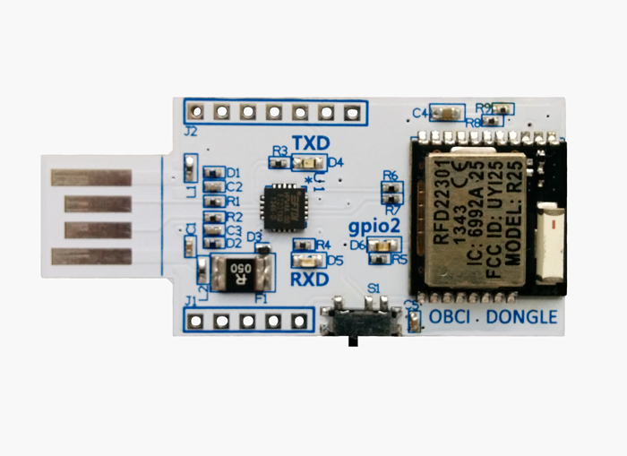

# Getting Started w/ OpenBCI

## I. What You Need

 1. OpenBCI board
 2. OpenBCI Dongle
 3. OpenBCI Electrode Starter Kit (ESK) or your own electrodes
 4. 6V AA battery pack & (x4) AA batteries (batteries not included)
 5. (x4) plastic feet for board stabilization

### 1. Your Board

This tutorial can be followed if you are working with any OpenBCI board (8bit, 32bit, or 32bit with Daisy). I'll be working with the 8bit board.

### 2. Your OpenBCI USB Dongle

The OpenBCI USB Dongle has an integrated RFDuino that communicates with the RFDuino on the OpenBCI board. The dongle establishes a serial (if you're working on a MAC) or COM (if you're on PC or Linux) connection with your computer with its on-board FTDI chip. You'll be connecting to this serial port from the OpenBCI GUI or whatever other software you want to end up using to interface your OpenBCI board.

### 3. Your Electrode Starter Kit (ESK)

If you ordered an Open BCI Electrode Starter Kit, it should come with:

 * 10 passive, gold cup electrodes on a color-coded ribbon cable
 * 4oz Jar of Ten20 conductive electrode paste
 

 
If you plan to work with your own electrodes, the touch-proof adapter may come in handy. It will convert any electrode that terminates in the industry-standard touch-proof design to an electrode that can be plugged into OpenBCI!

### 4. Your 6V AA Battery Pack & 4 AA Batteries

Both the 8bit board and the 32 bit boards have specific input voltage ranges. These input voltage ranges can be found on the back-side of the board, next to the power supply. **BE VERY CAREFUL** to not supply your board with voltages above these ranges, or else you will damage your board's power supply. For this reason, we recommend that you always use the battery pack that came with your OpenBCI kit.

### 5. (x4) Plastic Feet

Your OpenBCI kit comes with (x4) plastic feet that can be snapped into the wholes of your board to provide extra stability while you are working.

 

## II. Download & Install the OpenBCI GUI

a. Attach the 4 plastic feet to your OpenBCI board plus some spaghetti

b. Buy 4 AA batteries and put them in your battery pack

c. Connnect the battery pack to the OpenBCI board

d. Connect your electrodes to the OpenBCI board: Black->BIAS; White->SRB; Gray->N1P

e. Connect the USB Dongle to your computer

### 3. Software Setup

1. Download Processing
2. Download GWOptics and ControlP5 Libraries
3. Unzip the libraries and put them in the /Processing/libraries/ folder.
4. Download the OpenBCI_Processing Github Repository:
`git clone https://github.com/OpenBCI/OpenBCI_Processing.git`

### 4. Headware Setup

1. Apply electrode paste to the 3 electrodes. Make sure to add enough paste so that it forms a convex shape on the electrode cavity, allowing for a strong seal with the skin.
2. Connect 1 ground electrode (typically to the mastoid behind the ear)
3. Connect 1 reference electrode to the earlobe
4. Connect 1 EEG channel electrode (any location on the head from where you want to sample EEG)

### 5. Test It

1. Open the file OpenBCI_GUI.pde in Processing and run the program.
2. Select your serial/COM port in the left hand menu and click Initialize System.
3. If for some reason, the brainwaves don't start streaming, switch your OpenBCI board to Off and then back to "PC", and redo the previous step.
4. Click into the main interface and press Tab to change to Channel settings.
5. De-select every channel but the one your EEG channel electrode is connected to, which will be Channel 1 if you connected it to the N1P pin.
6. If all goes as it should, you should see your brainwaves streaming out.
7. Play with the controls to get a feel for different ways to view the data.
8. Blink your eyes, grit your teeth, play around with it!
