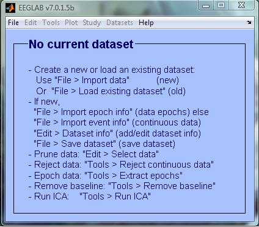

# MATLAB

## Overview
[MATLAB](https://en.wikipedia.org/wiki/MATLAB) is a powerful numerical computing language and environment that is widely used in a wide variety of academic, research, and industry applications. 

A few Matlab toolboxes have been created specifically for working with EEG and BCI. [EEGLAB](http://sccn.ucsd.edu/eeglab/), [BCILAB](http://sccn.ucsd.edu/wiki/BCILAB), [ERPLAB](http://erpinfo.org/erplab), and [FieldTrip](http://www.fieldtriptoolbox.org/) are a few toolboxes that have helped OpenBCI users work in MATLAB.

This tutorial will walk through setting up your Matlab environment for use with OpenBCI hardware, as well as some basic uses and functionalities that Matlab offers for working with brain-computer interfaces.


## MATLAB
####Installation
Go to the [MathWorks website](http://www.mathworks.com/help/install/ug/install-mathworks-software.html) for MATLAB installation instructions. 

*Please note that MATLAB is commercial software. Licenses must either be purchased or acquired through academic or professional institutions.*

Several useful MATLAB toolkits (EEGLAB, BCILAB, FieldTrip, etc) have been created for collecting and analyzing EEG data, so this tutorial will focus on using MATLAB through these toolkits.

## EEGLAB
#### Overview
From the EEGLAB wiki: "EEGLAB is an interactive Matlab toolbox for processing continuous and event-related EEG, MEG and other electrophysiological data using independent component analysis (ICA), time/frequency analysis, and other methods including artifact rejection."

#### Setup
Go to the [EEGLAB downloads page](http://sccn.ucsd.edu/eeglab/downloadtoolbox.html) and follow the instructions for your operating system.

In short, you will want to download the zip file of the most current version of EEGLAB and extract it into a directory on your system. Then, you will want to make this toolbox accessible from Matlab by adding a path to this directory (the steps to do this vary by OS - see the "EEGLAB downloads page" link above).

To check if EEGLAB is correctly set up, go to the Matlab prompt and type:
> \>\> eeglab

If the toolkit is not yet correctly implemented, the console should output:
"Undefined function or variable 'eeglab'."

If it is set up correctly, a pop-up window should appear with the EEGLAB GUI.



#### Loading OpenBCI datasets in EEGLAB
EEGLAB can be used for the analysis and visualization of EEG datasets recorded using OpenBCI hardware and software. EEGLAB can work with a variety of different file types, including those that are exported from the OpenBCI GUI. The following are different data types that can be used:

**ASCII (txt) Files**

EEG data can be stored ASCII files (often saved with the ".txt" extension).

The OpenBCI Processing GUI saves data in text or comma separated value (csv) files, which are output into the "SavedData" directory within the OpenBCI_Processing directory.

Import the CSV file as a MATLAB matrix using the following command:
```
eeg_data = csvread('.../directory/yourfile.txt', row offset, column offset)
```
for example:
```
eeg_data = csvread('.../OpenBCI-RAW-__.txt', 5, 1)
```
Row offset is the number of rows in your txt file before the start of your EEG data (in the current version of the OpenBCI GUI, there are 5 commented lines before the start of the data, so the offset should be 5 to make the matrix start on line 6). Column offset skips the sample number column.

If you are using the OpenBCI V3 board with accelerometer data and aux data, you might want to remove the last three channels of your data before you send it into EEGLAB in order to only work with the EEG data. To remove the last three columns, enter the command:
```
eeg_data = eeg_data(:,1:end-3)
```
In the case of OpenBCI Processing's txt data, the matrix is imported in the opposite orientation than what EEGLAB needs, so to transpose the data before importing in EEGLAB, perform a simple matrix transposition:
```
eeg_data = eeg_data'
```
If EEGLAB isn't already running, enter "eeglab" into the Matlab command line to start the program. Import your matrix into EEGLAB using the EEGLAB GUI: File -> Import Data -> Using EEGLAB functions and plugins -> From ASCII/float file or Matlab array


In the pop-up window that appears, enter information about the data set. Select "Matlab variable", and enter the name of the variable where your matrix is stored. Enter the Data Sampling rate (it should be commented in at the top of the txt file - usually 250 Hz by default in the OpenBCI GUI). The other fields can be left at default, and EEGLAB will automatically fill in the information from the data set.

Channel locations are useful for plotting EEG scalp maps in 2-D or 3-D format. OpenBCI uses the standard 10-20 format for the 8 and 16 channel models, which can be found within these sfp files: [8 channel](../assets/matlab/electrode_positions_8channel.sfp) and [16 channel](/assets/matlab/electrode_positions_16channel.sfp). You can then import channel data by click "Browse" next to "Channel location file or info" and locating the OpenBCI sfp file you downloaded.

The data is now imported into EEGLAB, and you can perform a variety of data analysis on the data.See ((performing EEG data analysis and visualization)) for next steps on working with your data.

####Streaming into EEGLAB
From what I can tell, EEGLAB seems to work primarily with datasets and recorded data. To use streaming in MATLAB with these toolboxes, see the [BCILAB tutorial](http://docs.openbci.com/3rd%20Party%20Software/01-Matlab#matlab-bcilab) below.


##BCILAB
####Overview
From the [BCILAB wiki](http://sccn.ucsd.edu/wiki/BCILAB): "BCILAB is a MATLAB toolbox and EEGLAB plugin for the design, prototyping, testing, experimentation with, and evaluation of Brain-Computer Interfaces (BCIs), and other systems in the same computational framework."

BCILAB provides a GUI from which you can control the plugin, but batch scripting can be used for those well-versed in MATLAB programming.

####Installation
To install BCILAB, download the [BCILAB-1.1 zip file](ftp://sccn.ucsd.edu/pub/bcilab) and extract it to any directory that is not your EEGLAB folder.

Open up MATLAB, and enter the following in MATLAB's command line:
```
>> cd your/path/to/bcilab; bcilab
```

After some console output, you should see the text "Welcome to the BCILAB toolbox!" and then a new GUI with the BCILAB menu should appear.


####Streaming into BCILAB
**LabStreamingLayer**

See our [Labstreaminglayer Tutorial] for instructions on how to start a stream from the OpenBCI headset to your computer. Follow the tutorial on how to start a stream using the OpenBCI Python API.

Once a stream has been started on your computer, open BCILAB within MATLAB (>> cd your/path/to/bcilab; bcilab) and from the menu, select **Online Analysis > Read input from... > Lab streaming layer...**:


##ERPLAB
####Overview
From the [ERPLAB homepage](http://erpinfo.org/erplab): "ERPLAB Toolbox is a free, open-source Matlab package for analyzing ERP data.  It is tightly integrated with EEGLAB Toolbox, extending EEGLAB’s capabilities to provide robust, industrial-strength tools for ERP processing, visualization, and analysis.  A graphical user interface makes it easy for beginners to learn, and Matlab scripting provides enormous power for intermediate and advanced users."

####Setup
[Download](http://erpinfo.org/erplab/erplab-download) and extract the latest ERPLAB release to the "plugins" folder of your EEGLAB directory (if you have an old release of EEGLAB, you will also have to enter the path to this directory in MATLAB by *File > Set Path*)

Next time your launch EEGLAB, the ERPLAB menu should appear in the EEGLAB GUI:


####Analyzing EEG Data Sets
To use ERPLAB for analyzing EEG datasets, import your data set as seen in the [Loading OpenBCI Datasets in EEGLAB section](#loading-openbci-datasets-in-eeglab). After the EEG data is imported into EEGLAB, you can then use ERPLAB functions to analyze your data. [Read more on using ERPLAB on their website](http://erpinfo.org/erplab/erplab-documentation/manual_4/)

##FieldTrip

##Further Reading
[EEGLAB Wiki](http://sccn.ucsd.edu/wiki/EEGLAB)

[BCILAB Wiki](http://sccn.ucsd.edu/wiki/BCILAB)

[ERPLAB Homepage](http://erpinfo.org/erplab)

[FieldTrip Homepage](http://www.fieldtriptoolbox.org/)


