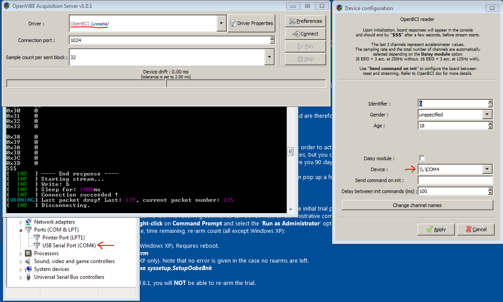
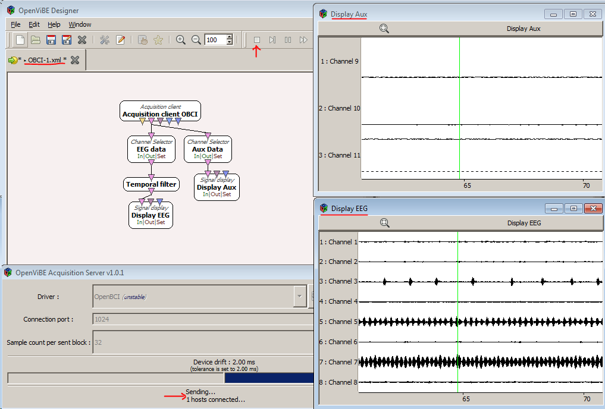

# OpenViBE

## Installation

**Windows**: Follow [OBCI on Windows](http://docs.openbci.com/Tutorials/11-OpenBCI_on_Windows) tutorial to properly connect your OBCI board on Windows. Then, continue this tutorial.

**OS X**: Visit the [Win7 Virtual Box installation tutorial](http://docs.openbci.com/Tutorials/12-Win7_VM_Installation) first, then follow these instructions.

**NOTE**: [Linux builds](http://openvibe.inria.fr/downloads/) of OpenViBE also work. Some linux users might find this guide useful but keep in mind it is ment primarily for mac + win7.

### I. OpenVibe Software
1. Make sure you have a running Windows 7 Machine (be it either a VM or native).
1. Download the latest OpenViBE software from their [website](http://openvibe.inria.fr/downloads/). 

### II. Connect the Board

Connect your OBCI board and make sure it is recognized as a COM port and it's latency is set to 1 ms. To troubleshoot, read [this](http://docs.openbci.com/tutorials/11-OpenBCI_on_Windows).

### III. Connect to OpenVibe

1. Start the OpenViBE Signal Acquisition Server (SAS). **C: > Program Files > openvibe > openvibe-acquisition-server** (normally shows up when searching “openvibe” in start menu). 
1. In the SAS select the OpenBCI (unstable means not throughly tested) option from the drop down list.
1. Then open **Driver Properties**. In the Device option, select the COM port number your OBCI board was connected to.
1. In the SAS Preference menu, change the drift tolerance from 2ms (default) to 10ms. 
1. Press Connect. If error, troubleshoot:
	- Look at the terminal window that the SAS opens up. It has a verbose report on the SAS's condition. 
	- Often, pressing the restart button on the OBCI board, or Disconnecting/Conneting the Dongle will fix any connection issues. 
	- If the error reports that it cannot open the selected port, make sure the COM port selected in the driver options is the same as your board.

### IV. First Graph

1. Open the OpenViBE designer GUI and load the attached [xml file](https://github.com/OpenBCI/Docs/blob/master/assets/files/Start_OBCI.xml). This file is a pre-made graph that will display both the EEG channels and the AUX channels. For the V3 board, the AUX channels correspond to accelerometer values in the three cardinal directions. 
1. Press the play button on the SAS; then press the play button on the Designer GUI's toolbar above.

**Enjoy OpenBCI in OpenViBE!**

### IV. Other resources
For more advanced tutorials using OpenBCI and OpenViBE, check out [Jeremy Frey's blog](http://blog.jfrey.info/). He has done both a [P300 Speller](http://blog.jfrey.info/2015/02/04/openbci-p300-coadapt/) and a [Motor Imagery Classifier](http://blog.jfrey.info/2015/03/03/openbci-motor-imagery/).

