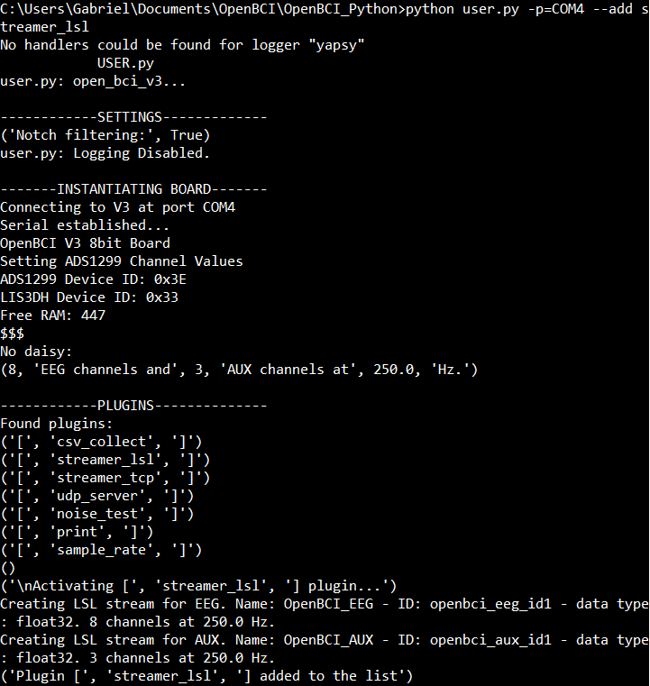

# Lab Streaming Layer (LSL)

[Lab streaming layer](https://github.com/sccn/labstreaminglayer)  is a system for synchronizing streaming data for live analysis or recording. LSL is a good way to send your OpenBCI stream to applications that can record or manipulate the data, such as Matlab (see our Matlab tutorial for using LSL in this context).

This tutorial will show you how to set up LSL using the OpenBCI Python API and then explain the various ways you can use LSL to perform experiments or record data.

##Lab Streaming Layer Setup
###Using Python
1) **Set up OpenBCI Python**

First, download and set up the OpenBCI Python API, which can bound found at the [OpenBCI Python repo ](https://github.com/OpenBCI/OpenBCI_Python) on Github. A full guide regarding setting up and using the API can found on our [OpenBCI_Python Tutorial](http://docs.openbci.com/OpenBCI%20Software/05-OpenBCI_Python).

The OpenBCI Python API repo already has an LSL plugin created to support streaming with OpenBCI. However, to use this plugin, you must first set up the other components of LSL on your computer.

2) **Download Lab Streaming Layer**

You can download the Python LSL package using PIP. In your terminal, enter:

	> pip install pylsl

Alternative:
Download the [LSL repository](https://github.com/sccn/labstreaminglayer) from Github. Although to set up LSL with our python library, you wll only need the LSL Python library, if you intend to use LSL with other programs (like Matlab), it might be worth downloading the entire repo.

After downloading LSL, run the get_deps.py file in the main "labstreaminglayer-master" directory that you downloaded in order to install all of the dependencies for lsl.

3) **Getting a Stream**
Now that you have both the OpenBCI Python API and LSL set up on your system, you are ready to start streaming via LSL.

1. Start the OpenBCI Python program via the command line by typing

		>python user.py -p=port --add streamer_lsl
Replace "port" with the serial port that the OpenBCI dongle is connected to (e.g. COM1). You can find out the name of your port by starting the OpenBCI GUI and seeing what ports appear when you select "LIVE" as the data source. For more information on doing this, see our [Getting Started Guide](http://docs.openbci.com/Tutorials/01-Cyton_Getting%20Started_Guide)

2. A message should appear on the console displaying the board being instantiated, available plugins, and the activation of the plugin streamer_lsl. It should show that you have two streams ready to be activated - EEG (8 channels) and AUX (3 channels).

) 

3.. Enter "/start" to begin streaming into LSL!

If your setup was successful, you won't see any additional information output onto the console. However, LSL should now be able to send the stream of data into whatever application or device you are using LSL to communicate with.
 

##Next Steps
Once you have the Lab Streaming Layer set up with your OpenBCI board, check out these other tutorials to view the stream in a variety of different programs:

[Matlab tutorial](http://docs.openbci.com/3rd%20Party%20Software/01-Matlab)

##Credit
Thanks to Winslow Strong for posting the original tutorial on the OpenBCI forums!
