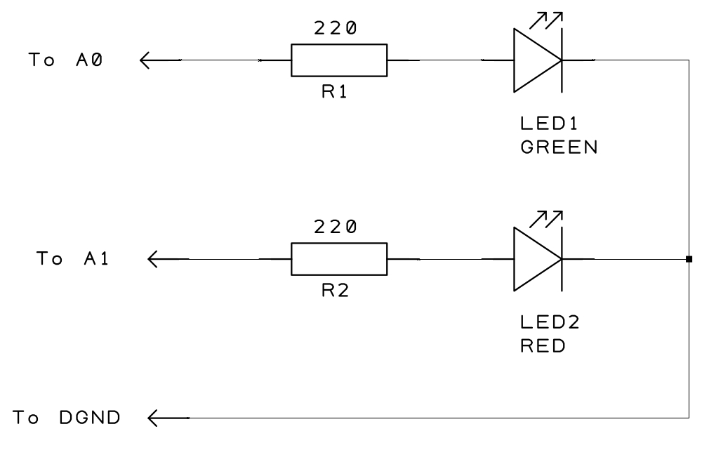
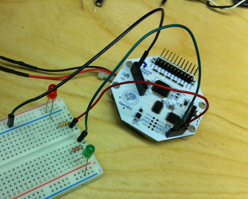

#Digital Ouput on OpenBCI 8bit Board
Sometimes, when studying EEG or other biopotential signals, you will want to generate a stimulus during a recording or live session, and it may be important that the stimulus occurs at a specific timed frequency. We've had some experiments using visual stimulus to control a small [hex robot](http://eeghacker.blogspot.com/2014/06/controlling-hex-bug-with-my-brain-waves.html). and some other work with [visual entrainment](http://eeghacker.blogspot.com/2014/05/visual-entrainment-blinking-screen.html). One issue that we ran into when generating a visual stimulus on the PC was that the frequency of the visual stimuli is not always as accurate as we would like. This tutorial will go over how to flash LEDs from the OpenBCI 8bit board itself, and get really accurate frequency generation. Please read this entire page before jaunting off into hardware hacking.

##Flashing Two LEDs at Different Frequencies
The OpenBCI 8bit Board comes with an ATmega32 with Arduino UNO bootloader. It programs with the Arduino IDE [download here](http://arduino.cc/en/Main/Software). The code that is running on your 8bit board is located [here](https://github.com/OpenBCI/OpenBCI_8bit). In this example, we will lash up 2 LEDs with series resistors on a breadboard. Here's what you'll need: 

* OpenBCI 8bit Board with Female Headers
* 2 LEDs (not necessarily different colors)
* 2 220 ohm resistors
* Breadboard and Jumper Wires

###Step One

First thing to do is solder the female headers. Your OpenBCI 8bit board came with a selection of female header rows. Find the 8, 6, and 4 pin female headers, and solder them in to the top of the board. For this tutorial, we will access the GND on the 8 pin header row (left side). 5V and the input pins are located on the two headers on the right.

**Note** The 4 and 6 pin headers on the right are operating at 5V, and the 8 pin header on the left is operating at 3.3V. DO NOT CONNECT THESE PINS TOGETHER OR YOU RISK DAMAGING YOUR BOARD! 

We have broken out the following Arduino pins:

| Pin Name | Default | Digital IO | Also Known As |
| ------- | ----- | ----- | ---- |
| A0 | Analog Input  | Yes | 14 |
| A1 | Analog Input  | Yes | 15 |
| A2 | Analog Input  | Yes | 16 |
| A3 | Analog Input  | Yes | 17 |
| A4 | Analog Input  | Yes | 18 |
| A5 | Analog Input  | Yes | 19 |
| A6 | Analog Input  | No | not applicable |
| A7 | Analog Input  | No | not applicable |

All of these pins default to Analog inputs. For this tutorial, we will be using two Digital outputs connected to LEDs. Here's a simple schematic, and photo of the breadboard setup. It's pretty straightforward. You can place the resistors either before or after the LEDs, it doesn't matter, just make sure they are in series!

###Step Two
On to the code! First, let's initialize some variables. Note that I'm making aliases for pins A0 and A1, and I could have called them 14 and 15 just as easily. I'm making variables REDstate and GRNstate to keep track of the LEDs on/off disposition, and the flashCounter variable will help to tightly time the frequency of the flashes. The setup() is where we make the pins outputs and initialize variables, etc. 

	int GRN = A0;
	int RED = A1;
	boolean REDstate, GRNstate;
	unsigned long flashCounter = 0;
	
	void setup(){
		// do stuff....
		// flashing LEDs at different frequencies. Period needs clean /4 to work!
		pinMode(GRN,OUTPUT);  // flash at 5Hz | 200mS period | switch pin state every 25 samples
		pinMode(RED,OUTPUT);  // flash at ~7Hz | 136mS period | switch pin state every 17 samples
		REDstate = GRNstate = true; // start with the lights on
		digitalWrite(GRN,GRNstate);
		digitalWrite(RED,REDstate);
		// do other stuff...
	}
		
The OpenBCI board samples incoming data at a rate of 250 samples per second. That makes for 4mS (0.004 seconds) between samples. I'm using this sample acquisition rate to accurately time the rate of our LED flashes. By doing this, we are not able to assign an arbitrary frequency to the LED flashes. Any frequency we use must have a period that is divisible by 4mS. This should be close enough for all but the most exacting applications To do this in the loop(), when the OpenBCI board is in streamingData mode, we use a modulo to find the toggle time of each LED. When you do modulo on a number, it returns the remainder, in the case of the green LED, in order to flash at 5Hz, we have to toggle the LED every 25 samples. Here's the equation to find the number of samples:

* Sample Counts = 1000x((1/freq)/2)/4

Where freq is the target LED flashing frequency.

		flashCounter++;     // used to time blinks
      
      if (flashCounter%25 == 0){  // blink the green LED at 5Hz
        GRNstate = !GRNstate;     // toggle state of LED
        digitalWrite(GRN,GRNstate);
      }
      
      if (flashCounter%17 == 0){  // blink the red LED at 7.35Hz
        REDstate = !REDstate;     // toggle state of LED
        digitalWrite(RED,REDstate);
      }
      

The last thing I'm doing is to reset the LEDs to 'both on' whenever the OpenBCI board exits streamingData mode. When the user or controlling program sends an 's' on the serial port to the board, it will stop streaming data mode. I've added some code to help make the user experience smooth. This section is located in the getCommand() function.

	case 's':
        stopRunning();
        if(use_SD) stampSD(DEACTIVATE);  // mark the SD log with millis() if it's logging
        GRNstate = REDstate = true; // set the LED states
        digitalWrite(GRN,GRNstate); // keep the lights on!
        digitalWrite(RED,REDstate);
        break;

Here's a link to the github branch that implements this LED flashing output!
[OpenBCI 2 LEDs](https://github.com/OpenBCI/OpenBCI_8bit/tree/OpenBCI_8bit_2LEDs)

