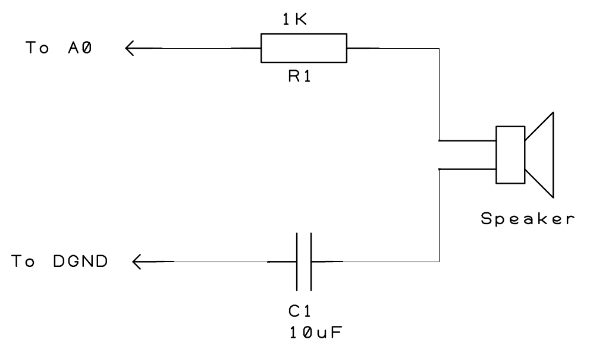
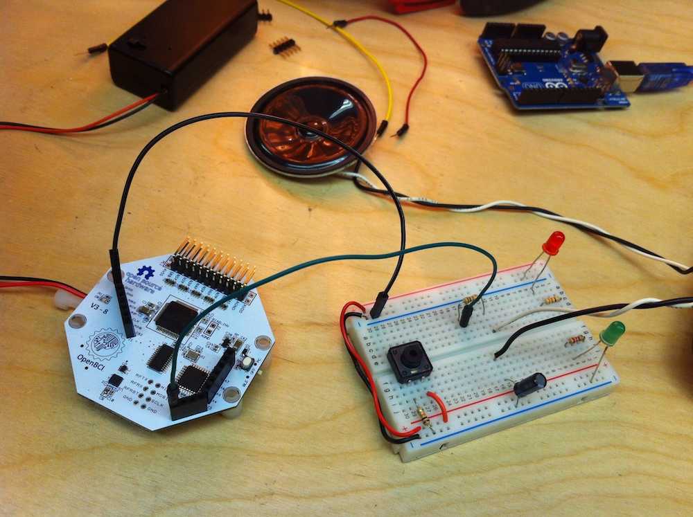

#Audio Output on OpenBCI 8bit Board
Sometimes, when studying EEG or other biopotential signals, you will want to generate a stimulus during a recording or live session, and it may be important that the stimulus occurs at a specific timed frequency. We've posted a tutorial on how to blink LEDs at different rates, and that works for visual stimulation, but what about auditory stimulation? This tutorial seeks to answer that question. The example below would be applicable to a study exploring audio ERPs (Event Related Potentials) and P300 wave experiments. For these kinds of studies, the onset of the stimulus (beep or boop) needs to be noted in the data stream with great accuracy. We can do this easily with the OpenBCI board. Please read this entire page before jaunting off into hardware hacking.

##Generating Audio Signals With OpenBCI 8bit Board
The OpenBCI 8bit Board comes with an ATmega32 with Arduino UNO bootloader. It programs with the Arduino IDE [download here](http://arduino.cc/en/Main/Software). The code that is running on your 8bit board is located [here](https://github.com/OpenBCI/OpenBCI_8bit). In this example, we will lash up an 8ohm speaker with series resistor for volume control and AC coupling capacitor on a breadboard. Here's what you'll need: 

* OpenBCI 8bit Board with Female Headers
* 8ohm Speaker
* 1 1K Resistor
* 1 10uF Capacitor
* Breadboard and Jumper Wires

###Step One

First thing to do is solder the female headers. Your OpenBCI 8bit board came with a selection of female header rows. Find the 8, 6, and 4 pin female headers, and solder them in to the top of the board. For this tutorial, we will access the GND on the 8 pin header row (left side). 5V and the input/output pins are located on the two headers on the right.

**Note** The 4 and 6 pin headers on the right are operating at 5V, and the 8 pin header on the left is operating at 3.3V. DO NOT CONNECT THESE PINS TOGETHER OR YOU RISK DAMAGING YOUR BOARD! 

We have broken out the following Arduino pins:

| Pin Name | Default | Digital IO | Also Known As |
| ------- | ----- | ----- | ---- |
| A0 | Analog Input  | Yes | 14 |
| A1 | Analog Input  | Yes | 15 |
| A2 | Analog Input  | Yes | 16 |
| A3 | Analog Input  | Yes | 17 |
| A4 | Analog Input  | Yes | 18 |
| A5 | Analog Input  | Yes | 19 |
| A6 | Analog Input  | No | not applicable |
| A7 | Analog Input  | No | not applicable |

All of these pins default to Analog inputs. For this tutorial, we will be using one Digital output connected to our speaker. Here's a simple schematic, and photo of the breadboard setup. It's pretty straightforward. You can place the resistor either before or after the speaker, it doesn't matter, just make sure they are in series! Do not ignore or bypass the capacitor! It is doing an important job protecting the speaker from DC current, which could potentially damage it's coil. The value of the cap is not critical (1uF ~ 10uF), but it really should be there.
The resistor is acting as a volume control. You can bypass the resistor if you want to really blast the beep-boop.

###Step Two
On to the code! First, let's initialize some variables. Note that I'm making aliases for pins A0, and I could have called it 14 just as easily. I'm making the variable toneStartTimer to help to tightly time the frequency of the tones. The setup() is where we make the pins outputs and initialize variables, etc. 

	int Speaker = A0;  // alias for pin A0
	unsigned long toneStartTimer = 0;
	
	void setup(){
		// do stuff....
		pinMode(Speaker,OUTPUT);
		// do other stuff...
	}
		
The OpenBCI board samples incoming data at a rate of 250 samples per second. That makes for 4mS (0.004 seconds) between samples. I'm using this sample acquisition rate to accurately time the timing of the tones. By doing this, we are not able to assign an arbitrary frequency to the sound generation. Any frequency we use must have a period that is divisible by 4mS. This should be close enough for all but the most exacting applications. To do this in the loop(), when the OpenBCI board is in streamingData mode, we use a modulo to find the time to start the boop sound. When you do modulo on a number, it returns the remainder, in the case of the tone output, if we want to beep every 1 second, we need to wait 250 samples between tones. Here's the equation to find the number of samples:

* Sample Counts = 1000*((1/freq)/4)

Where freq is the target booping frequency.

In this example, I'm placing a flag in the data stream at the onset of each tone. First, I test the toneStartTimer with a modulo to determine if it's time to make the sound. If it is, then I start the tone running for 200mS, and then set one of my auxData variables equal to 0x6220. Our OpenBCI GUI is expecting to see accelerometer data in this channel, and will automatically convert it to Gs. In this case, by placing 0x6220 there, the GIU will convert to the value 3.14 (PI flag), which is kinda cool, and easy to find in the data stream. Notice that I'm doing all of this **before** the OBCI.sendChannelData() function. That is to make sure that the PI flag is accurately temporally located. 

		// ... do stuff ...
		toneStartTimer++;
      if(toneStartTimer%250 == 0){  // tone happens every this number of mS times 4
        tone(Speaker,NOTE_B3,200);  // make a boop that lasts for 0.2 Seconds
        // 0x6220 converts to 3.14 in Processing. This is a flag in the data timed with the boop
        OBCI.auxData[0] = 0x6220;	 
        OBCI.useAux = true;	    // set the OBCI.auxData flag
      }
      
      OBCI.sendChannelData(sampleCounter);  // send the new data over radio
      
      sampleCounter++;    // get ready for next time
      

Here's a link to the github branch that implements this LED flashing output!
[OpenBCI 8bit Tone](https://github.com/OpenBCI/OpenBCI_8bit/tree/OpenBCI_8bit_Tone) Included there is a tab of tone definitions, called Pitches.h, to make it easier for you to get the right sounds for your project. Brilliant!
