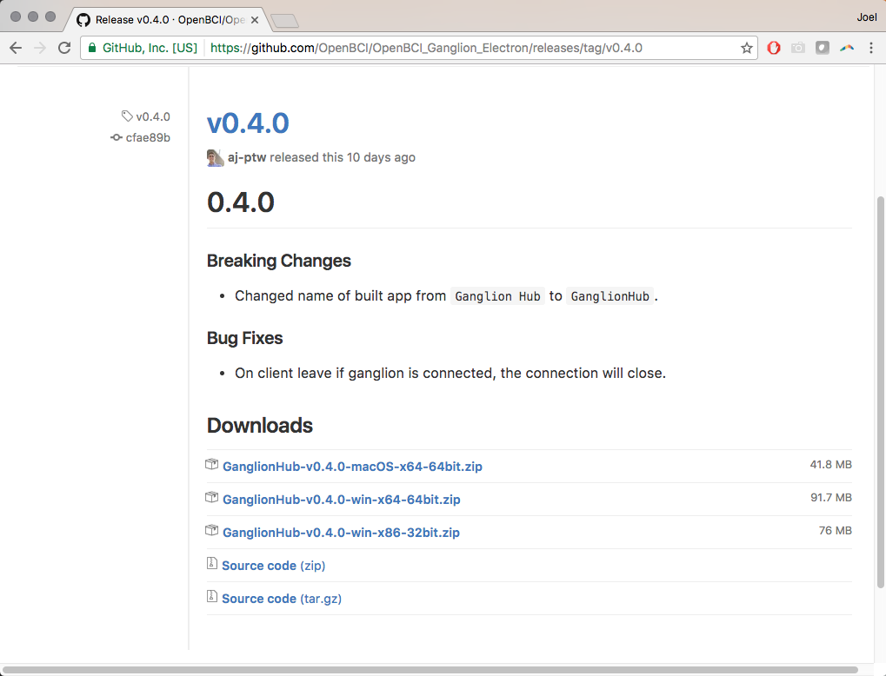
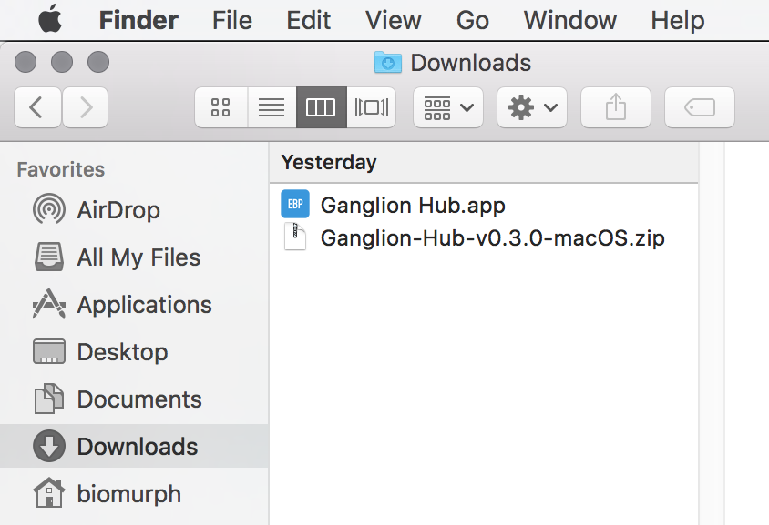

## Run The OpenBI GUI In Processing

The things you will need to run the OpenBCI GUI in Processing are:  

 * [Processing App](https://processing.org/download/?processing)
 * [OpenBCI GUI Sketch](https://github.com/OpenBCI/OpenBCI_GUI)
 * [OpenBCI Electron HUB](https://github.com/OpenBCI/OpenBCI_Ganglion_Electron/releases/tag/v0.3.0)

First, go to processing.org and download the latest version of Processing. While that's downloading, move on to the next step, which will allow you to run the OpenBCI GUI on Sierra.

When Apple Computer updated their Operating System to Sierra, they changed a few things about your `Security & Privacy` default settings. Sierra won't allow any apps that aren't from the App Store or Identified Developers. While we work on becoming Identified Developers, you will need to change your default `Security & Privacy` settings. Here's how to do it:  

1. Open the Terminal app from the /Applications/Utilities/ folder and then enter the following command syntax: `sudo spctl --master-disable` and press the  `return` key.
2. You will be prompted to enter your administrator password. Do that, and then press `return` key.

>This hack was published by [osXdaily](http://osxdaily.com/2016/09/27/allow-apps-from-anywhere-macos-gatekeeper/) September, 2016.

Now, go to your `System Preferences/Security & Privacy` and make sure that your system allows apps downloaded from Anywhere. You may again be prompted for your administrator password.  

By this time, Processing has likely downloded and extracted itself. Go ahead and move it to your `Applications` folder, and launch the application. If this is the first time that you are running Processing, it will create what it calls it's `Sketch` folder. The default location for the `Sketch` folder is in your Documents folder:  

On a Mac `Users/<user-name>/Documents/Processing`  
On a Windows `C:\Users\Username\Documents\Processing`

This is the location that we will move the OpenBCI GUI files that we'll download next.  

The OpenBCI GUI code repository is located on github [here](https://github.com/OpenBCI/OpenBCI_GUI). click on the `Clone or download` button in green on the right, and select `Download ZIP`. If you are a advanced github user, go ahead and clone it, or fork it if you like.  

After the download completes and the file extracts itself, you will see the folder called `OpenBCI_GUI-master`. Change the name of this file to `OpenBCI_GUI`. If you don't change it, it won't work! Now move the folder `OpenBCI_GUI` and it's entire contents to your Sketch folder:

On a Mac `Users/<user-name>/Documents/Processing`  
On a Windows `C:\Users\Username\Documents\Processing`

Inside the `OpenBCI_GUI` folder, there is a folder called `libraries`. Theses are the 3rd party libraries that the OpenBCI GUI uses to work it's magic. You need to move all of these folders into:

On a Mac `Users/<user-name>/Documents/Processing/libraries`  
On a Windows `C:\Users\Username\Documents\Processing\libraries`

folder. If there is no folder called `libraries` in that location, go ahead and make one. Once you have done that, quit out of Processing. There's one more big step, and it means going back to the OpenBCI github repository.

## Install Ganglion Hub on Mac

   

There is a piece of software which is necessary to make the connection between the GUI and your computer's Bluetooth hardware.
We call this the OpenBCI Electron Hub. Go to our github repository for the [Hub](https://github.com/OpenBCI/OpenBCI_Ganglion_Electron/releases/tag/v0.4.0), and click on the link for your Operating System.  

After it downloads and unpacks itself, your Downloads folder will look like this. the `Ganglion Hub app` needs to be inside your sketch folder, in a specific place.  

Move the `Ganglion Hubb app` from your Downloads folder to:

`Users/<user-name>/Documents/Processing/OpenBCI_GUI/OpenBCI_GUI/data`

## Install Ganglion Hub on Windows
   

There is a piece of software which is necessary to make the connection between the GUI and your computer's Bluetooth hardware.
We call this the OpenBCI Electron Hub. Go to our github repository for the [Hub](https://github.com/OpenBCI/OpenBCI_Ganglion_Electron/releases/tag/v0.4.0), and click on the link for your Operating System.  

After it downloads, unzip it and your Downloads folder will look like this.  
**Do Not run the `GanglionHub Setup 0.4.0.exe`!**  

Open the file `win-unpacked` and select the entire contents of the folder.

**All** of those files need to be moved into the folder: `Documents\Processing\OpenBCI_GUI-master\OpenBCI_GUI\data`

Your `data` folder should look like this when you're done.  

That is the final structural step to getting all of the pieces in place to run the GUI in Processing. Pat yourself on the back for a job well done, and get ready to see if it actually works!  
If the Processing app is still running, quit out of it and start it again from scratch (Processing needs to restart to find the libraries and other stuff).  

## Run the OpenBCI GUI 

When you get Processing running again, you will see a window open up. This is the Processing IDE (Integrated Development Environment).

Select `File > Sketchbook` and you will open a window where you should see the option to select `OpenBCI GUI`. When you get that far, select `OpenBCI GUI` and the Processing will open up yet another window, that contains all the code to successfully run the OpenBCI GUI.  

If you don't know anything about coding, don't edit these files. If you like to dig in to the meat of what makes things work, by all means. have at it. You are looking at the program code that makes the OpenBCI GUI work it's magic. Now, it's time to run it!

Press the `play` button on the upper left of the IDE, and the sketch will try to launch in all it's glory. If this is your first time running the sketch, you will get a message from the Mac OS that will ask you if you will allow permission for an unsigned app to run. The app in question is the Electron Hub. If you've enabled apps to run from Anywhere, you can just give permission to run the app. However, it is likely that the GUI will not function, because timing is everything. You will need to quit the sketch (press `command+q` or click the `x` button on the upper left of the GUI). Then, relaunch the sketch by pressing the `play` button as above. This time you won't get the alert from the Mac OS, and the GUI will launch in all it's glory!  