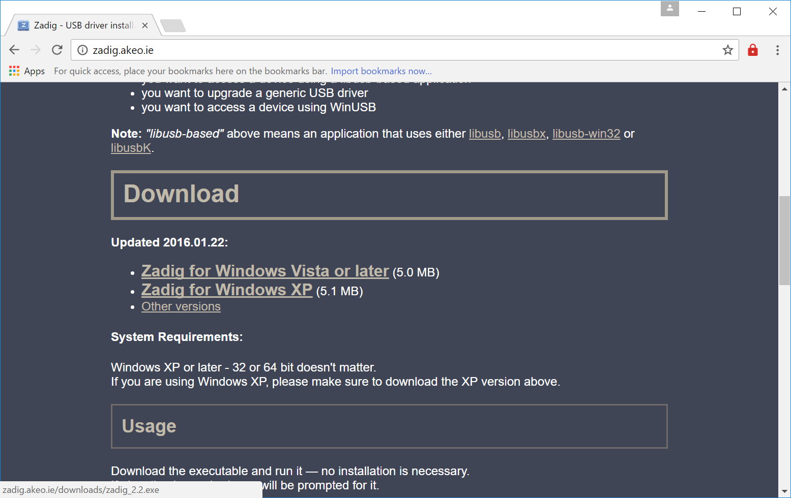
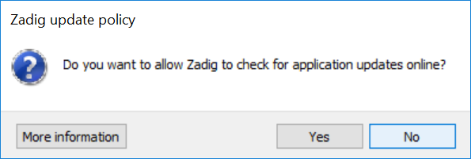
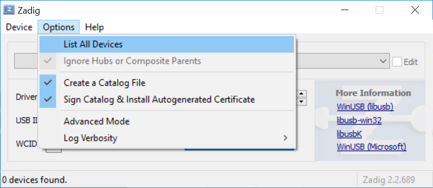
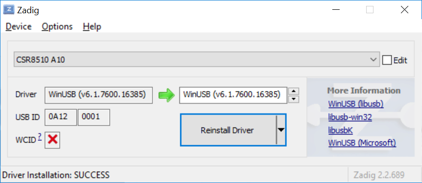

### Ganglion on Windows

The OpenBCI Ganglion uses Bluetooth LE (aka Bluetooth Smart, Bluetooth 4.0) and in order to use the Ganglion with Windows, you need a small USB Dongle. We have verified CSR 4.0 Dongles in our [store](http://shop.openbci.com/products/csr-4-0-bluetooth-dongle), and you can get them from various online vendors.  

**IMPORTANT:** The BLE Dongle *must* be a verified CSR 4.0 Dongle!

First plug in your CSR 4.0 BLE Dongle.   

Then, go to the [Zadig tool website](http://zadig.akeo.ie) to get the driver.

Download Zadig for Windows Vista or Later

Open the Zadig tool once it's done downloading. Acknowledge the message to allow the program to make changes to your OS.

Select *No To Updates* when prompted.

On the top bar select *Options*.

Then select *List All Devices*.

Select CSR from the dropdown.

Then press *Replace Driver*.

You should then see a progress bar followed by a success message.

Note that both drop-downs both say *WinUSB*.  

**We are in the process of updating this guide to include Windows 7 users. it *is* possible to use the Ganglion and CSR 4.0 BLE Dongle on Windows 7. For now, please visit this [forum post](http://openbci.com/forum/index.php?p=/discussion/918/ganglion-and-windows-7), which outlines the procedure.**