# Ganglion Programming Tutorial
The [Simblee](https://www.simblee.com/) radio module that is at the heart of the Ganlion board offers the ability to reprogram Over The Air `OTA`. The method for doing this in a nutshell is:  

1. Create new Ganglion firmware, or modify existing code in Arduino IDE
2. Generate a compiled HEX file in the Arduino IDE
3. Compress it into a ZIP with some other important files
4. Transfer the ZIP file to your phone or tablet
5. Connect your phone or tablet to the Ganglion
6. Upload new code Over The Air

The following tutorials will get your computer and the Arduino IDE set up to create the correct ZIP file, and also show how to use your phone or tablet to upload new code to the Ganglion.   

***IMPORTANT: Ganglions shipped prior to February 27, 2017 will NOT program Over The Air for the first time! If you purchased your Ganglion prior to 2/27/17, Please follow the instructions at the bottom of this page to program your Ganglion for the first time.*** 

## Setting Up for OTA Programming On A MAC
### What You Need

* Arduino IDE v1.8.0 Or Newer
* Simblee Board Files
* Compiler Tools 

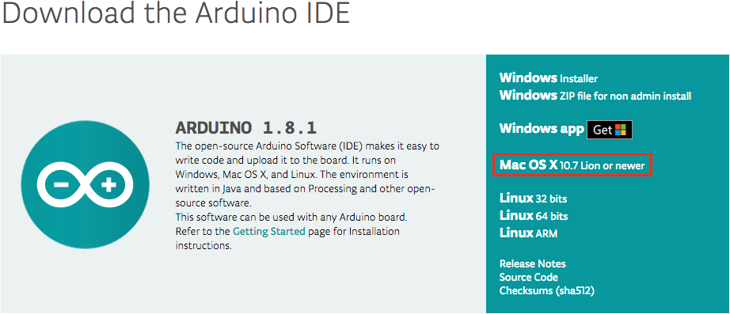

If you don't already have the Arduino IDE software on your computer, go [here](https://www.arduino.cc/en/Main/Software) to download the latest version for macOS.  
Then, follow the instructions in the [Simblee Quick Start Guide](https://www.simblee.com/Simblee_Quickstart_Guide_v1.1.0.pdf) to install the Simblee board files in Arduino for macOS.  

### Modify The Simblee Board Files 

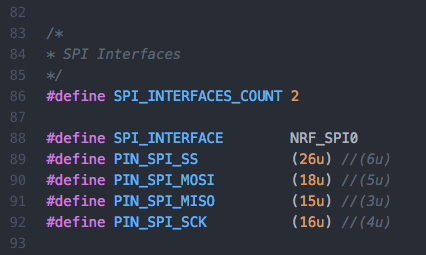

In order to program the Simblee to communicate and control the Ganglion, we need to make a quick change to the `variants.h` file in the Simblee folder that you just loaded into Arduino. Naviage to the folder   `/Applications/Arduino.app/Contents/Java/portable/packages`  
`/Simblee/hardware/Simblee/1.1.0/variants/Simblee`,  
and you will find the file called `variant.h`. Open this file up in the editor of your choice, and change the pin defines as shown.  
**NOTE** To access the application contents, right click on the application [or `control` + left click] and select `Show Package Contents`.

| define  | DEFAULT  | Change To |
|:----- |:------:| :-------:|
| PIN_SPI_SS     | 6u | 26u |
| PIN_SPI_MOSI   | 5u | 18u |
| PIN_SPI_MISO   | 3u | 15u | 
| PIN_SPI_SCK    | 4u | 16u |   

Make sure to **save** and close the file.  
**IMPORTANT NOTE:** If you don't do this, your Ganglion will not work after you reprogram it!
  

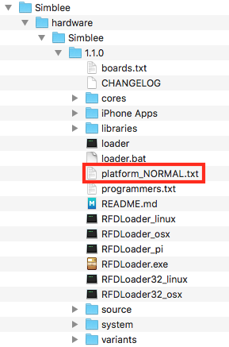

In order to create a zip file with the appropriate components to do OTA, we need to further modify the Simblee board files in your `Arduino/Contents/Java/portable` folder. Navigate to the folder  
`/Arduino.app/Contents/Java/portable/packages`  
`/Simblee/hardware/Simblee/1.1.0`  
Then change the name of the file `platform.txt` to `platform_NORMAL.txt`.  
We're doing this in case you ever want to revert to the original.  

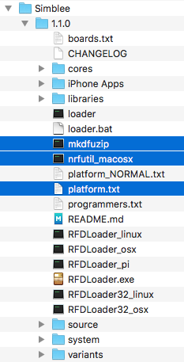

Next, download the necessary files [here](https://github.com/biomurph/Ganglion_OTA_Tools). They are:  

* mkdfuzip
* nrfutil_macosx
* platform.txt

Move the files called `mkdfuzip`, `nrfutil_macosx`, and `platform.txt` into your `Simblee/1.1.0` folder. Restart or launch Arduino. 

### Get The Ganglion Library

Go to our gihub repo and either clone or download the [OpenBCI_Ganglion_Library](https://github.com/OpenBCI/OpenBCI_Ganglion_Library). Move the folder called `OpenBCI_Ganglion_Library` into your `Documents/Arduino/libraries` folder. If you don't have a `libraries` folder there, go ahead and make one.  

Launch, or relaunch the Arduino IDE, and open the  
`File > Examples > OpenBCI_Ganglion_Library > DefaultGanglion`  
sketch. Make sure that you select the correct Serial Port from the `Tools > Port` menu, and also select Simblee from the `Tools > Board` menu.

### Compile Ganglion Firmware and Create OTA File

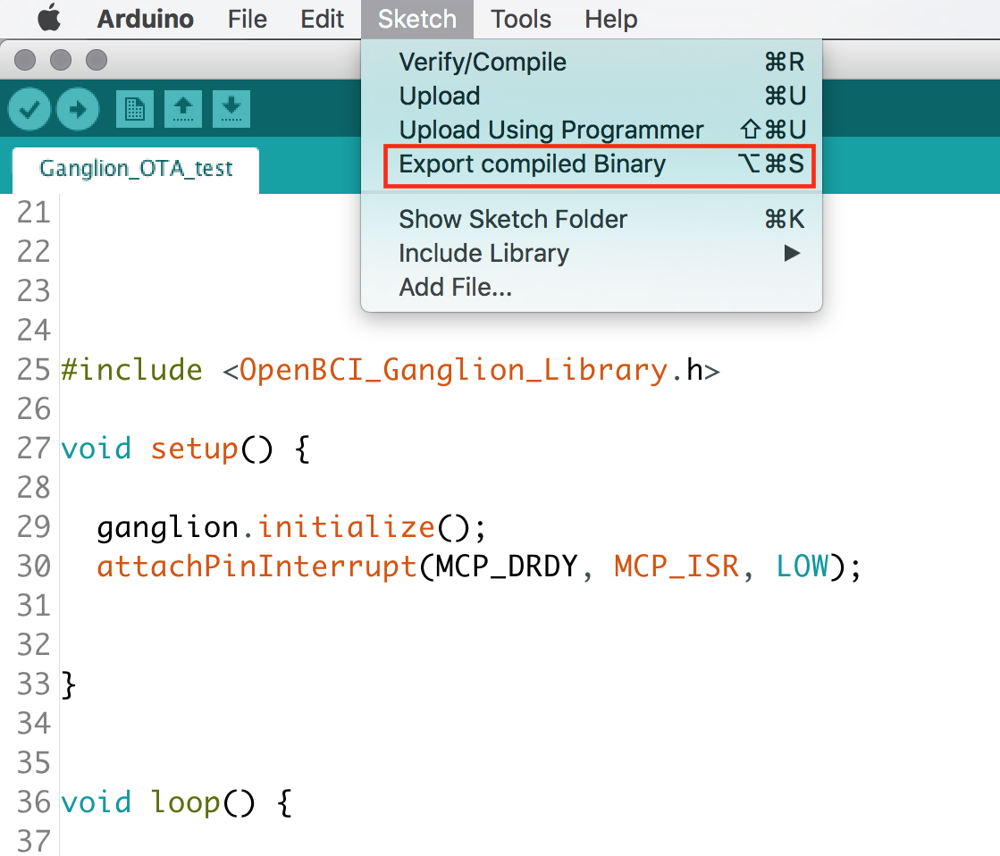

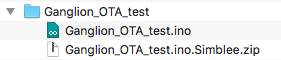

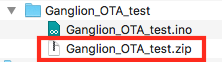

Now you're ready to create custom Ganglion firmware that is packaged correctly for OTA programming! This walk through will use example code as an example.  
**IMPORTANT NOTE:** Whenever you want to create or modify Ganglion firmware, You must **Always** put the line  
`#include <OpenBCI_Ganglion_Library.h>`  
at the top of your code!  
To create the OTA files, simply select `Export compiled Binary` from the `Sketch` menu. The Arduion IDE will take a few moments, and the tools you just installed will create the `.zip` file you need for OTA ***right in the sketch folder*** right beside your sketch! Cool! Go ahead and change the name of the file to remove the `.ino.Simblee` and you are good to go. 

## Setting Up for OTA Programming On A Windows
### Coming Sooooon!

## Setup Mobile Device For OTA Programming 

The Simblee is designed around a Nordic Semiconductor [nRF51822](http://www.nordicsemi.com/eng/Products/Bluetooth-low-energy/nRF51822), and so we need to use the Nordic nRF apps to do the actual Over-The-Air stuff. Here's what you will need for this tutorial:

### iPhone Setup: What You Need

* iPhone
* nRF Toolbox App
* Lightblue Explorer App

### Install apps

Install the nRF Toolbox and Lightblue Explorer apps onto you device. 

### Verify Ganglion Version

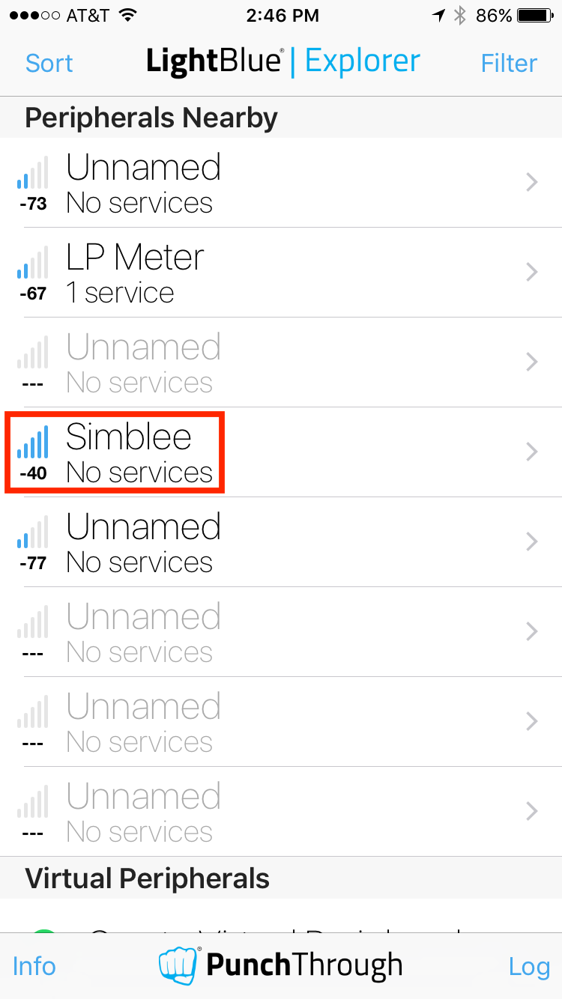

Turn on your Ganglion, and turn on your phone's bluetooth Then open the Lightblue app. The app will open and show you what Bluetooth Peripherals are nearby. The Ganglion will be listed as `Simblee`. Tap that peripheral, and Lightblue will connect to and interrogate it.  
**NOTE: the Ganglion may also show up as DfuTarg** 

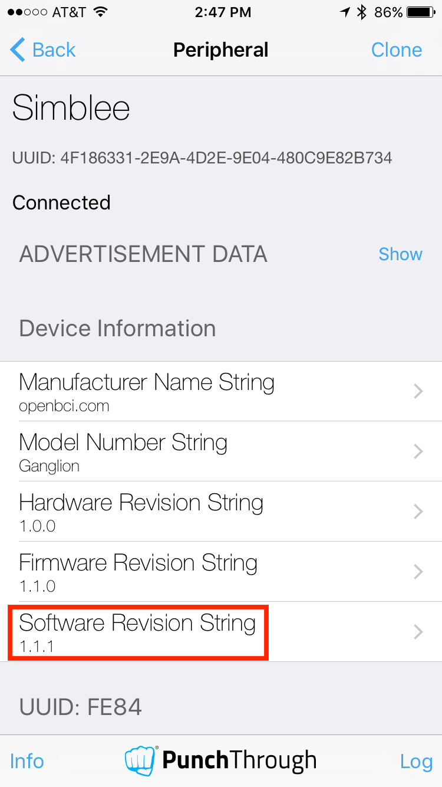

In the Device Information, you will find the following:

* Manufacturer Name String
* Model Number String
* Hardware Revision String
* Firmware Revision String
* Software Revision String

You should see `openbci.com` as the Manufacturer, `Gagnlion` as the Model Number, and `1.1.1` as the **Software Revision String**. The Hardware and Firmware versions are generated by the Simblee itself.  
**IMPORTANT NOTE: If the Software Revision String is earlier than 1.1.1 you *cannot do OTA* until you follow the Hardware Upload Tutoral at the bottom of this page.**  

### Android Setup: What You Need

* Android Device
* nRF Toolbox App
* nRF Connect App

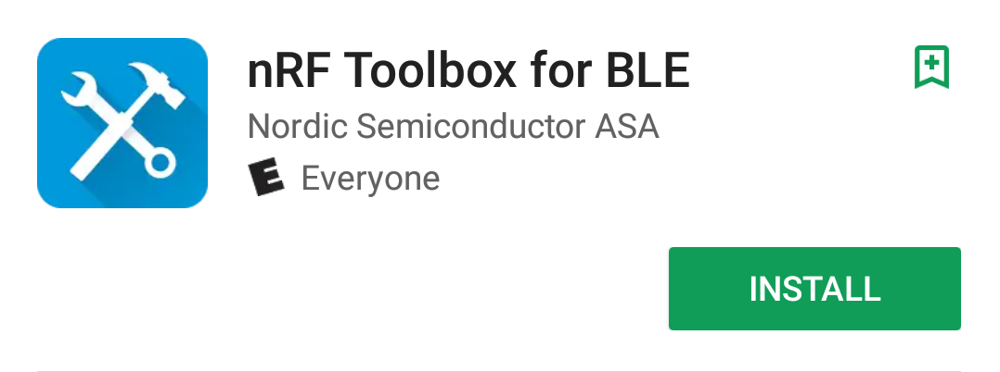

### Install apps

Install the nRF Toolbox and nRF Connect Apps onto you device. 

### Verify Ganglion Version

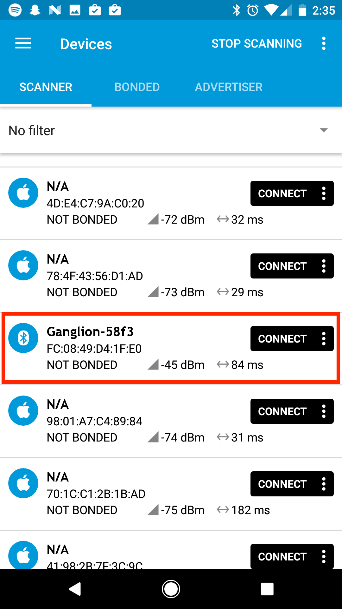

Turn on your Ganglion, and turn on your device's bluetooth then open the nRF Connect App. The app will open and show you what Bluetooth Peripherals are nearby. The Ganglion will be listed as `Ganglion-XXXX` where `XXXX` is the 4 character code specific to your Ganglion. Tap that peripheral, and nRF Connect will connect to and interrogate it.  

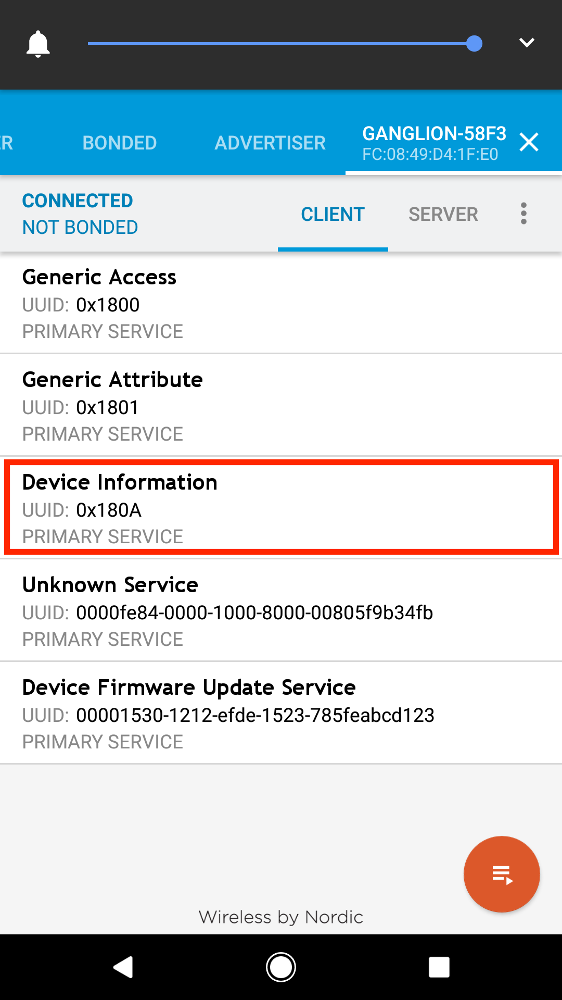
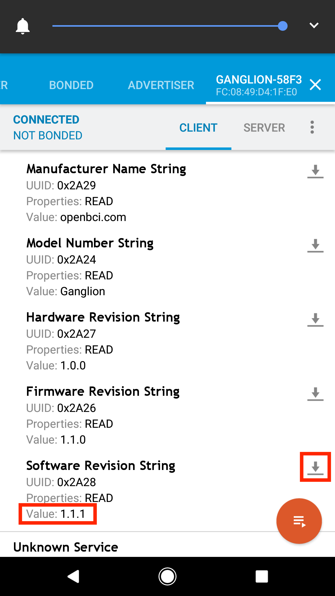

Tap the `Device Information` service, and it will open up to show you the following information.  
**NOTE:** You may need to tap the screen to read this data.

* Manufacturer Name String
* Model Number String
* Hardware Revision String
* Firmware Revision String
* Software Revision String

You should see `openbci.com` as the Manufacturer, `Gagnlion` as the Model Number, and `1.1.1` as the **Software Revision String**. The Hardware and Firmware versions are generated by the Simblee itself.  
**IMPORTANT NOTE: If the Software Revision String is earlier than 1.1.1 you *cannot do OTA* until you follow the Hardware Upload Tutoral at the bottom of this page.**  

## Using Your Mobile Device To Do OTA Programming

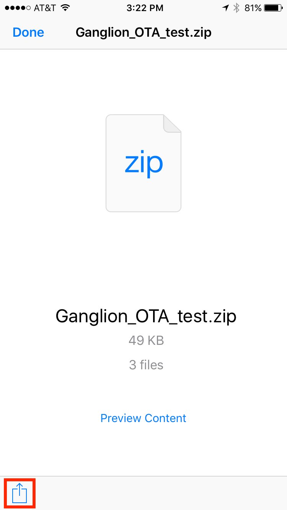
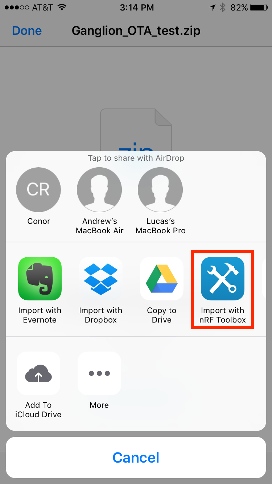

Now we need to get the `.zip` file from your Arduinn Sketch folder to your iPhone. In this example, I'm going to use email. Email the `.zip` file to yourself, and then open and download it on your iPhone. Tap the sharing options in the lower left corner and select the `Import with nRF Toolbox` option. Since you have already installed nRF Toolbox, the `DFU` tool will open with the downloaded file already selected.

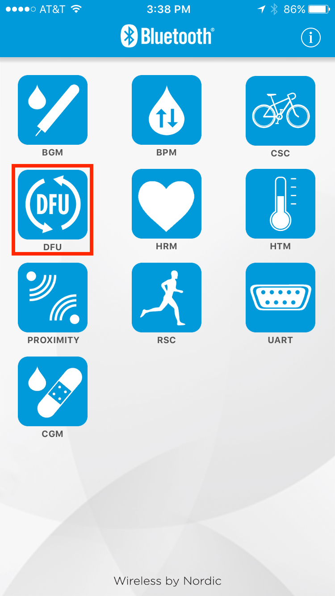
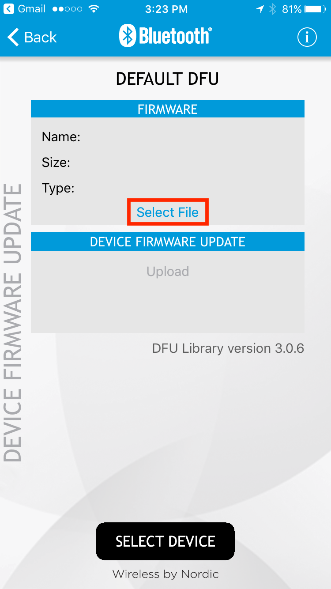
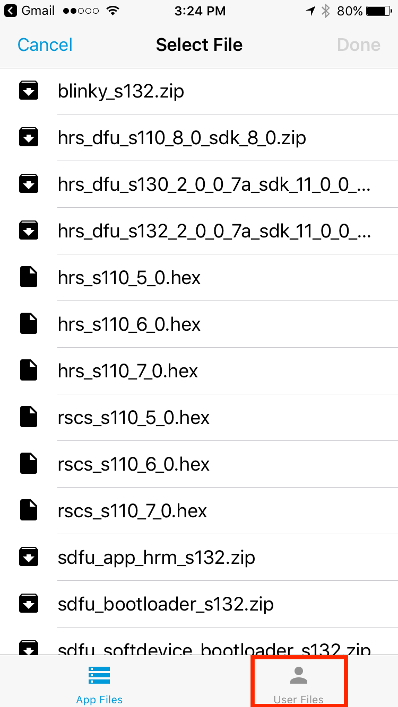
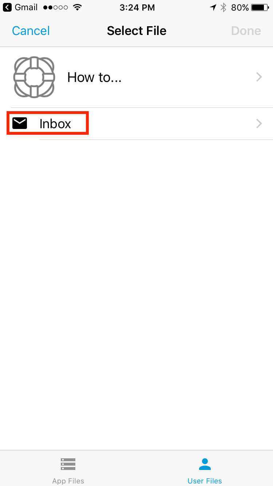
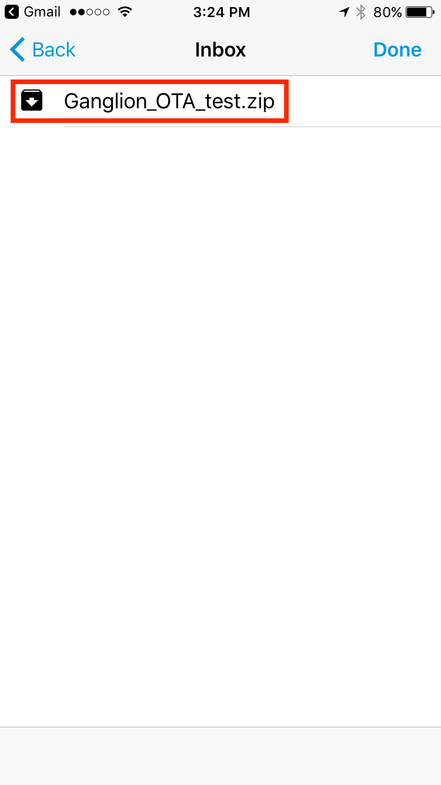

If you ever want to re-upload a program that you already have on your phone, select the `DFU` tool after launching the nRF Toolbox app. Tap the `Select File` button, and on the next screen at the bottom you will see an option for `User Files`. Select that, and then `Inbox` on the next screen to choose from all of your nRF Imported files. 

## Program Ganglion Using Hardware

The first Ganglions that were shipped out have firmware that will not allow for OTA programming. The problem came from using a 'virtual EEPROM' in the code. **If you ordered your Ganglion before 2/27/17 you will need to go through this process before you can program OTA.** After doing this once, you will not need to do it again!

### What You Need

* FTDI Breakout or OpenBCI Cyton Dongle
* 0.1uF Capacitor 
* Jumper Wires
* Arduino IDE v

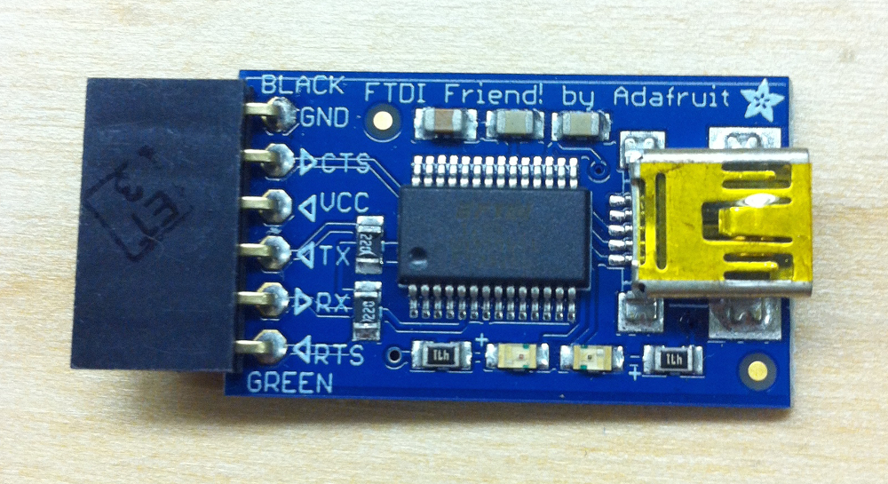
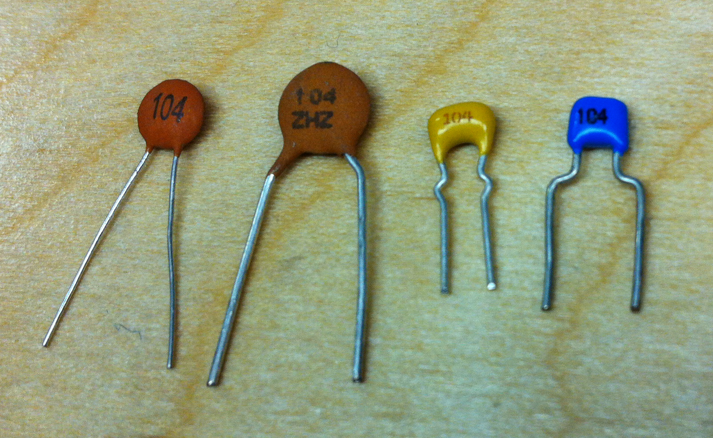
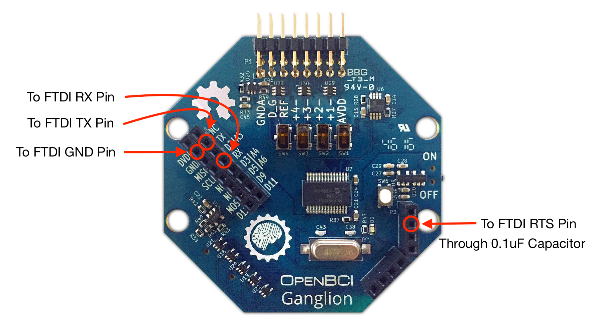

For this tutorial, I will use the [Adafruit FTDI Friend](https://www.adafruit.com/products/284). You can use any FTDI breakout, as long as it uses **only 3V for logic levels**. If you go to Adafruit to purchase one, you can also pick up some [jumper wires](https://www.adafruit.com/products/758), and [0.1uF Capacitors](https://www.adafruit.com/products/753) as well.  
**IMPORTANT NOTE: THE GANGLION IS A 3V DEVICE! YOU MUST NEVER CONNECT ANY HIGHER VOLTAGE SOURCE TO ANY OF THE PINS!**  
The 0.1uF capacitor needs to be inbetween the`RESET` pin of the Ganglion and the `RTS` pin of the FTDI breakout. 

### Set Up Arduino to Program Your Ganglion

If you don't already have the Arduino IDE software on your computer, go [here](https://www.arduino.cc/en/Main/Software) to download the latest version for macOS.  
Then, follow the instructions in the [Simblee Quick Start Guide](https://www.simblee.com/Simblee_Quickstart_Guide_v1.1.0.pdf) to install the Simblee board files in Arduino for macOS.  

### Modify The Simblee Board Files 

In order to program the Simblee to communicate and control the Ganglion, we need to make a quick change to the `variants.h` file in the Simblee folder that you just loaded into Arduino. Naviage to the folder   `/Applications/Arduino.app/Contents/Java/portable/packages`  
`/Simblee/hardware/Simblee/1.1.0/variants/Simblee`,  
and you will find the file called `variant.h`. Open this file up in the editor of your choice, and change the pin defines as shown.  
**NOTE** To access the application contents, right click on the application [or `control` + left click] and select `Show Package Contents`.

| define  | DEFAULT  | Change To |
|:----- |:------:| :-------:|
| PIN_SPI_SS     | 6u | 26u |
| PIN_SPI_MOSI   | 5u | 18u |
| PIN_SPI_MISO   | 3u | 15u | 
| PIN_SPI_SCK    | 4u | 16u |   

Make sure to **save** and close the file.  
**IMPORTANT NOTE:** If you don't do this, your Ganglion will not work after you reprogram it!

### Get The Ganglion Library

Go to our gihub repo and either clone or download the [OpenBCI_Ganglion_Library](https://github.com/OpenBCI/OpenBCI_Ganglion_Library). Move the folder called `OpenBCI_Ganglion_Library` into your `Documents/Arduino/libraries` folder. If you don't have a `libraries` folder there, go ahead and make one.  

Launch, or relaunch the Arduino IDE, and open the  
`File > Examples > OpenBCI_Ganglion_Library > DefaultGanglion`  
sketch. Make sure that you select the correct Serial Port from the `Tools > Port` menu, and also select Simblee from the `Tools > Board` menu.  

With your wires all connected correctly, you should be able to click the `Upload` button and successfully re-program the Ganglion. Now you're ready to do OTA Programming!

