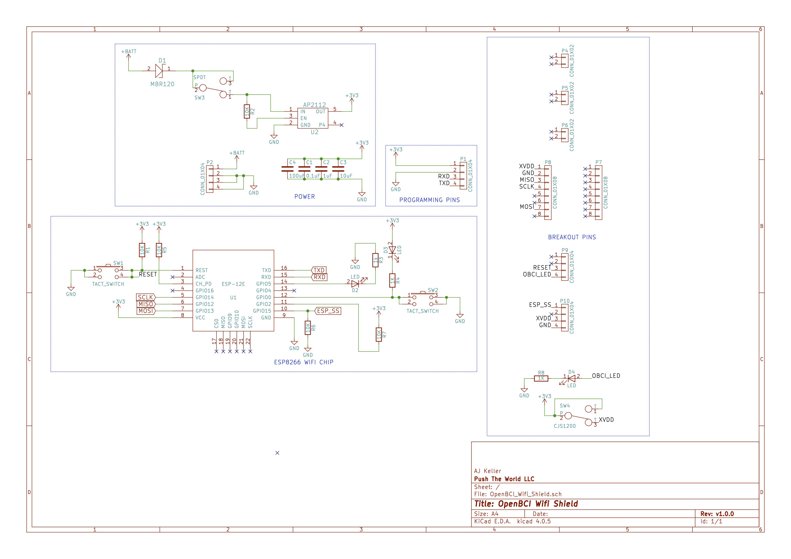
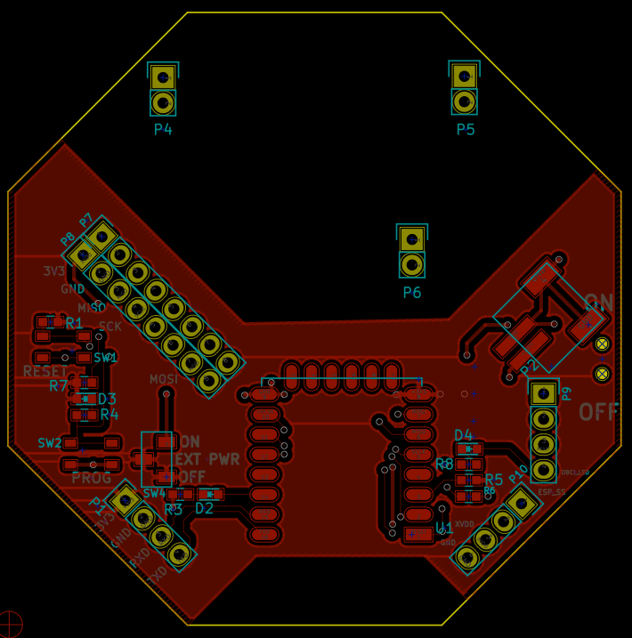
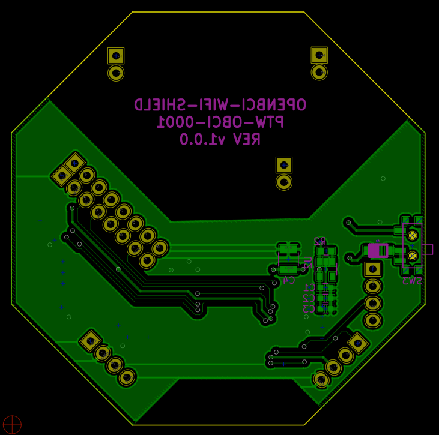

# OpenBCI Wifi

**These docs are open source, if you see a typo [please open an issue](https://github.com/OpenBCI/Docs/issues/new).**

The OpenBCI Wifi Shield was designed in partnership with [Push The World](www.pushtheworld.us). The OpenBCI Wifi PCB was designed with KiCAD, an Open Source PCB capture software. You can find a link to download KiCAD in our [OpenBCI design files repository](https://github.com/OpenBCI/OpenBCI_Wifi_Shield) where you will find design files and component library files to load into KiCAD and edit, if you like, along with the full BOM for this maiden production run.

## About the WiFi Shield

### Wifi Board Specs

* Power with 3.3V to 6V DC battery ONLY
* Current Draw: 150mA connected and streaming data
* [ESP8266](http://www.esp8266.com) Wifi module (Arduino Compatible)
* Board Dimensions 2.41" x 2.41" (octagon has 1" edges)
* JST Power input
* Switch to stop power to external board

### Wifi Board Circuit Schematic

### Wifi Board PCB Layer Images  

Top Layer  
  
Bottom Layer  
  

### Buttons

The top push button, `RESET`, is a reset button that will power cycle the ESP8266 chip. Don't press the `RESET` button when a Ganglion is attached, if you want to power cycle the WiFi Shield, send a `;` command to the Ganglion or Cyton to trigger a power on reset of the WiFi Shield. The bottom button, `PROG`, is use for programming the WiFi Shield over serial UART and is hooked up to GPIO 0.
