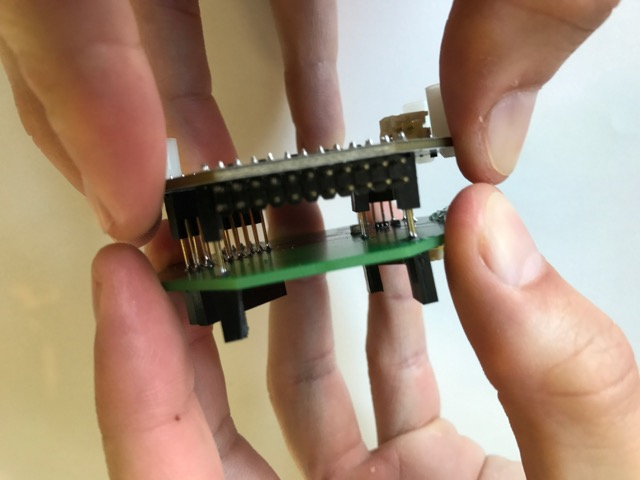
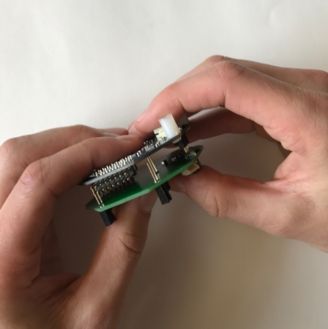
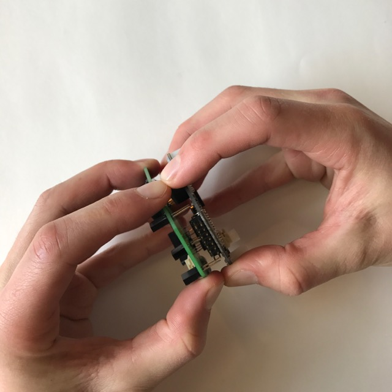
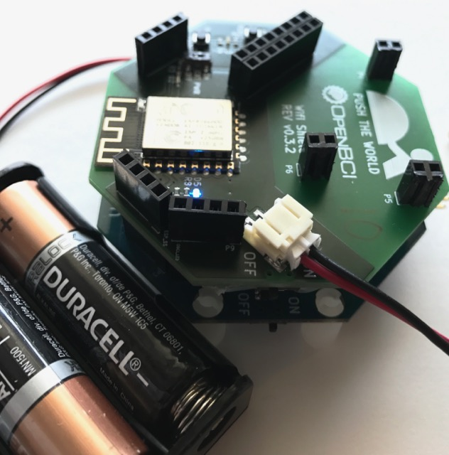

# OpenBCI Wifi

**These docs are open source, if you see a typo [please open an issue](https://github.com/OpenBCI/Docs/issues/new).**

The OpenBCI Wifi Shield was designed in partnership with [Push The World](www.pushtheworld.us). The OpenBCI Wifi PCB was designed with KiCAD, an Open Source PCB capture software. You can find a link to download KiCAD in our [OpenBCI design files repository](https://github.com/OpenBCI/OpenBCI_Wifi_Shield) where you will find design files and component library files to load into KiCAD and edit, if you like, along with the full BOM for this maiden production run.

## About the WiFi Shield

### Wifi Board Specs

* Power with 3.3V to 6V DC battery ONLY
* Current Draw: 150mA connected and streaming data
* [ESP8266](http://www.esp8266.com) Wifi module (Arduino Compatible)
* Board Dimensions 2.41" x 2.41" (octagon has 1" edges)
* JST Power input
* Switch to stop power to external board

### Wifi Board Circuit Schematic

### Wifi Board PCB Layer Images  

Top Layer  
  
Bottom Layer  
  

### Buttons

The top push button, `RESET`, is a reset button that will power cycle the ESP8266 chip. Don't press the `RESET` button when a Ganglion is attached, if you want to power cycle the WiFi Shield, send a `;` command to the Ganglion or Cyton to trigger a power on reset of the WiFi Shield. The bottom button, `PROG`, is use for programming the WiFi Shield over serial UART and is hooked up to GPIO 0.

#### Ganglion Note
You can flip the power switch on and then off on the Ganglion which will trigger a power on reset of the WiFi Shield. Be sure to always have your `EXT PWR` switch in the `OFF` position with the Ganglion!

## Interfacing with the Cyton

Install 4 AA batteries in your battery pack or charge up your LiPo battery. The Wifi shield has a 4-5x larger power draw then the Bluetooth communication system so we recommend using LiPo battery packs. You can keep the `EXT PWR` switch `ON` to passthrough power to the Cyton, more on this in the section below titled _Powering the Shield_.

### Seating the Wifi Shield

Remove power to your Cyton and/or Wifi shield.

First line up the big header.

Then line up the front analog pins.

Finally once all the pins are lined up, you can press straight down to fully seat the wifi shield onto it's new Cyton home :)

### Removing the Wifi Shield

Remove power to your Cyton and/or Wifi shield.

Either wiggle the board slowly off

Slowly...

Or pull the shield straight off to avoid bending the pins.

### Powering the Shield

**IMPORTANT! Keep the dip switch labeled `EXT PWR` to `ON` when using Cyton.**

The Wifi Shield and the Cyton board use only one battery by means of the JST connector on the Wifi shield. Passing through power to the Cyton requries having the `EXT PWR` switch in the `ON` position.

The pass through LED on the wifi shield will show the classic _pleasant_ blue LED when powered up!

Make sure that the external power switch is set to `ON` to send power through to the Cyton board.

The Cyton is not able to supply enough current to power the power-hungry wifi shield, so we put a bigger voltage regulator on the shield to power both the Wifi chip and pass the Cyton components.

## Interfacing with Ganglion

Install 4 AA batteries into your two battery packs or charge up your LiPo batteries. The Wifi shield has a 10x larger power draw then the Ganglion communication system so we recommend using LiPo to power the Wifi Shield! Please review _Powering The Shield_ below to properly power the system.

### Seating the Wifi Shield

Make sure the batteries are disconnected from both the Ganglion and the Wifi shield.

To connect the Wifi shield to the Ganglion, first line up the big header pins on the Wifi shield to the Ganglion's female headers, like in the picture below:

Then line up the two four pin headers.

Finally once all the pins are lined up, you can press straight down to fully seat the wifi shield onto it's new Ganglion home :)

### Removing the Wifi Shield

Remove power to your Ganglion and/or Wifi shield.

Wiggle the board slowly off

Or pull the shield straight off to avoid bending the pins.

### Powering the Shield

**IMPORTANT! Keep the dip switch labeled `EXT PWR` to `OFF` when using Ganglion.** As of today, the Wifi shield cannot pass through power to the Ganglion, therefore you must use two batteries.
**Always turn the Wifi on before the Ganglion.** Your Ganglion cannot be powered from the Wifi shield, but the Ganglion can send reset signals to Wifi shield to reset it via software. Therefore you will need two sets of batteries (battery packs or LiPo) in order to use the Ganglion and Wifi shield together.

When the Ganglion is on, the pass through LED on the Wifi shield will show the classic _pleasant_ blue LED when powered up!

Verify that the external power switch is set to `OFF` to **NOT** power through to the Ganglion board.

The Ganglion is not able to supply enough current to power the power-hungry wifi shield, so we put a bigger voltage regulator on the shield. In the future, the wifi shield will be able to power the Ganglion too.

## Sending Data to WiFi Shield

### Overview

The WiFi Shield acts a SPI slave device to the Cyton or Ganglion. The max speed the ESP8266 can seem to handle is 10MHz. A [SPISlave example](https://github.com/esp8266/Arduino/blob/master/libraries/SPISlave/examples/SPISlave_Test/SPISlave_Test.ino) we based our [Wifi](https://github.com/OpenBCI/OpenBCI_WIFI/blob/master/examples/DefaultBoard/DefaultBoard.ino) code on. To interact with this SPI slave library, (you wanted to use this WiFi Shield for some other reason...) you should look at the [SPI Master example](https://github.com/esp8266/Arduino/blob/master/libraries/SPISlave/examples/SPISlave_Master/SPISlave_Master.ino) because the commands to get data vs read a status register are strictly defined and must be followed. The first constraint the Arduino ESP8266 SPI slave places on us is to always send 32 bytes per message. This library says that each packet must be 32 bytes, so that's where we begin....

### Byte Stream Format
The first byte to send is the control byte. For streaming data, that goes on the TCP socket, send `0xCX` (where `X` is `0-F` in hex) as the control byte. In the `OpenBCI_32bit_Library` code base:

~~~
/*  
 * @description Writes channel data and axisData array to serial port in
 *  the correct stream packet format.
 */
void OpenBCI_32bit_Library::sendChannelDataWifi(void)  {

    wifiStoreByte(OPENBCI_EOP_STND_ACCEL); // 0xC0 1 byte

    wifiStoreByte(sampleCounter); // 1 byte

    ADS_writeChannelDataWifi(); // 24 bytes

    accelWriteAxisDataWifi(); // 6 bytes

    wifiFlushBuffer(); // Flushes the buffer to the SPISlave ESP8266 device!

    sampleCounter++;

}
~~~  

This code writes 32 bytes of data in the correct format and therefore as soon as it arrives at the WiFi Shield. The WiFi Shield will convert the 32 byte packet to the standard 33 byte [binary format](http://docs.openbci.com/Hardware/03-Cyton_Data_Format#cyton-data-format-binary-format) by moving the control byte `0xCn`, where `n` is `0-F` (hex), to the stop position and add add `0xA0` to the start position. This allows for a seamless integration with the tried and tested parsing systems already built for the Cyton.
**Important** if you want to only send `20` bytes of data per packet, you still must send this `32` bytes with the proper start and stop bytes.
