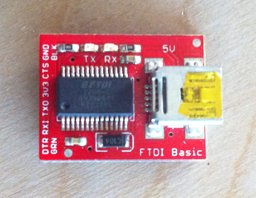

# Wifi Shield Programming Tutorial

**The Wifi shield and these docs are still in beta, if you see a typo [please open an issue](https://github.com/OpenBCI/Docs/issues/new).**

##Overview
The OpenBCI Wifi Shield can be programmed over the air or through a direct connection to the serial port on the wifi shield itself. Over the air is the preferred way to update your WiFi Shield. For the wired programming, you can use the USB dongle that comes with the Cyton as a pass through or you can use a standard [FTDI UART to USB Breakout board](http://docs.openbci.com/Hardware/12-Wifi_Programming_Tutorial#wifi-shield-programming-tutorial-program-openbci-wifi-with-ftdi-boards).

## Program OpenBCI WiFi Over The Air

**CRITICAL: REMOVE THE WIFI SHIELD FROM CYTON OR GANGLION. KEEP BOARD ISOLATED DURING UPDATE**

Download the latest stable released binary from the [Github page](https://github.com/OpenBCI/OpenBCI_WIFI/releases/latest). Save to downloads folder.

### Mac

Go to http://OpenBCI-2F0E.local/update where `2F0E` is your devices unique identifier. You may use the _windows_ ip based instructions too.

### Windows/Linux

Get the ip address of your wifi shield and visit http://192.168.0.1/update.

### Uploading The Firmware

Be sure that the WiFi Shield is not **physically** connected to either a Ganglion or Cyton.

Select choose file and navigate to your Downloads folder where the recently downloaded hex file is, select the hex file and press ok. Then hit the `upload` button, the shield will accept the firmware and reboot.

## Compile source code Program OpenBCI Wifi with Arduino

**You will need:**

* Computer (Windows or Mac or Other)
* OpenBCI [Wifi Shield firmware](https://github.com/OpenBCI/OpenBCI_WIFI)
* [Arduino IDE Version 1.8.2](http://www.arduino.cc/en/main/software)
* Custom [ESP8266 libraries with SPISlave](https://github.com/esp8266/Arduino)

**Steps:**

1. Download and install the [Arduino IDE Version 1.8.2](http://www.arduino.cc/en/main/software).

   On Windows be sure to download the file marked `Windows Installer`.

   On Mac download the `MAC OS X` version, unzip the app and move it into Applications folder.

2. Follow the instructions for downloading the [Arduino ESP8266 core from Boards Manager](https://github.com/esp8266/Arduino). **NOTE** because `SPISlave.h` is newly added to the official SDK, be sure to use 2.4.0 or newer!

## Compile Source Code with make

While developing this firmware, we found it much better to use [makeESPArduino](https://github.com/plerup/makeEspArduino) which is a command line tool for building and compiling the firmware without having to use the Arduino IDE! Use the `makeESPWifiDefault.mk` file in the [WiFi's githuv repo](https://github.com/OpenBCI/OpenBCI_WIFI)

## Program OpenBCI Wifi with FTDI Boards

There are many, many FTDI chip breakouts and cables out there that you can use. Here are a couple examples of popular devices.

### FTDI Friend

Another example would be the [FTDI Friend](http://www.adafruit.com/products/284) from Adafruit. I cut the trace on the RTS and 5V pads as well. These are the correct settings for uploading to ESP8266 using FTDI Friend. These breakouts are awesome and how the board was developed.

### FTDI Basic Breakout

Sparkfun makes an FTDI breakout as well, and they come in a couple of flavors. 5V and 3V. By now, you know that you want the [3V Version](https://www.sparkfun.com/products/9873). [pic coming soon] Also, if you have a version of this board with a voltage selection on the back, make sure that it has the 3.3V pads connected and the 5V pads cut!  

### OpenBCI Cyton Dongle

The OpenBCI Dongle can be used to upload firmware to ESP8266. [See the section](http://docs.openbci.com/Hardware/06-Cyton_Radios_Programming_Tutorial#cyton-radios-programming-tutorial-uploading-device-firmware-to-cyton-board-upload-pass-thru-radio-firmware-version-2xx-fall-2016) on how to [pass through the code](http://docs.openbci.com/Hardware/06-Cyton_Radios_Programming_Tutorial#cyton-radios-programming-tutorial-uploading-device-firmware-to-cyton-board-program-device-radio-with-openbci-dongle) in the [Cyton Radio Programming Guide](http://docs.openbci.com/Hardware/06-Cyton_Radios_Programming_Tutorial).

## Wired upload

### Getting the board in boot-loading mode

Wether you are using `makeESPArduino` or the Arduino IDE, the steps to get the board into boot-loading are as follows.

Remove your Wifi Shield from the Cyton/Ganglion board.

First, plug in battery to the wifi shield

Second power the Wifi shield

Then press and hold the `RESET` button.

Then press and hold the `PROG` button.

Release the `RESET` button

And finally release the `PROG` button

Now the board is ready to get hit with some new firmware!

Hook up the FTDI friend to the Wifi Shield, don't power the Wifi shield through the FTDI friend, it will not supply enough power!

|FTDI_Friend|Wifi Shield|
|-----------|-----------|
|GND|GND|
|RX|TX|
|TX|RX|

Now upload using either the Arduino IDE or a custom make solution.

## Connecting to the Wifi Shield

Be sure that your WiFi Shield is on your local network. Please continue reading if your OpenBCI Wifi Shield is on the same wifi network as your computer.

The steps for connecting to the Wifi Shield and streaming over TCP:

1. Get Wifi Shield On Your Wireless Network
2. Find IP Address of Wifi Shield
3. Open a TCP Socket on Host Computer
4. Send `POST` `/tcp` http request with open socket IP/Port number, can include options for output format (i.e. JSON or RAW output), along with latency.
5. Send `POST` `/command` http requests for control or for just streaming use GET `/stream/start` or GET `/stream/stop`
6. Send `POST` `/latency` http requests for tuning, if packets are dropped because older router or poor connection.

The steps for connecting to the Wifi Shield and streaming over MQTT:

1. Get Wifi Shield On Your Wireless Network
2. Find IP Address of Wifi Shield
3. Open a TCP Socket on Host Computer
4. Send `POST` `/mqtt` http request with broker address with optional username and password
5. Send `POST` `/command` http requests for control

## Get IP Address of Wifi Shield

Use [Simple Service Discovery Protocol](https://en.wikipedia.org/wiki/Simple_Service_Discovery_Protocol) (SSDP) to find the device on your local network. Use a tool in your favorite language [Python](http://brisa.garage.maemo.org/doc/html/upnp/ssdp.html) | [Node.js](https://github.com/diversario/node-ssdp) | [C](https://developer.gnome.org/gssdp/stable/).

The [Node.js SDK](https://github.com/aj-ptw/OpenBCI_NodeJS/blob/wifi/examples/getStreamingWifi/getStreamingWifi.js) which will implement SSDP for you.

Use a graphical user interface [Mac - Lan Scan](https://itunes.apple.com/us/app/lanscan/id472226235?mt=12)

We are still hashing out the best ways to discover the Wifi shield on the networks (home vs. enterprise and beyond) so [please contribute ides if you have any on this github issue](https://github.com/OpenBCI/OpenBCI_WIFI/issues/8) and we can add it in! [Wifi Direct Feature Request (researcher frequently requested feature)](https://github.com/OpenBCI/OpenBCI_WIFI/issues/9)

## Open a TCP Socket on Host Computer

In order to get low latency high-reliability wireless data transmission we will open a TCP socket on your host Computer. The Wifi Shield will stream data to this socket. **IMPORTANT** The data comes over this socket raw and is defined in the docs for [Binary Data Format](http://docs.openbci.com/Hardware/03-Cyton_Data_Format#cyton-data-format-binary-format).

If you want the data in another format, please comment on [this issue](https://github.com/OpenBCI/OpenBCI_WIFI/issues/11), thinking protocols like `JSON`.

## OpenBCI HTTP Rest Server

### Send `/tcp` http request for TCP configuration

Refer to [http server description](https://app.swaggerhub.com/apis/pushtheworld/openbci-wifi-server/1.3.0) swagger.io page as the single source of truth in regards to the OpenBCI Wifi Server.

### Send `/mqtt` http request for MQTT configuration

Refer to [http server description](https://app.swaggerhub.com/apis/pushtheworld/openbci-wifi-server/1.3.0) swagger.io page as the single source of truth in regards to the OpenBCI Wifi Server.

### Send `/command` http requests for control

Refer to [http server description](https://app.swaggerhub.com/apis/pushtheworld/openbci-wifi-server/1.3.0) swagger.io page as the single source of truth in regards to the OpenBCI Wifi Server. To change the sample rate of the Cyton, please use the `~` command as defined in the Cyton SDK docs.

### Send `/latency` http requests for tuning

Refer to [http server description](https://app.swaggerhub.com/apis/pushtheworld/openbci-wifi-server/1.3.0) swagger.io page as the single source of truth in regards to the OpenBCI Wifi Server.

The time in micro seconds (us) between packet sends. The higher the OpenBCI sample rate, the higher the latency needed. Default is 1000us, minimum stable is 50us. For upper limit sample rates such as 4kHz/8kHz/16kHz, latency around 20ms seems to really stabilize the system.  
