#Ultracortex Mark IV

*Development Period: January to November 2016*

 

####Complete Ultracortex Mark 4 kits are [available for sale](http://shop.openbci.com/collections/frontpage/products/ultracortex-mark-iv) in the OpenBCI Online Store!

The Ultracortex is an open-source, 3D-printable headset intended to work with the [OpenBCI system](http://openbci.com/). It is capable of recording research-grade brain activity (EEG), muscle activity (EMG), and heart activity (ECG). The Ultracortex is under constant iteration. If you print/assemble your own Ultracortex, we would love to hear your feedback. Send us an email at [contact@openbci.com](mailto:contact@openbci.com) or Tweet at us ([@Ultracortex](https://twitter.com/Ultracortex) & [@OpenBCI](https://twitter.com/OpenBCI))!

Designers & Engineers:

* [Aaron Lehr (aka Tangible NYC)](https://www.3dhubs.com/service/tangiblenyc)
* [Aaron Trocola (aka Threeform)](http://threeformfashion.com/)
* [Conor Russomanno](https://twitter.com/russomanno15)
* [Joel Murphy (aka SafeForRobots)](https://twitter.com/safeforrobots)

## THE COMPLETE ULTRACORTEX

**Note:** the part quantities listed below assume you are making an electrode holder for all 35 nodes of the Ultracortex Mark 4. In reality, you will likely have only 8 or 16 electrodes, depending on whether you are working with the [OpenBCI Cyton Board](http://openbci.myshopify.com/collections/frontpage/products/openbci-32-bit-board-kit) (8 channels) or the [OpenBCI 16-channel R&D Kit](http://openbci.myshopify.com/collections/frontpage/products/openbci-16-channel-r-d-kit) (16 channels). In general, more electrodes will distribute the downward scalp pressure, increasing comfort.

###3D-printed Parts:

The following parts are included in the Unassembled version of the Mark IV:

* [FRAME](https://github.com/OpenBCI/Docs/tree/master/assets/MarkIV/STL_Directory) (head circumference: small = 42-50cm, medium = 48-58cm, large = 58-65cm)
	* FRAME_FRONT (**x1**) — .STLs ([small](https://github.com/OpenBCI/Docs/raw/master/assets/MarkIV/STL_Directory/M4_Small_Front.stl) / [medium](https://github.com/OpenBCI/Docs/raw/master/assets/MarkIV/STL_Directory/M4_Medium_Front.stl) / [large](https://github.com/OpenBCI/Docs/raw/master/assets/MarkIV/STL_Directory/M4_Large_Front.stl))
	* FRAME_BACK (**x1**) — .STLs ([small](https://github.com/OpenBCI/Docs/raw/master/assets/MarkIV/STL_Directory/M4_Small_Back.stl) / [medium](https://github.com/OpenBCI/Docs/raw/master/assets/MarkIV/STL_Directory/M4_Medium_Back.stl) / [large](https://github.com/OpenBCI/Docs/raw/master/assets/MarkIV/STL_Directory/M4_Large_Back.stl))
	* You can also print the frame in quarters or print the full frame. The .stl files are found [here](https://github.com/OpenBCI/Docs/tree/master/assets/MarkIV/STL_Directory/Mark_IV_Frame).
* MECH_PARTS
	* INSERT (**x35**) — .STLs ([tight](https://github.com/OpenBCI/Docs/raw/master/assets/MarkIV/STL_Directory/M4_Hardware_insert_105dot5_percent.STL) / [loose](https://github.com/OpenBCI/Docs/raw/master/assets/MarkIV/STL_Directory/M4_Hardware_insert_106_percent.STL)) (Choose one configuration and modify accordingly)
* [BOARD_MOUNT](https://github.com/OpenBCI/Docs/blob/master/assets/MarkIV/STL_Directory/M4%20Board_Mount.stl) (**x1**) — [.STL download link](https://github.com/OpenBCI/Docs/raw/master/assets/MarkIV/STL_Directory/M4%20Board_Mount.stl)
* BOARD_COVER (**x1**) 
	* [BOARD COVER](https://github.com/OpenBCI/Docs/blob/master/assets/MarkIV/STL_Directory/M4%20Board_Cover.stl) — [.STL download link](https://github.com/OpenBCI/Docs/raw/master/assets/MarkIV/STL_Directory/M4%20Board_Cover.stl)
* WIRE_CLIPS (**x30**) 
	* [WIRE CLIPS](https://github.com/OpenBCI/Docs/blob/master/assets/MarkIV/STL_Directory/M4_Wire_Clip.stl) (lips will be used to hold wire in place) — [.STL download link](https://github.com/OpenBCI/Docs/raw/master/assets/MarkIV/STL_Directory/M4_Wire_Clip.stl)

###Non-printed Parts:

**Note that unlike the Mark III, the electrodes and the electrode holders of the Mark IV are not designed to be 3D printed. The Spikey, Flat, and Comfort Units are all custom made and injection molded and can be purchased at the [OpenBCI shop](shop.openbci.com). If you need thse files for prototyping you can find them [here](https://github.com/OpenBCI/Docs/tree/master/assets/MarkIV/STL_Directory/Injection_Molded_Parts).** 

The following parts are included in the Unassembled and the Print it Yourself versions of the Mark IV:

* (**2x**)* [#4 Screws for Brittle Plastic](https://www.mcmaster.com/#97349A100)
* Cables (**x3**)
	* We strip apart the Cables in your kit (https://github.com/OpenBCI/Docs/blob/master/assets/MarkIV/Photos/Cables.JPG) 
* Spikey units
	* (**6x or 14x**) Depending on a 8 or 16 channel heas set dry (spikey) electrodes to be installed in Ultracortex nodes with hair: (https://github.com/OpenBCI/Docs/blob/master/assets/MarkIV/Photos/SpikeyUnits8chan.JPG)
* Flat units
	* (**2x**) Dry (non-spikey) electrodes to be installed in Ultracortex nodes without hair (forehead, for instance): (https://github.com/OpenBCI/Docs/blob/master/assets/MarkIV/Photos/FlatUnits.JPG)
* Comfort units
	* (**5x**) Comfort units used for relieving weight reuse of headsett: (https://github.com/OpenBCI/Docs/blob/master/assets/MarkIV/Photos/ConfortUnits.JPG)	
	
* Ear Clips
	* (**2x**) Ear Clip electrode: (https://github.com/OpenBCI/Docs/blob/master/assets/MarkIV/Photos/EarClips.JPG)
	
The following parts are not included with the purchase of any configuration of the Mark IV and should be purchased separately:

* (**1x**) An [OpenBCI Cyton Board](http://openbci.myshopify.com/collections/frontpage/products/openbci-32-bit-board-kit) or an [OpenBCI 16-channel R&D Kit](http://openbci.myshopify.com/collections/frontpage/products/openbci-16-channel-r-d-kit)
* (**1x**) Lithium Ion Rechargeable Battery Pack (~500mAh) — [Sparkfun](https://www.sparkfun.com/products/10718) or [Adafruit](http://www.adafruit.com/products/1578)
* (**1x**) [A charger for your battery pack](https://www.adafruit.com/products/1304)

## THE COMPLETE ULTRACORTEX (w/ PICTURES)

###3D-printed Parts:

####(1x) FRAME

* FRAME (head circumference: small = 42-50cm, medium = 48-58cm, large = 58-65cm)
	* FRAME_FRONT (**x1**) — .STLs ([small](https://github.com/OpenBCI/Docs/raw/master/assets/MarkIV/STL_Directory/M4_Small_Front.stl) / [medium](https://github.com/OpenBCI/Docs/raw/master/assets/MarkIV/STL_Directory/M4_Medium_Front.stl) / [large](https://github.com/OpenBCI/Docs/raw/master/assets/MarkIV/STL_Directory/M4_Large_Front.stl) )
	* FRAME_BACK (**x1**) — .STLs ([small](https://github.com/OpenBCI/Docs/raw/master/assets/MarkIV/STL_Directory/M4_Small_Back.stl) / [medium](https://github.com/OpenBCI/Docs/raw/master/assets/MarkIV/STL_Directory/M4_Medium_Back.stl) / [large](https://github.com/OpenBCI/Docs/raw/master/assets/MarkIV/STL_Directory/M4_Large_Back.stl))
	* You can also print the frame in quarters or print the full frame. The .stl files are found [here](https://github.com/OpenBCI/Docs/tree/master/assets/MarkIV/STL_Directory/Mark_IV_Frame).

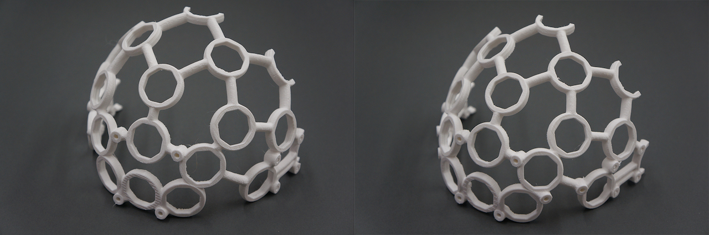

####(21x) MECH_PARTS

* [MECH_PARTS](https://github.com/OpenBCI/Ultracortex/tree/master/Mark_IV/M4_Released/STL's/Mech_Parts/M4_Hardware_insert.STL)
	* [INCERTS](https://github.com/OpenBCI/Ultracortex/tree/master/Mark_IV/M4_Released/STL's/Mech_Parts/M4_Hardware_insert.STL) (**x35**) — .STLs ([tight](https://github.com/OpenBCI/Docs/raw/master/assets/MarkIV/STL_Directory/M4_Hardware_insert_105dot5_percent.STL) / [loose](https://github.com/OpenBCI/Docs/raw/master/assets/MarkIV/STL_Directory/M4_Hardware_insert_106_percent.STL)) (Choose one configuration and modify accordingly)

####(1x) BOARD_HOLDER

* [BOARD_MOUNT](https://github.com/OpenBCI/Docs/blob/master/assets/MarkIV/STL_Directory/M4%20Board_Mount.stl) (**x1**) — [.STL download link](https://github.com/OpenBCI/Docs/raw/master/assets/MarkIV/STL_Directory/M4%20Board_Mount.stl)

####(1x) BOARD_COVER

* [BOARD COVER](**x1**) 
	* [BOARD COVER](https://github.com/OpenBCI/Docs/blob/master/assets/MarkIV/STL_Directory/M4%20Board_Cover.stl) — [.STL download link](https://github.com/OpenBCI/Docs/raw/master/assets/MarkIV/STL_Directory/M4%20Board_Cover.stl)

 

* [WIRE CLIPS](https://github.com/OpenBCI/Docs/blob/master/assets/MarkIV/STL_Directory/M4_Wire_Clip.stl) (lips will be used to hold wire in place) — [.STL download link](https://github.com/OpenBCI/Docs/raw/master/assets/MarkIV/STL_Directory/M4_Wire_Clip.stl)

###Non-printed Parts:

###Non-printed Parts:

**Note that unlike the Mark III, the electrodes and the electrode holders of the Mark IV are not designed to be 3D printed. The Spikey, Flat, and Comfort Units are all custom made and injection molded and can be purchased at the [OpenBCI shop](shop.openbci.com). If you need thse files for prototyping you can find them [here](https://github.com/OpenBCI/Docs/tree/master/assets/MarkIV/STL_Directory/Injection_Molded_Parts).** 

####Suggested screws for fastening BOARD_MOUNT & OpenBCI Board

* (**2x**)* [#4 Screws for Brittle Plastic](https://www.mcmaster.com/#97349A100)

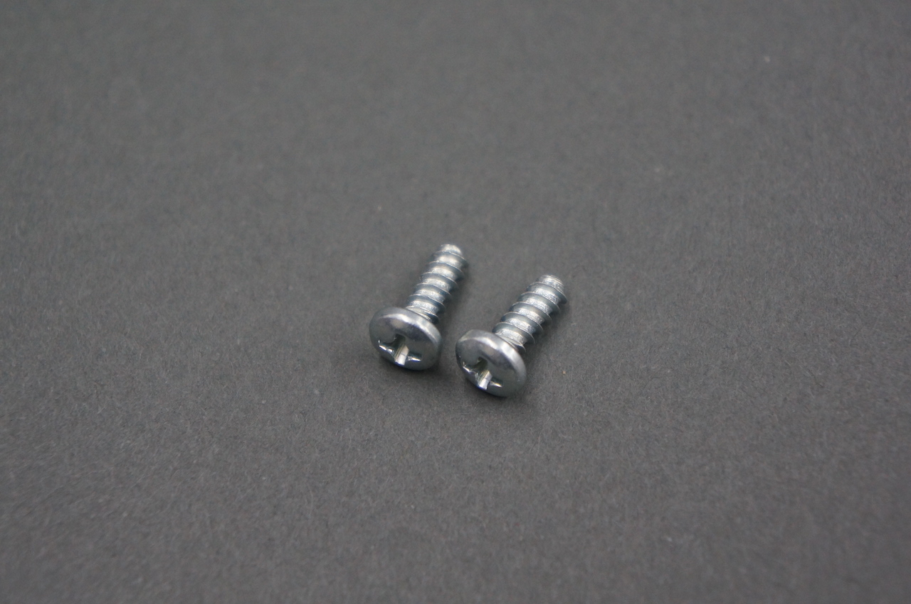

* Cables (**x3**)
	* We strip apart the Cables in your kit (https://github.com/OpenBCI/Docs/blob/master/assets/MarkIV/Photos/Cables.JPG) 
	
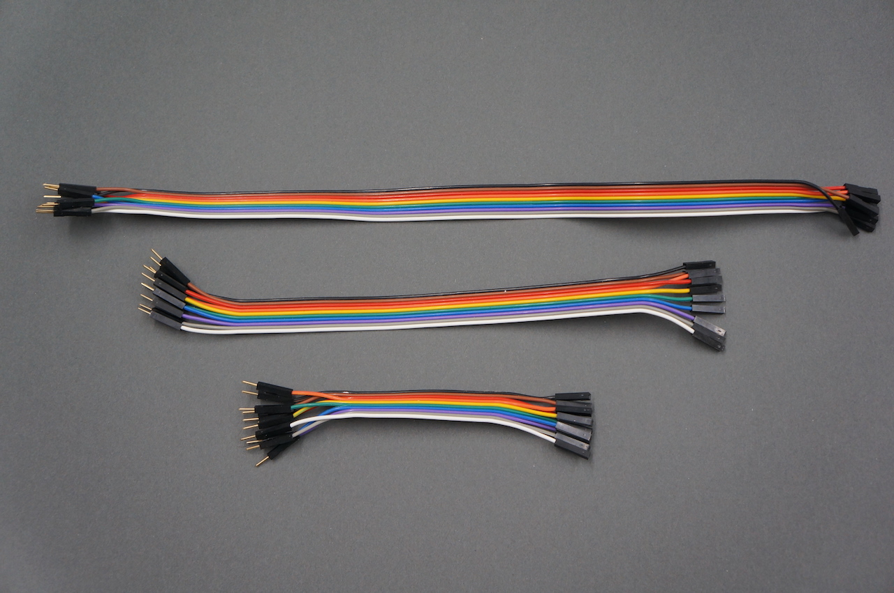

* Spikey units
	* (**6x or 14x**) Depending on a 8 or 16 channel heas set dry (spikey) electrodes to be installed in Ultracortex nodes with hair: (https://github.com/OpenBCI/Docs/blob/master/assets/MarkIV/Photos/SpikeyUnits8chan.JPG)
	
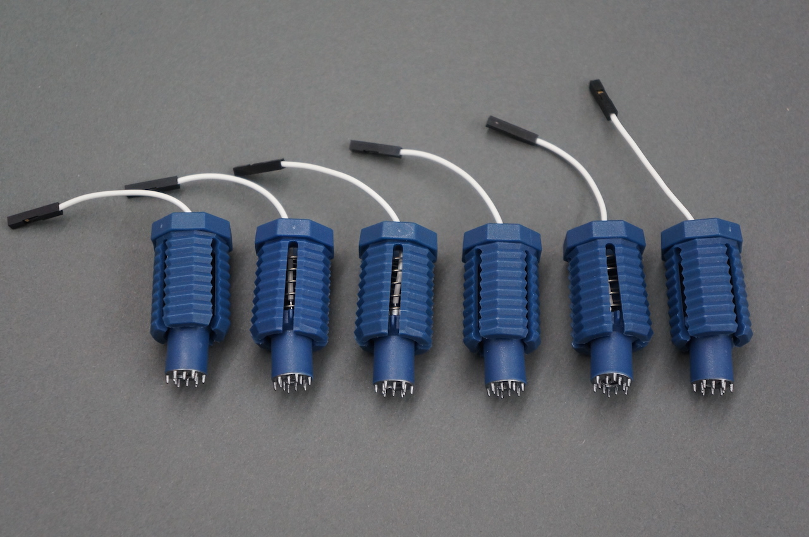

* Flat units
	* (**2x**) Dry (non-spikey) electrodes to be installed in Ultracortex nodes without hair (forehead, for instance): (https://github.com/OpenBCI/Docs/blob/master/assets/MarkIV/Photos/FlatUnits.JPG)
	
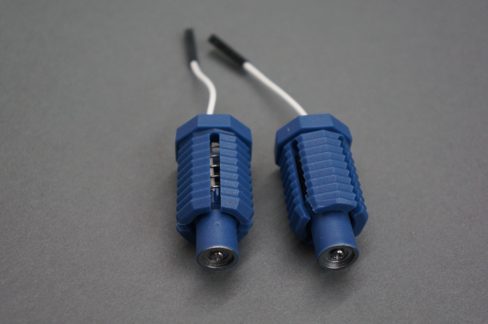

* Comfort units
	* (**5x**) Comfort units used for relieving weight reuse of headsett: (https://github.com/OpenBCI/Docs/blob/master/assets/MarkIV/Photos/ConfortUnits.JPG)
	

	
* Ear Clips
	* (**2x**) Ear Clip electrode: (https://github.com/OpenBCI/Docs/blob/master/assets/MarkIV/Photos/Earclips.JPG)

####(1x) An [OpenBCI Cyton Board](http://openbci.myshopify.com/collections/frontpage/products/openbci-32-bit-board-kit) (8 electrode channels) or an [OpenBCI 16-channel R&D Kit](http://openbci.myshopify.com/collections/frontpage/products/openbci-16-channel-r-d-kit) (16 electrode channels)

####(**1x**) ~500mAh lithium ion rechargeable battery pack ([Sparkfun](https://www.sparkfun.com/products/10718) or [Adafruit](http://www.adafruit.com/products/1578)) & (**1x**) [A charger for your battery pack](https://www.adafruit.com/products/1304)

## SUGGESTED PRINT SETTINGS

* FRAME_FRONT & FRAME_BACK
	* Material: PLA
	* Supports: YES
	* Raft: hopefully NO (but if supports aren't sticking, try the raft)
	* Infill: 20%
	* Layer Height: 0.2mm
	* Number of Shells: 3
	* Speed while extruding: 50-70% (slow it down if possible; these parts are detailed)
* MECH_PARTS (INSERT )
	* Material: PLA
	* Supports: NO
	* Raft: NO
	* Infill: 20%
	* Layer Height: 0.2mm
	* Number of Shells: 3
	* Speed while extruding: 50-70% (slow it down if possible; these parts are detailed)
* BOARD_MOUNT, BOARD_COVER
	* Material: PLA
	* Supports: NO
	* Raft: NO
	* Infill: 20%
	* Layer Height: 0.2mm
	* Number of Shells: 3
	* Speed while extruding: 50-70% (slow it down if possible; these parts are detailed)

## RECOMMENDED ASSEMBLY TOOLS

1. [Loctite Super Glue w/ Cyanoacrylate](http://www.amazon.com/Loctite-1365882-20-Gram-Bottle-Professional/dp/B004Y960MU/ref=sr_1_1?s=automotive&ie=UTF8&qid=1440204266&sr=1-1&keywords=loctite+cyanoacrylate&pebp=1440204267936&perid=0HJQ0FB9G4J9SEBQBVGA)
2. coarse flat & circular files (for removing support artifacts)
3. medium sand paper
4. exacto blade
5. philips head screw driver
6. wire cutters
7. needle-nose pliers
8. snippers

## ASSEMBLY INSTRUCTIONS

### Remove residual support material & print flaws

Use sand paper, a file, and snippers to clean your FRAME and other 3D-printed parts. The most important part of this process is that you thoroughly clean out the frames nodes where you will place your INSERTS pieces.

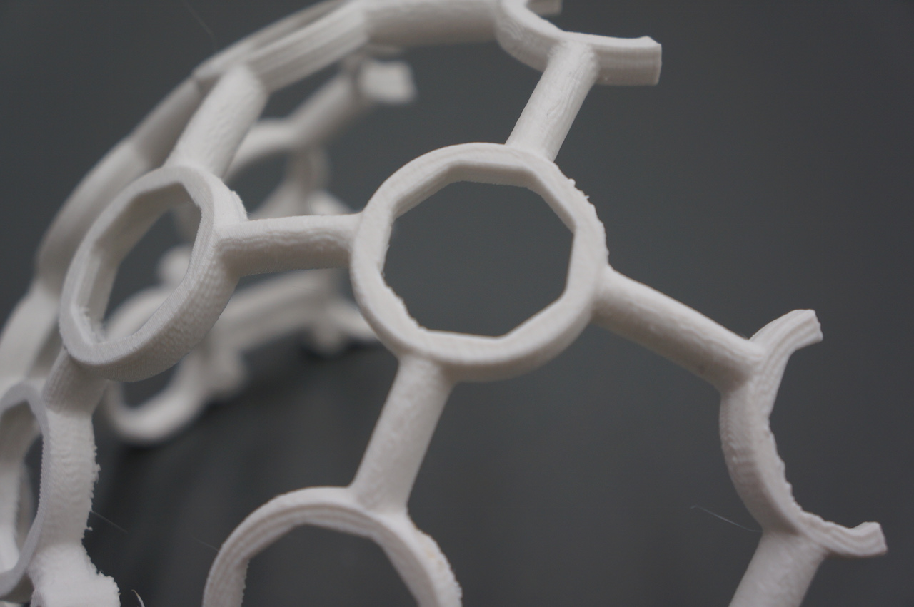

### Glue the FRAME together

Carefully, glue the FRONT FRAME and BACK FRAME together with your Cyanoacrylate super glue. The best way to do this is to place both halves of the frame on a level surface and carefully bring them together. Be sure to be precise; it's VERY difficult to pull the pieces apart once you've put them together.

### Mount the OpenBCI BOARD_MOUNT

Use two screws to mount the M4 Board_Mount to the Frame. Make sure that the orientation of the BOARD_HOLDER matches that of the pictures below:

### Insert INSERTS pieces (x35) into frame

**Note:** Before glueing the INSERTS into the frame ensure, that it fits properly into the frame without glue.

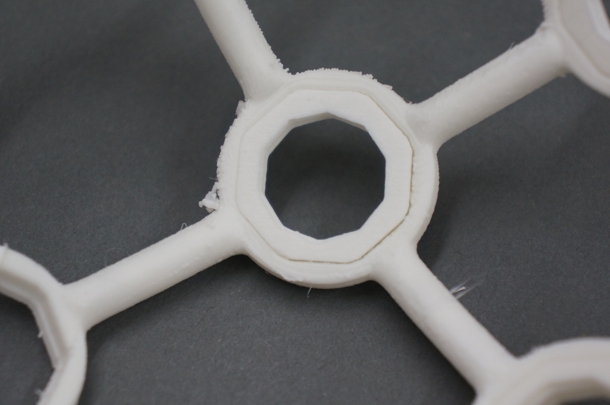

For each INSERT, line the inner rim of frame with glue. Then insert the INSERT so that it is flush with the frame.

Your Ultracortex should now look like this with your 5 COMFORT UNITS screwed in place:

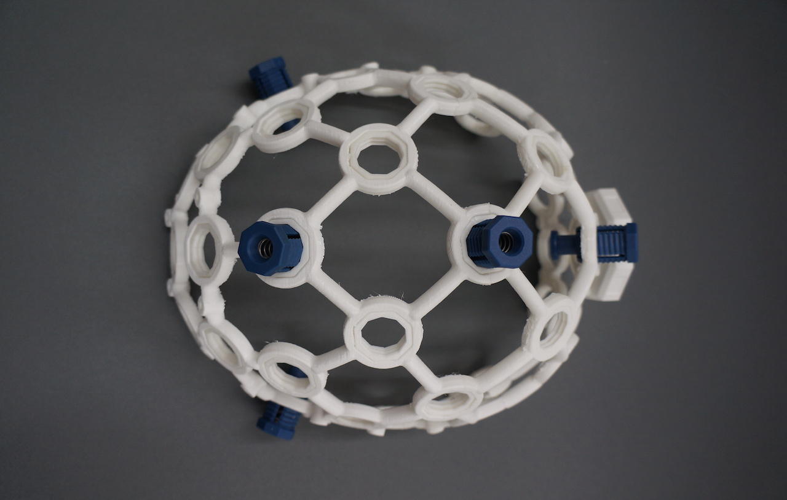

### Embed OpenBCI into the Ultracortex

Connect your ~500 mAh lithium ion rechargeable batter to the back of your Cyton OpenBCI Board. Then fold the battery and its wires neatly behind the board before inserting the board into the BOARD_MOUNT. You can then secure the OpenBCI Board to the BOARD_MOUNT by clipping BOARD_COVER over top. 

<!---->

### Identify electrode locations

Before creating your electrode mounts, it's a good idea to think about where you may want to place the electrodes on the Ultracortex FRAME. The placement of the electrode may affect how long you make the wire between the electrode and where the OpenBCI is mounted, at the back of the frame.

The Ultracortex node locations are based on the [10-20 system](https://goo.gl/gSwYw), which is the internationally accepted standard for electrode placement in the context of EEG.

The images below indicates the default 10-20 electrode locations that the OpenBCI Graphical User Interface expects. This application is great for viewing/recording your EEG and can be found in our [OpenBCI_Processing](http://) repo. The blue nodes indicate the 8 default 10-20 locations (channels 1-8) of the Cyton Board. The red nodes indicate the default 10-20 locations of channels 9-16 when using the OpenBCI 16-channel R&D Kit. 

For the remainder of this tutorial, the blue nodes on the 10-20 system diagram (channels 1-8 of the OpenBCI default settings) will be used. The channel to 10-20 system correlations are as follows:

* Channel 1(N1P) - Fp1
* Channel 2(N2P) - Fp2
* Channel 3(N3P) - C3
* Channel 4(N4P) - C4
* Channel 5(N5P) - P7
* Channel 6(N6P) - P8
* Channel 7(N7P) - O1
* Channel 8(N8P) - O2

### placement of Nodes

First screw your two FLAT ELECTRODE UNITS in the front two nodes of the frame. 

Then screw 6 SPIKEY ELECTRODE UNITS in the following nodes of the frame. 

### Connect wiring to OpenBCI

You will find 3 ribbon cables in your kit as seen below.

Peel off the GRAY and PURPLE from the 12" set and the BLUE, GREEN, ORANGE and YELLOW from the 8" set and the RED and BROWN from the 4" Set as seen below.

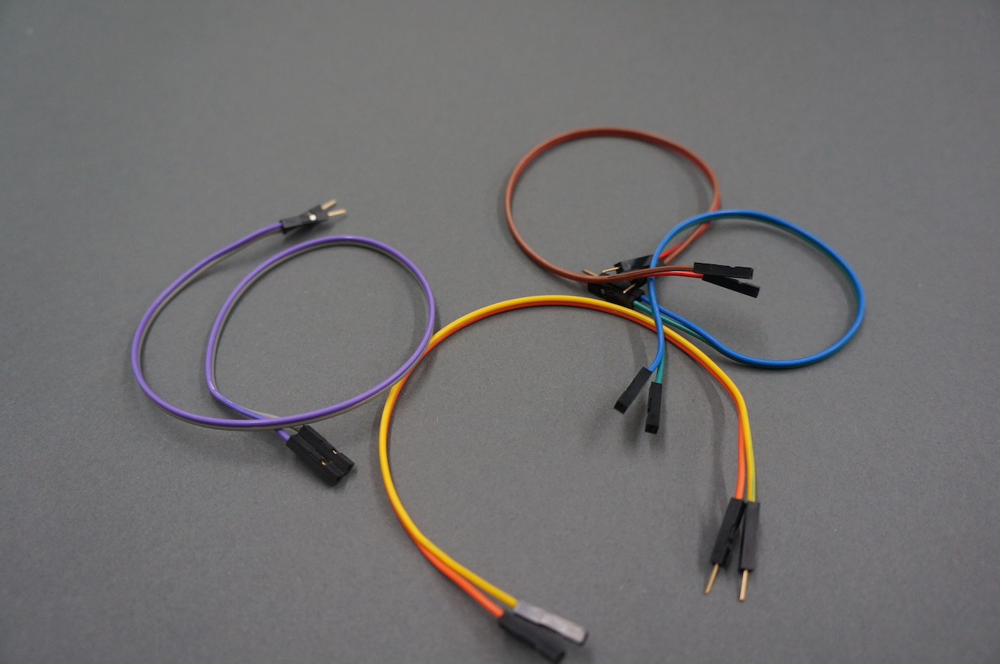

Than plug the male end in to the header cable on the NODES as seen below.

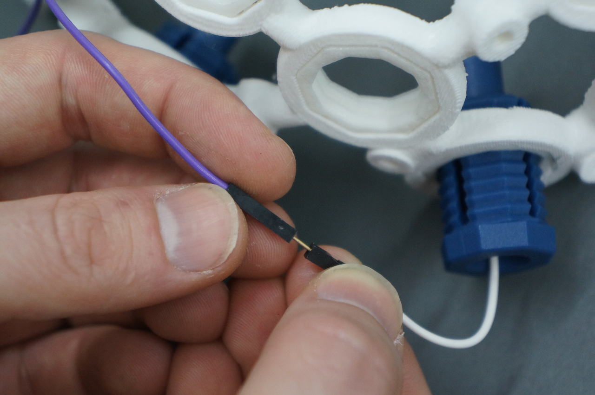

Run wires back to our OPENBCI Board and secure with wire clips. As mentioned above, if you're using the default OpenBCI electrode configuration, cut the wires so that they terminate at the following nodes:

* Channel 1(N1P) - Fp1
* Channel 2(N2P) - Fp2
* Channel 3(N3P) - C3
* Channel 4(N4P) - C4
* Channel 5(N5P) - P7
* Channel 6(N6P) - P8
* Channel 7(N7P) - O1
* Channel 8(N8P) - O2 

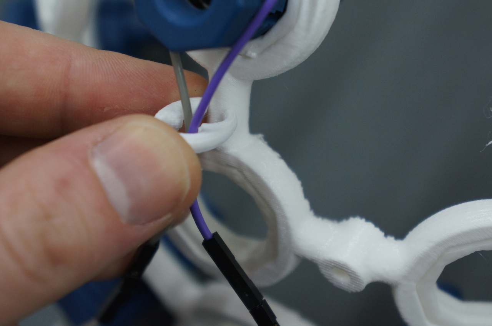

Your headset should look like this when your finished assembeling the 8 channels. 16 channel see instructions below on how to add nodes.

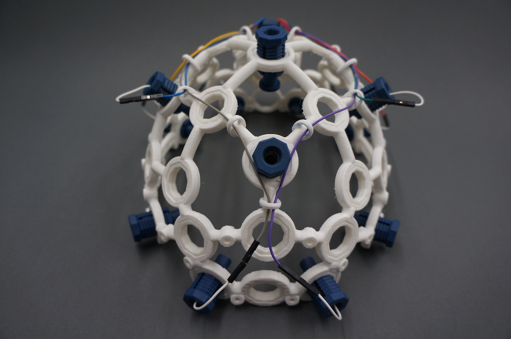
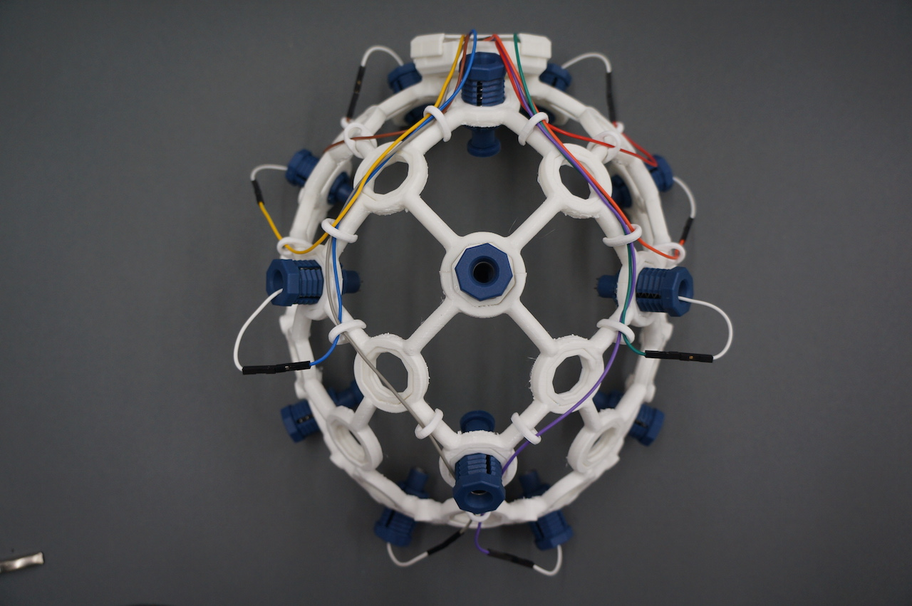

### Connect ear clip electrodes (Reference & Ground)

Now that all of your electrode units are connected to your Ultracortex frame. Connect two [ear clip electrodes](http://fri-fl-shop.com/product/td-430-silver-disc-electrode-ear-clip/) to SRB2 and bottom BIAS pin (white and black respectively in the image below).  These ear clip electrodes serve as the reference and bias (ground with common-mode noise rejection) for your EEG system.

## 16 Channel Add-Ons

### Remove the two Comfort Nodes

From the front of the frame remove the following two Comfort Nodes.

### Replace with Spikey Electrodes

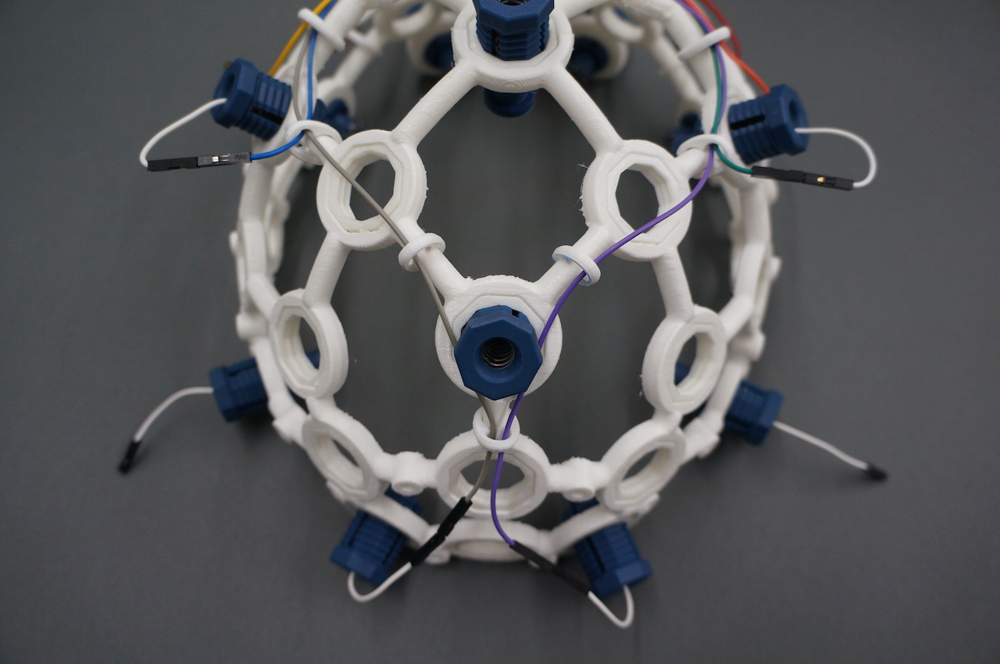

### Add the next 6 Spikey Electrodes

In the following locations screw in the remaining 6 electrodes units.

### Wiring Electrodes

Take out your rest of your Ribben Cables and separatethe GRAY and PURPLE 8" & 4" cables and the BLUE, GREEN, ORANGE and YELLOW 8" and lastly the RED & BROWN 4" cables.

Then plug the male end of the 8" GRAY and PURPLE to the 4" GRAY and PURPLE.

Then wire your nodes in the same sequence as the first 8 as seen in the photo below. These wires get plugged them in to the OPENBCI DAISY board. Remove and replace wire clips when needed to secure the 8 wires you just put in place.

Run wires back to our OPENBCI Board and secure with wire clips. As mentioned above, if you're using the default OpenBCI electrode configuration, cut the wires so that they terminate at the following nodes:

* Channel 9 (N1P on Daisy) - F7
* Channel 10 (N2P on Daisy) - F8
* Channel 11 (N3P on Daisy) - F3
* Channel 12 (N4P on Daisy) - F4
* Channel 13 (N5P on Daisy) - T3
* Channel 14 (N6P on Daisy) - T4
* Channel 15 (N7P on Daisy) - P3
* Channel 16 (N8P on Daisy) - P4

### Adjust the Ultracortex for your head

Put the Ultracortex Mark 4 onto your head and gradually tighten the electrode units until the electrodes are snuggly (but comfortably) against your scalp. If it is difficult to twist the ELECTRODE & COMFORT UNITS by hand

**Be careful** not to strain the electrode wires when twisting the electrode unit with the  ELECTRODE UNITS, or you may separate the wire from the electrode itself. 

### Examine your brain waves!

Place your UltraCortex on your head so that the back center node is roughly the same distance above your inion (bump on the back of your skull) as the front center node is above the bridge of your nose. As you place the UltraCortex on your head, the springs should adjust to the shape and size of your head.

Now that you have your Ultracortex assembled and comfortably adjusted to your head size and shape, it's brain wave time!

Check out the [Getting Started w/ OpenBCI tutorial](http://docs.openbci.com/OpenBCI%20Software/01-OpenBCI_GUI) to get up-and-running with the [OpenBCI Processing GUI](https://github.com/OpenBCI/OpenBCI_Processing).

Below is a screenshot of what the GUI looks like when you've got your OpenBCI + Ultracortex (w/ 8 channels) hooked up! You can see a nice alpha (~11 hz) spike on the FFT Plot. 

### Give Us Feedback!

If you have questions, comments, or suggestions regarding the printing and/or assembly of the Ultracortex, we'd love to hear from you. Please submit issues to this repository or email us at [contact@openbci.com](mailto:contact@openbci.com). Or take some pictures of yourself wearing the Ultracortex and Tweet at us ([@OpenBCI](https://twitter.com/OpenBCI) & [@Ultracortex](https://twitter.com/Ultracortex))!

