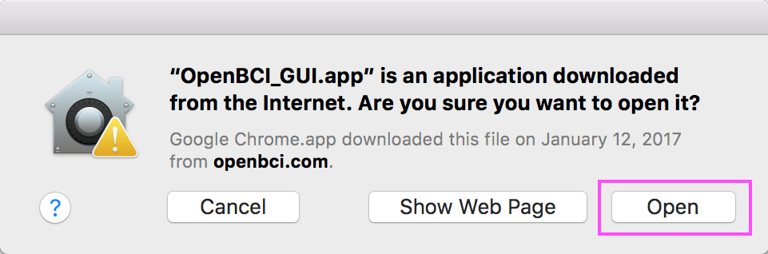
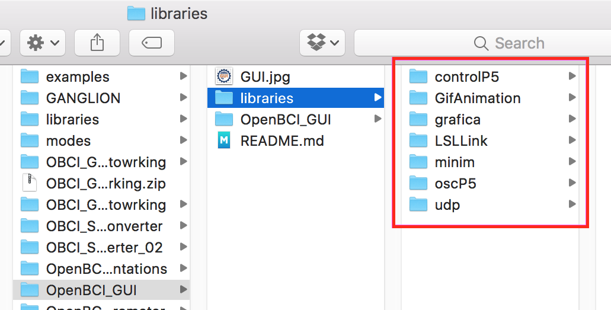

# The OpenBCI GUI

[Suggest changes to this doc](https://github.com/OpenBCI/Docs/edit/master/OpenBCI%20Software/01-OpenBCI_GUI.md)


The OpenBCI GUI is OpenBCI's default software tool for visualizing, recording, and streaming data from the OpenBCI Boards. It can be launched as a standalone application or launched from Processing (a Java-based programming language). In this guide, we will walk you through how to go about doing it both ways.

## Hardware/Driver Setup for OpenBCI_GUI and OpenBCIHub

### Cyton on macOS/Windows/Linux


The FTDI chip on your OpenBCI Dongle requires you to install the FTDI drivers on your machine. You may already have these installed, if you've worked with Arduino or other USB hardware accessories. You can download the latest FTDI drivers for your operating system [here](http://www.ftdichip.com/Drivers/VCP.htm). 

**If using Windows 64-bit:** Here is a direct link to download the FTDI version for your system [here.](https://www.ftdichip.com/Drivers/CDM/CDM21228_Setup.zip)

**Note:** if you jumped ahead and are already running your GUI, you may need to restart your GUI for this to take effect.


**If using a MAC:** When you try to install the FTDI driver, your computer may tell you that it is unable to install the application because it is from an unidentified developer. In this case, go to System Preference > Security & Privacy and switch your settings to "Allow Applications Downloaded from: Anywhere," as seen in the screenshot to the right. You will most likely have to unlock the lock (and type in your root password) at the bottom of the Security & Privacy window before you can make this change.

### Ganglion on macOS

Turn on your computer's Bluetooth if not already.

  

Alternatively, you can use a [small USB Dongle](https://shop.openbci.com/products/ganglion-dongle).

### Ganglion on Windows/Linux

The OpenBCI Ganglion uses Bluetooth LE (aka Bluetooth Smart, Bluetooth 4.0) and in order to use the Ganglion, you need a [small USB Dongle](https://shop.openbci.com/products/ganglion-dongle).

There is also a CSR dongle, more information can be found on the [Setup CSR Dongle doc](/Deprecated%20Docs/Setup_CSR_Dongle.md).

### Wifi on macOS/Windows/Linux

There are no prerequisites for running the WiFi Shield with Cyton or Ganglion on macOS/Windows/Linux, move on to the installation section below.

## Installing the OpenBCI GUI as a "Standalone" Application

### Download the Appropriate Application For Your OS

The fastest way is to download the standalone .exe/.app for your machine and operating system. To do this, head to the [Downloads](http://openbci.com/donation) page of the OpenBCI website, and click the download link that correlates to your OS and machine.


### Install OpenBCI_GUI On macOS

Drag and drop the `OpenBCI_GUI` application to you `Applications` folder.


### Install OpenBCI_GUI On Windows
Move the `OpenBCI_GUI` directory anywhere you like.
	
If you have a high DPI screen and are running windows 10, you may notice that the GUI is hard to see, and nothing seems to scale correctly. Select `Change high DPI Settings` and on the bottom drop down box, change from `Application` to `System (Enhanced)`.

### Install OpenBCI_GUI On Linux

Unzip the downloaded application and place in desired location.

## Running the OpenBCI_GUI

**Important Notes:**

 * In some cases, there may be issues with the way your machine handles the BLE application that enables communication with the Ganglion Board.
 * If you run into additional issues, please visit the [OpenBCI_GUI Section](http://openbci.com/index.php/forum/#/categories/openbci_gui) of our Forum

### Running on macOS

Navigate to your `Applications` folder and double click the `OpenBCI_GUI` You may see a message pop up asking you if you're sure you want to open it. Click Open and the app will launch.



### Running on Windows

Navigate to your `OpenBCI_GUI` directory, double click `OpenBCI_GUI.exe`.

If prompted, check both boxes:


As of GUI v4, the GUI will auto-launch the Hub on Windows.

After launching the GUI, you can verify the Hub is running in your Windows tool tray.

### Running on Linux

Open a terminal application and navigate to the directory (with `cd`) of the unzipped application.

Then launch the Application from terminal with the command:

```
$ sudo ./OpenBCI_GUI
```

This will launch the OpenBCI_GUI and OpenBCIHub.

## Running the OpenBCI GUI From The Processing IDE

The OpenBCI GUI was built using [Processing](https://processing.org/), a popular, Java-based creative coding framework. If you are interested in adding features or modifying the existing code, it is really easy to do so, if you are familiar with Java. If you are not, don't fret! Processing is one of the easiest software packages to pick up as a beginner coder.

The things you will need to run the OpenBCI GUI in Processing are:  

 * [Processing App](https://processing.org/download/?processing)
 * [OpenBCI GUI Sketch](https://github.com/OpenBCI/OpenBCI_GUI)
 * [OpenBCI Electron HUB](https://github.com/OpenBCI/OpenBCI_Ganglion_Electron/releases)

First, go to processing.org and download the latest version of Processing.

Go ahead and move it to your `Applications` folder, and launch the application. If this is the first time that you are running Processing, it will create what it calls it's `Sketch` folder. The default location for the `Sketch` folder is in your Documents folder:  

 On a Mac `Users/<user-name>/Documents/Processing`  
 On a Windows `C:\Users\Username\Documents\Processing`

This is the location that we will move the OpenBCI GUI files that we'll download next.  


The OpenBCI GUI code repository is located on github [here](https://github.com/OpenBCI/OpenBCI_GUI). click on the `Clone or download` button in green on the right, and select `Download ZIP`. If you are a advanced github user, go ahead and clone it, or fork it if you like.  

After the download completes and the file extracts itself, you will see the folder called `OpenBCI_GUI-master`. Change the name of this file to `OpenBCI_GUI`. If you don't change it, it won't work! Now move the folder `OpenBCI_GUI` and it's entire contents to your Sketch folder:

On a Mac `Users/<user-name>/Documents/Processing`  
On a Windows `C:\Users\Username\Documents\Processing`



Inside the `OpenBCI_GUI` folder, there is a folder called `libraries`. Theses are the 3rd party libraries that the OpenBCI GUI uses to work it's magic. You need to move all of these folders into:

On a Mac `Users/<user-name>/Documents/Processing/libraries`  
On a Windows `C:\Users\Username\Documents\Processing\libraries`

folder. If there is no folder called `libraries` in that location, go ahead and make one. Once you have done that, quit out of Processing. There's one more big step, and it means going back to the OpenBCI github repository.

### Install OpenBCI Hub on Mac/Linux/Windows

   

There is a piece of software which is necessary to make the connection between the GUI and your computer's Bluetooth hardware.
We call this the OpenBCI Electron Hub. Go to our github repository for the [Hub](https://github.com/OpenBCI/OpenBCI_Hub/releases/latest), and click on the link for your Operating System.  


After downloading and uppacking, your Downloads folder will look like this on Windows/Linux. On Mac, you'll just have an OpenBCIHub.app file.

#### On Mac, move the `OpenBCIHub.app` to:

`/users/<user-name>/Documents/Processing/OpenBCI_GUI/OpenBCI_GUI/data/OpenBCIHub.app`

#### On Linux:

Rename the directory you just unpacked to `OpenBCIHub` and move it to:

`<path-to-processing>/Processing/OpenBCI_GUI/OpenBCI_GUI/data/`

#### On Windows:

Rename the directory you just unpacked to `OpenBCIHub` and move it to:

`C:\users\<user-name>\Documents\Processing\OpenBCI_GUI\OpenBCI_GUI\data\`


Enter the new OpenBCIHub folder and right click on the executable -> properties -> compatibility -> tick "Run this program as an administrator".


Then double click the executable to run it for the first time. You must check both check boxes when prompted.


Then quit the HUB: click the tray icon, and then press the quit button.


As of GUI v4.0.3, the GUI will auto-launch the Hub on Windows.

### Open The OpenBCI GUI Project in Processing & Launch It!


**If you are on Windows, set Processing to 'Run this program as an administrator'.**

When you get Processing running again, you will see a window open up. This is the Processing IDE (Integrated Development Environment).


Select `File > Sketchbook` and you will open a window where you should see the option to select `OpenBCI GUI`. When you get that far, select `OpenBCI GUI` and the Processing will open up yet another window, that contains all the code to successfully run the OpenBCI GUI.  


If you don't know anything about coding, don't edit these files. If you like to dig in to the meat of what makes things work, by all means. have at it. You are looking at the program code that makes the OpenBCI GUI work it's magic. Now, it's time to run it!


Press the `play` button on the upper left of the IDE, and the sketch will try to launch in all it's glory. If this is your first time running the sketch, you will get a message from the Mac OS that will ask you if you will allow permission for an unsigned app to run. The app in question is the Electron Hub. If you've enabled apps to run from Anywhere, you can just give permission to run the app. However, it is likely that the GUI will not function, because timing is everything. You will need to quit the sketch (press `command+q` or click the `x` button on the upper left of the GUI). Then, relaunch the sketch by pressing the `play` button as above. This time you won't get the alert from the Mac OS, and the GUI will launch in all it's glory!  

If you are encountering issues launching the GUI at this point, please head to the [OpenBCI_GUI section](http://openbci.com/index.php/forum/#/categories/openbci_gui) of our Forum and look for help or post a question.

### Using the OpenBCI GUI


Check out this [Youtube video](https://www.youtube.com/watch?v=agV1B2l-QLw) on how to use the OpenBCI GUI. We are in the process of updating it to match the GUI V3! Coming Soon.

## Customize Your Layout

The OpenBCI GUI displays up to six customizable windows in twelve layouts! You can choose what each window displays by clicking the dropdown menu at the upper left of each window. In the screengrab below, my GUI is showing Time Series, FFT Plot, and Accelerometer. Here's a tip that some users have inquired about: display the impedance of individual channels by toggling the small Ohm icon to the right of each color coded channel number in the Time Series Widget. When the Ohm icon is toggled on, the board sends a small current through the selected channel to obtain the impedance value. For this reason, you won't be able to stream data on a channel and obtain the impedance value simultaneously. See below:


The GUI stores the raw EEG data in a directory called "data" in the root directory of the GUI
It stores each session with a session time stamp.

## Decrease Setup Time by Saving/Loading Settings
Starting with GUI V3, you can save and load a snapshot of nearly every setting in the GUI (ex. Layout, Time Series Channel Settings, Networking Settings, etc.) by using a dropdown menu (pictured below) or keyboard shortcuts. If you change anything during a session, save your settings or click "Stop System" before exiting. __Save with lowercase 'n'__ and __Load with capital 'N'__ on your keyboard to and from _/SavedData/Settings/_.


Start the system first. Then, arrange the GUI to suit your needs and __click "Settings"-->"Save"__. A dialog box will open to confirm file name and path _(e.g. GanglionUserSettings.json)_. After, you will see a message saying "Settings Saved!" When you click "Stop System", all settings will be auto-saved.

The GUI automatically loads settings from _/SavedData/Settings/_ when the system starts!

To load settings, just __click "Settings"-->"Load"__. Select a settings file from the dialog box that opens. If the settings are incompatible (ex. loading 16 channels while using 8), the GUI will display an error at the bottom or "Default Settings Loaded". If all is well, the GUI will display "Settings Loaded!" as the GUI snaps directly to your desired settings.

__Click "Settings"-->"Default" to revert the GUI to default settings.__

When in Live Mode, please allow 1-2 seconds to successfully apply settings to Cyton and Ganglion boards. If loading takes more than a few seconds, there may be a connection issue with the board. An error will print at the bottom of the GUI if this happens.

## Other Keyboard Shortcuts
__Use the spacebar to start or stop the data stream!__ 

__To enable all keyboard shortcuts, set "Expert Mode On" in the settings dropdown.__


Expert Mode Keyboard Shortcuts:

- Other than spacebar, you can press 's' to stop data stream, and 'b' to begin, or start the data stream.

- You can _use lowercase 'k' to set "Bias Don't Include"_ on all channels, or _lowercase 'l' to set "Bias Include"_ on all channels. 

- __Press lowercase 'd' to set all channels settings to default.__

- Using an _English keyboard_, you can deactivate channels 1-16 using:
  - 1,2,3,4,5,6,7,8
  - q,w,e,r,t,y,u,i

- Similarly, activate channels 1-16 using:
  - !, @, #, $, %, ^, &, *
  - Q,W,E,R,T,Y,U,I

- __Take a screenshot of the GUI using lowercase 'm'!__ It will be saved to /SavedData/.

- __Enter presentation mode using Enter (Win), or Return (Mac).__

- To change to the alternate color scheme, use '{' .
