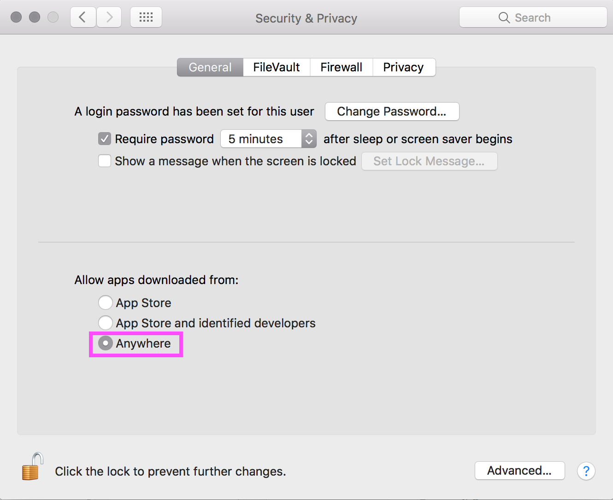

# The OpenBCI GUI

The OpenBCI GUI is OpenBCI's default software tool for visualizing, recording, and streaming data from the OpenBCI Boards. It can be launched as a standalone application or launched from Processing (a Java-based programming language). In this guide, we will walk you through how to go about doing it both ways.

## Using the OpenBCI GUI as a "Standalone" Application

### Download the Appropriate Application For Your OS

The fastest way is to download the standalone .exe/.app for your machine and operating system. To do this, head to the [Downloads](http://openbci.com/donation) page of the OpenBCI website, and click the download link that correlates to your OS and machine.

### Install the Application On Mac

Next, you must save the application somewhere, the same way you would any other application or executable on your machine.

Place the OpenBCI_GUI in your /Applications folder. If the GUI fails to boot the first time, reboot it, a second popup will come up that asks about running the OpenBCIHub for the first time, please press "OK".

### Install OpenBCI On Windows

First unzip the windows application you downloaded from the [downloads](http://openbci.com/donation) section of the OpenBCI Website.

Please place the OpenBCIHub in your Program Files directory such that the structure looks like:
"\Program Files\OpenBCIHub\OpenBCIHub.exe"

Enter the new OpenBCIHub folder and right click on the executable -> properties -> compatibility -> tick "Run this program as an administrator".

Create a short cut on your desktop by right click on the executable -> Send to -> Desktop

Then double click the executable to run it for the first time. You must check both check boxes when prompted.

We recommend you leave the Hub running, even when not using the OpenBCI_GUI, the hub's impact on performance when not in use is minimal.

Verify the hub is running in your windows tool tray

To quit the hub, click the tray cat icon, and then press the quit button.

Please place the GUI in your Program Files directory such that the structure looks like:
"\Program Files\OpenBCI_GUI\OpenBCI_GUI.exe"

If you already have a GUI installed, you may select to replace all the files.

Replacing the files may bring up another pop up that you need to accept for altering files within the Program Files folder.

Lastly, right click on the executable -> properties -> compatibility -> tick "Run this program as an administrator".

### Make Sure You Have The Latest FTDI Drivers Downloaded

Go to the [FTDI VCP](http://www.ftdichip.com/Drivers/VCP.htm) Downloads page, and install the FTDI Driver suitable for your operating system.

### Ganglion Users: Connect the USB CSR BLE 4.0 Dongle only if you use Windows or Linux

The signal will not work if the [CSR BLE Dongle](https://shop.openbci.com/collections/frontpage/products/csr-4-0-bluetooth-dongle?variant=34793373070) is connected on a Mac. Windows users will need to use the program [Zadig](http://zadig.akeo.ie/) to properly configure the CSR BLE 4.0 dongle; detailed instructions can be found [here](http://docs.openbci.com/Tutorials/02-Ganglion_Getting%20Started_Guide).

### Launch the Application

The easy part!

**Important Notes:**

 * In some cases, there may be issues with the way your machine handles the BLE application that enables communication with the Ganglion Board. For troubleshooting these issues, please
 * If using **macOS Sierra:**
 	* Additionally, you will need to [follow the steps](http://docs.openbci.com/Tutorials/02-Ganglion_Getting%20Started_Guide#ganglion-getting-started-guide-run-the-gui-in-processing-on-macos-sierra) in the section titled "Run The GUI In Processing On MacOS Sierra" in the Getting Started w/ Ganglion Guide. This will allow you to alter your system preferences to run apps "downloaded from anywhere"
 * If you run into additional issues, please visit the [OpenBCI_GUI Section](http://openbci.com/index.php/forum/#/categories/openbci_gui) of our Forum

## Running the OpenBCI GUI From The Processing IDE

The OpenBCI GUI was built using [Processing](https://processing.org/), a popular, Java-based creative coding framework. If you are interested in adding features or modifying the existing code, it is really easy to do so, if you are familiar with Java. If you are not, don't fret! Processing is one of the easiest software packages to pick up as a beginner coder.

The things you will need to run the OpenBCI GUI in Processing are:  

 * [Processing App](https://processing.org/download/?processing)
 * [OpenBCI GUI Sketch](https://github.com/OpenBCI/OpenBCI_GUI)
 * [OpenBCI Electron HUB](https://github.com/OpenBCI/OpenBCI_Ganglion_Electron/releases)

First, go to processing.org and download the latest version of Processing. While that's downloading, move on to the next step, which will allow you to run the OpenBCI GUI on Sierra.

When Apple Computer updated their Operating System to Sierra, they changed a few things about your `Security & Privacy` default settings. Sierra won't allow any apps that aren't from the App Store or Identified Developers. While we work on becoming Identified Developers, you will need to change your default `Security & Privacy` settings. Here's how to do it:  

1. Open the Terminal app from the /Applications/Utilities/ folder and then enter the following command syntax: `sudo spctl --master-disable` and press the  `return` key.
2. You will be prompted to enter your administrator password. Do that, and then press `return` key.

>This hack was published by [osXdaily](http://osxdaily.com/2016/09/27/allow-apps-from-anywhere-macos-gatekeeper/) September, 2016.

Now, go to your `System Preferences/Security & Privacy` and make sure that your system allows apps downloaded from Anywhere. You may again be prompted for your administrator password.  

By this time, Processing has likely downloded and extracted itself. Go ahead and move it to your `Applications` folder, and launch the application. If this is the first time that you are running Processing, it will create what it calls it's `Sketch` folder. The default location for the `Sketch` folder is in your Documents folder:  

On a Mac `Users/<user-name>/Documents/Processing`  
On a Windows `C:\Users\Username\Documents\Processing`

This is the location that we will move the OpenBCI GUI files that we'll download next.  

The OpenBCI GUI code repository is located on github [here](https://github.com/OpenBCI/OpenBCI_GUI). click on the `Clone or download` button in green on the right, and select `Download ZIP`. If you are a advanced github user, go ahead and clone it, or fork it if you like.  

After the download completes and the file extracts itself, you will see the folder called `OpenBCI_GUI-master`. Change the name of this file to `OpenBCI_GUI`. If you don't change it, it won't work! Now move the folder `OpenBCI_GUI` and it's entire contents to your Sketch folder:

On a Mac `Users/<user-name>/Documents/Processing`  
On a Windows `C:\Users\Username\Documents\Processing`

Inside the `OpenBCI_GUI` folder, there is a folder called `libraries`. Theses are the 3rd party libraries that the OpenBCI GUI uses to work it's magic. You need to move all of these folders into:

On a Mac `Users/<user-name>/Documents/Processing/libraries`  
On a Windows `C:\Users\Username\Documents\Processing\libraries`

folder. If there is no folder called `libraries` in that location, go ahead and make one. Once you have done that, quit out of Processing. There's one more big step, and it means going back to the OpenBCI github repository.

## Install Ganglion Hub on Mac

   

There is a piece of software which is necessary to make the connection between the GUI and your computer's Bluetooth hardware.
We call this the OpenBCI Electron Hub. Go to our github repository for the [Hub](https://github.com/OpenBCI/OpenBCI_Ganglion_Electron/releases/latest), and click on the link for your Operating System.  

After it downloads and unpacks itself, your Downloads folder will look like this. the `Ganglion Hub app` needs to be inside your sketch folder, in a specific place.  

Move the `Ganglion Hubb app` from your Downloads folder to:

`Users/<user-name>/Documents/Processing/OpenBCI_GUI/OpenBCI_GUI/data`

## Install Ganglion Hub on Windows

The fastest way is to download the standalone .exe/.app for your machine and operating system. To do this, head to the [Downloads](http://openbci.com/donation) page of the OpenBCI website, and click the download link that correlates to your OS and machine.

Please place the OpenBCIHub in your Program Files directory such that the structure looks like:
"\Program Files\OpenBCIHub\OpenBCIHub.exe"

Enter the new OpenBCIHub folder and right click on the executable -> properties -> compatibility -> tick "Run this program as an administrator".

Create a short cut on your desktop by right click on the executable -> Send to -> Desktop

Then double click the executable to run it for the first time. You must check both check boxes when prompted.

To quit the hub, click the tray cat icon, and then press the quit button.

Now simply run the hub before starting from processing.   

### Make Sure You Have The Latest FTDI Drivers Downloaded

### 1. Make sure your FTDI drivers are installed and up-to-date

The FTDI chip on your OpenBCI Dongle requires you to install the FTDI drivers on your machine. You may already have these installed, if you've worked with Arduino or other USB hardware accessories. You can download the latest FTDI drivers for your operating system [here](http://www.ftdichip.com/Drivers/VCP.htm). **Note:** you may need to restart your GUI for this to take effect.

**If using a MAC:** When you try to install the FTDI driver, your computer may tell you that it is unable to install the application because it is from an unidentified developer. In this case, go to System Preference > Security & Privacy and switch your settings to "Allow Applications Downloaded from:" `Anywhere`, as seen in the screenshot to the right. You will most likely have to unlock the lock (and type in your root password) at the bottom of the Security & Privacy window before you can make this change.  

### Open The OpenBCI GUI Project in Processing & Launch It!

When you get Processing running again, you will see a window open up. This is the Processing IDE (Integrated Development Environment).

Select `File > Sketchbook` and you will open a window where you should see the option to select `OpenBCI GUI`. When you get that far, select `OpenBCI GUI` and the Processing will open up yet another window, that contains all the code to successfully run the OpenBCI GUI.  

If you don't know anything about coding, don't edit these files. If you like to dig in to the meat of what makes things work, by all means. have at it. You are looking at the program code that makes the OpenBCI GUI work it's magic. Now, it's time to run it!

Press the `play` button on the upper left of the IDE, and the sketch will try to launch in all it's glory. If this is your first time running the sketch, you will get a message from the Mac OS that will ask you if you will allow permission for an unsigned app to run. The app in question is the Electron Hub. If you've enabled apps to run from Anywhere, you can just give permission to run the app. However, it is likely that the GUI will not function, because timing is everything. You will need to quit the sketch (press `command+q` or click the `x` button on the upper left of the GUI). Then, relaunch the sketch by pressing the `play` button as above. This time you won't get the alert from the Mac OS, and the GUI will launch in all it's glory!  

If you are encountering issues launching the GUI at this point, please head to the [OpenBCI_GUI section](http://openbci.com/index.php/forum/#/categories/openbci_gui) of our Forum and look for help or post a question.

### Using the OpenCBI GUI

Check out this [Youtube video](https://www.youtube.com/watch?v=agV1B2l-QLw) on how to use the OpenBCI GUI. We are in the process of updating it to match the GUI V2! Coming Soon.
