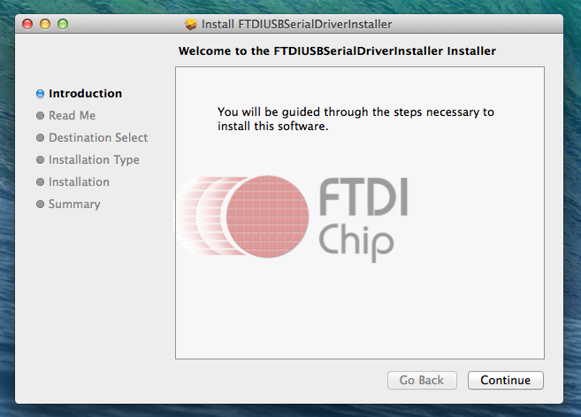

# The OpenBCI GUI

The OpenBCI GUI is OpenBCI's default software tool for visualizing, recording, and streaming data from the OpenBCI Boards. It can be launched as a standalone application or launched from Processing (a Java-based programming language). In this guide, we will walk you through how to go about doing it both ways.

## Using the OpenBCI GUI as a "Standalone" Application

### Download the Appropriate Application For Your OS

The fastest way is to download the standalone .exe/.app for your machine and operating system. To do this, head to the [Downloads](http://openbci.com/donation) page of the OpenBCI website, and click the download link that correlates to your OS and machine.

### Install the Application

Next, you must save the application somewhere, the same way you would any other application or executable on your machine. 

### Make Sure You Have The Latest FTDI Drivers Downloaded

### Launch the Application

The easy part! 

**Important Notes:** 

 * In some cases, there may be issues with the way your machine handles the BLE application that enables communication with the Ganglion Board. For troubleshooting these issues, please 
 * If using Mac OS w/ Sierra:
 	* you will need to [re-download the "GanglionHub"](https://github.com/OpenBCI/OpenBCI_Ganglion_Electron/releases/download/v0.3.0/Ganglion-Hub-v0.3.0-macOS.zip) and install it manually in: Show Package Contents > Contents/Java/data // you must replace the "Ganglion Hub.app" that is already there.
 	* Additionally, you will need to [follow the steps](http://docs.openbci.com/Tutorials/02-Ganglion_Getting%20Started_Guide#ganglion-getting-started-guide-run-the-gui-in-processing-on-macos-sierra) in the section titled "Run The GUI In Processing On MacOS Sierra" in the Getting Started w/ Ganglion Guide. This will allow you to alter your system preferences to run apps "downloaded from anywhere": System Preferences/Security & Privacy/Click the lock to make changes/Anywhere
 * If you run into additional issues, please visit the [OpenBCI_GUI Section](http://openbci.com/index.php/forum/#/categories/openbci_gui) of our Forum
 
## Running the OpenBCI GUI from Processing

The OpenBCI GUI was built using [Processing](https://processing.org/), a popular, Java-based creative coding framework. If you are interested in adding features or modifying the existing code, it is really easy to do so, if you are familiar with Java. If you are not, don't fret! Processing is one of the easiest software packages to pick up as a beginner coder.

### Download the Latest Version of Processing

To get started working with the OpenBCI GUI in Processing, first you must [download the latest stable release of Processing](https://processing.org/download/) from their website. 

### Download or Fork the OpenBCI_GUI Github Repo

Next, you must [download or fork](https://github.com/OpenBCI/OpenBCI_GUI) (if you're familiar with Github) the OpenBCI_GUI Processing code. 

### Put All Necessary Libraries In the Correct Folder

Next, you must locate the sketch folder of your Processing application. You can do this by opening Processing and clicking:
Processing > Preferences... 

At the top of this pane you will see a textfield titled "Sketchbook location:"

Browse to that location.
If it does not exist already, create a folder called "libraries".
Then copy and paste all of the files/folders from the "libraries" directory in the OpenBCI_GUI (downloaded from Github) into the newly created "libraries" folder in your Processing Sketchbook.

### Make Sure You Have The Latest FTDI Drivers Downloaded

### 1. Make sure your FTDI drivers are installed and up-to-date

The FTDI chip on your OpenBCI Dongle requires you to install the FTDI drivers on your machine. You may already have these installed, if you've worked with Arduino or other USB hardware accessories. You can download the latest FTDI drivers for your operating system [here](http://www.ftdichip.com/Drivers/VCP.htm). **Note:** you may need to restart your GUI for this to take effect.

**If using a MAC:** When you try to install the FTDI driver, your computer may tell you that it is unable to install the application because it is from an unidentified developer. In this case, go to System Preference > Security & Privacy and switch your settings to "Allow Applications Downloaded from: Anywhere," as seen in the screenshot to the right. You will most likely have to unlock the lock (and type in your root password) at the bottom of the Security & Privacy window before you can make this change.

### Open The OpenBCI GUI Project in Processing & Launch It!

Now, close Processing. Re-open it, and you should be able to launch the GUI by pushing the play button without any issues.

If you are encountering issues launching the GUI at this point, please head to the [OpenBCI_GUI section](http://openbci.com/index.php/forum/#/categories/openbci_gui) of our Forum and look for help or post a question.

### Using the OpenCBI GUI

Check out this [Youtube video](https://www.youtube.com/watch?v=agV1B2l-QLw) on how to use the OpenBCI GUI. We are in the process of updating it to match the GUI V2! Coming Soon.

