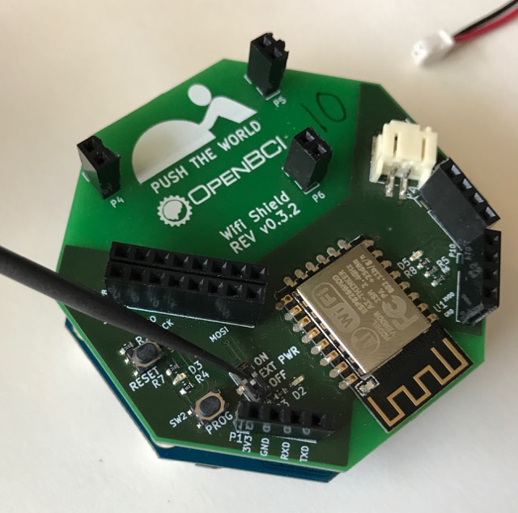
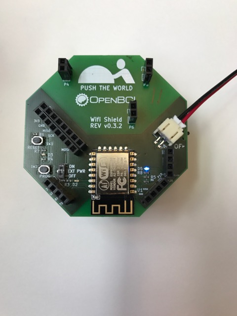

# OpenBCI Wifi Shield

**The Wifi shield and these docs are still in beta, if you see a typo [please open an issue](https://github.com/OpenBCI/Docs/issues/new).**

The OpenBCI Wifi Shield seeks to offer a plug and play Wifi solution for the OpenBCI Cyton and Ganglion.

One of the coolest parts is the restful fully qualified web server sitting on your OpenBCI board!

# Ganglion

## Prerequisites

1. OpenBCI Ganglion with at least [2.x.x firmware](https://github.com/OpenBCI/OpenBCI_Ganglion_Library/blob/development/OpenBCI_Ganglion_Library/examples/WifiGanglion/DefaultGanglion.ino)
2. Wifi shield with [current firmware](https://github.com/OpenBCI/OpenBCI_WIFI/blob/master/examples/ESP8266HuzzahSSDP/ESP8266HuzzahSSDP.ino)
3. Wireless local area network (internet)
4. Two batteries to power the whole system

## Powering the Wifi Shield

Wifi takes a lot more current to run then Bluetooth. The Wifi shield exceeds the maximum power of the Ganglion, so the Wifi shield has it's own power port that allows for much more current to flow. With the first hardware design of the Ganglion, we were not able to eliminate the need for two batteries. The ganglion runs at 3VDC while the wifi shield runs at 3.3VDC. They must share a common ground through!

Don't run power to the Ganglion through the top! Power running to the Ganglion with the `EXT PWR` in on `OFF` position.

Do NOT run Ganglion if because the `EXT PWR` is in `ON` position. We tested it in the lab and nothing bad will happen, it will just not work.

If the Ganglion is powered up already, the Wifi Shield can not start. The Ganglion will power on reset the Wifi sheld at the start of the ganglion initialization.

# Cyton

## Prerequisites

1. OpenBCI Cyton with at least [3.x.x firmware](https://github.com/OpenBCI/OpenBCI_32bit_Library/tree/dev-3.0.0)
2. Wifi shield with [current firmware](https://github.com/OpenBCI/OpenBCI_WIFI/blob/master/examples/ESP8266HuzzahSSDP/ESP8266HuzzahSSDP.ino)
3. Wireless local area network (internet)
4. Battery to power the whole system

## Powering the Wifi Shield

Wifi takes a lot more current to run then Bluetooth. The Wifi shield exceeds the maximum power of the Cyton, so the Wifi shield has it's own power port that allows for much more current to flow. To eliminate the need for two batteries, we pass through 3.3 VDC to the Cyton board, allowing you, the user, to only have to power the Wifi shield and never have to plug power directly into the Cyton again.

Power running to the Cyton with the `EXT PWR` in on `ON` position.

Power running to Wifi but NOT Cyton because the `EXT PWR` is in `OFF` position.

If the Cyton is powered up already, the Wifi Shield can not start. Don't power your Cyton and hot plug in a Wifi Shield.

## Connecting to the Wifi Shield

Please continue reading if your OpenBCI Wifi Shield is on the same wifi network as your computer.

The steps for connecting to the Wifi Shield:

1. Get Wifi Shield On Your Wireless Network
2. Find IP Address of Wifi Shield
3. Open a TCP Socket on Host Computer
4. Send `/websocket` http request for data
5. Send `/command` http requests for control
6. Send `/latency` http requests for tuning

### Get Wifi Shield On Your Wireless Network

First thing you need to do is get the Wifi shield on the same network as your computer. You should leave your Wifi shield unattached from the Cyton for now, or flip the external power switch `EXT PWR` to `OFF` position. This allows the ESP to boot up nice and safely.

First, power the Wifi Shield with a battery pack of your choosing

When the wifi shield boots up for the first time in your working environment, it has no known network to join, so the shield turns into a hot spot (_access point_ if you speak wifi) of sorts and is waiting for you to help it along.

Here is an example:

The wifi network at OpenBCI HQ is called `867`, it's password protected, and my computer is connected to the internet through `867` right now.

I plug in power to my new OpenBCI Wifi Shield, of course my board has never joined a network before, so it's an access point, which means my computer, phone or any internet connected device can join the wifi network being broadcasted by my new Wifi Shield.

I need to use my computer to join the OpenBCI Wifi Shield network. I go to list wifi networks around my laptop and sure enough there is a new network called `OpenBCI-2F0E` (the last four numbers are unique to my device). So I click to join this new OpenBCI network.

After a couple seconds a capture link appears on my computer. I click configure wifi and see that `867` is listed as a possible network for my little Wifi Shield to join! I select `867` and enter the password for the network and press connect. If I made a mistake in the password, no worries, I'll turn the Wifi Shield off and on again and repeat the process. If a got my password right, then the Wifi shield has joined `867` and the fun can begin!

The OpenBCI is now fully qualified port 80 http server that is fully defined on with an industry standard swagger.io format. Click for [full http server description](https://app.swaggerhub.com/apis/pushtheworld/openbci-wifi-server/1.0.0).

### Get IP Address of Wifi Shield

Use [Simple Service Discovery Protocol](https://en.wikipedia.org/wiki/Simple_Service_Discovery_Protocol) (SSDP) to find the device on your local network. Use a tool in your favorite language [Python](http://brisa.garage.maemo.org/doc/html/upnp/ssdp.html) | [Node.js](https://github.com/diversario/node-ssdp) | [C](https://developer.gnome.org/gssdp/stable/).

The [Node.js SDK](https://github.com/aj-ptw/OpenBCI_NodeJS/blob/wifi/examples/getStreamingWifi/getStreamingWifi.js) which will implement SSDP for you.

Use a graphical user interface [Mac - Lan Scan](https://itunes.apple.com/us/app/lanscan/id472226235?mt=12)

We are still hashing out the best ways to discover the Wifi shield on the networks (home vs. enterprise and beyond) so [please contribute ides if you have any on this github issue](https://github.com/OpenBCI/OpenBCI_WIFI/issues/8) and we can add it in! [Wifi Direct Feature Request](https://github.com/OpenBCI/OpenBCI_WIFI/issues/9)

### Open a TCP Socket on Host Computer

In order to get low latency high-reliability wireless data transmission we will open a TCP socket on your host Computer. The Wifi Shield will stream data to this socket. **IMPORTANT** The data comes over this socket raw and is defined in the docs for [Binary Data Format](http://docs.openbci.com/Hardware/03-Cyton_Data_Format#cyton-data-format-binary-format).

If you want the data in another format, please comment on [this issue](https://github.com/OpenBCI/OpenBCI_WIFI/issues/11), thinking protocols like `JSON`.

### Send `/websocket` http request for data

Refer to [http server description](https://app.swaggerhub.com/apis/pushtheworld/openbci-wifi-server/1.0.0) swagger.io page as the single source of truth in regards to the OpenBCI Wifi Server.

### Send `/command` http requests for control

Refer to [http server description](https://app.swaggerhub.com/apis/pushtheworld/openbci-wifi-server/1.0.0) swagger.io page as the single source of truth in regards to the OpenBCI Wifi Server. To change the sample rate of the Cyton, please use the `~` command as defined in the Cyton SDK docs.

### Send `/latency` http requests for tuning

Refer to [http server description](https://app.swaggerhub.com/apis/pushtheworld/openbci-wifi-server/1.0.0) swagger.io page as the single source of truth in regards to the OpenBCI Wifi Server.

The time in micro seconds (us) between packet sends. The higher the OpenBCI sample rate, the higher the latency needed. Default is 1000us, minimum stable is 50us. For upper limit sample rates such as 4kHz/8kHz/16kHz, latency around 20ms seems to really stabilize the system.  
