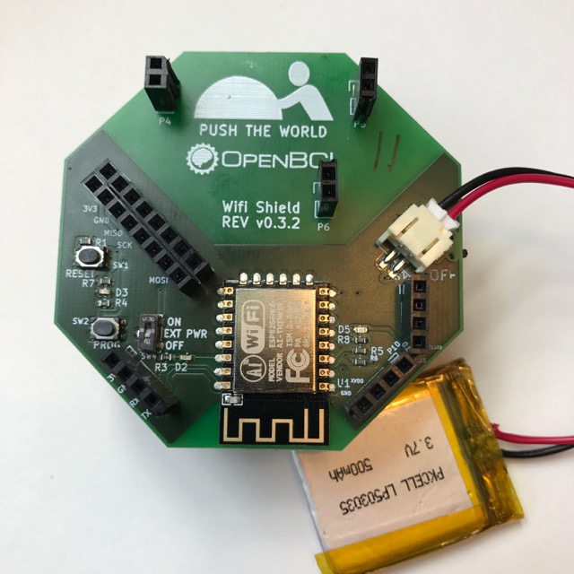

# OpenBCI Wifi Shield

The OpenBCI Wifi Shield seeks to offer a plug and play Wifi solution for the OpenBCI Cyton and Ganglion. **The Wifi shield is still in beta.**

One of the coolest parts is the restful fully qualified web server sitting on your OpenBCI board!

## Prerequisites

1. OpenBCI Cyton with at least 3.x.x firmware
2. Wifi shield with current firmware
3. Wireless local area network (internet)
4. Battery to power the whole system

## Powering the Wifi Shield

Wifi takes a lot more current to run then Bluetooth. The Wifi shield exceeds the maximum power of the Cyton, so the Wifi shield has it's own power port that allows for much more current to flow. To eliminate the need for two batters, we pass through 3.3 VDC to the Cyton board, allowing you, the user, to only have to power the Wifi shield and never have to plug power directly into the Cyton again.

Power running to the Cyton with the `EXT PWR` in on `ON` position.

Power running to Wifi but NOT Cyton because the `EXT PWR` is in `OFF` position.

If the Cyton is powered up already, the Wifi Shield can not start. Don't power your Cyton and plug in a Wifi Shield and expect the system to work, it won't.

## Get Wifi Shield On The Network

First thing you need to do is get the Wifi shield on the same network as your computer. You should leave your Wifi shield unattached from the Cyton for now, or flip the external power switch `EXT PWR` to `OFF` position. This allows the ESP to boot up nice and safely.

First, power the Wifi Shield with a battery pack of your choosing

When the wifi shield boots up for the first time in your working environment, it has no known network to join, so the shield turns into a hot spot (_access point_ if you speak wifi) of sorts and is waiting for you to help it along.

Here is an example:

The wifi network at OpenBCI HQ is called `867`, it's password protected, and my computer is connected to the internet through `867` right now.

I plug in power to my new OpenBCI Wifi Shield, of course my board has never joined a network before, so it's an access point, which means my computer, phone or any internet connected device can join the wifi network being broadcasted by my new Wifi Shield.

I need to use my computer to join the OpenBCI Wifi Shield network. I go to list wifi networks around my laptop and sure enough there is a new network called `OpenBCI-2F0E` (the last four numbers are unique to my device). So I click to join this new OpenBCI network.

After a couple seconds a capture link appears on my computer. I click configure wifi and see that `867` is listed as a possible network for my little Wifi Shield to join! I select `867` and enter the password for the network and press connect. If I made a mistake in the password, no worries, I'll turn the Wifi Shield off and on again and repeat the process. If a got my password right, then the Wifi shield has joined `867` and the fun can begin!

## Connecting to the Wifi Shield

Figuring out how to discover the Wifi Shield turns out to be a whole science in and of itself! As far as we can tell, the whole goal is to get the IP address of the Wifi Shield, so that goal is to get that...

We have been using Node.js as the tool to find and interact with the Wifi Shield, checkout a [fully working example](https://github.com/aj-ptw/OpenBCI_NodeJS/blob/wifi/examples/getStreamingWifi/getStreamingWifi.js) on AJ Keller's github!

We are still hashing out the best ways to discover the Wifi shield on the networks (home vs. enterprise and beyond) so [please contribute ides if you have any on this github issue](https://github.com/OpenBCI/OpenBCI_WIFI/issues/8) and we can add it in!

Anyway...

The Wifi Shield is running an http server on port 80. You are going to want to run the `wifiFindShields()` function in Node.js, [just like we do in the example](https://github.com/aj-ptw/OpenBCI_NodeJS/blob/wifi/examples/getStreamingWifi/getStreamingWifi.js#L75), to list devices matching the characteristics of the OpenBCI Wifi Shield using [SSDP](https://en.wikipedia.org/wiki/Simple_Service_Discovery_Protocol).

Using SSDP achieves the goal of finding out the OpenBCI Wifi Shield's IP address.

Now how do we get streaming data back from the device is the next question... it's a good one too! In order to get low latency high-reliability wireless data transmission we will open a TCP socket on our Computer, one that the Wifi Shield can send data to whenever. Open a TCP port on your computer and let's say it randomly get's assigned a fresh port number of `56342`. We now need to tell the Wifi Shield, hey, this is my port number, send data here! We do that by sending the Wifi shield an http `POST` request from the PC on route `/websocket` with params `{"port":56342}`. Now the OpenBCI Wifi Shield, knows the IP Address and the Port number of the your computers newly opened TCP port, thus data can begin to flow! 
