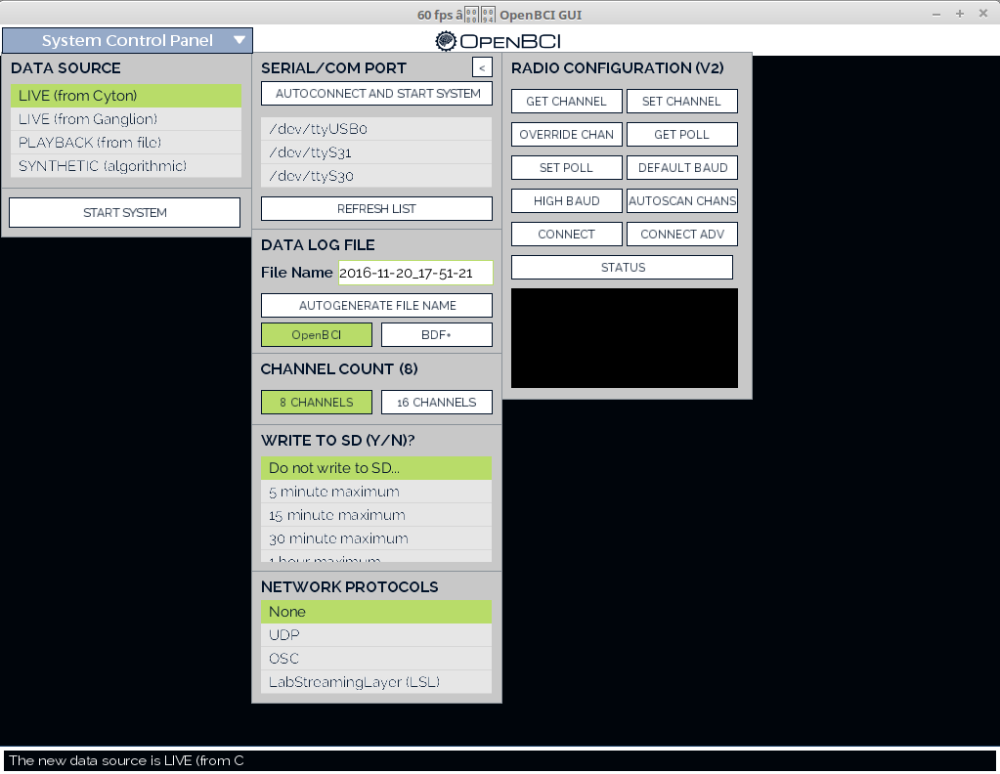
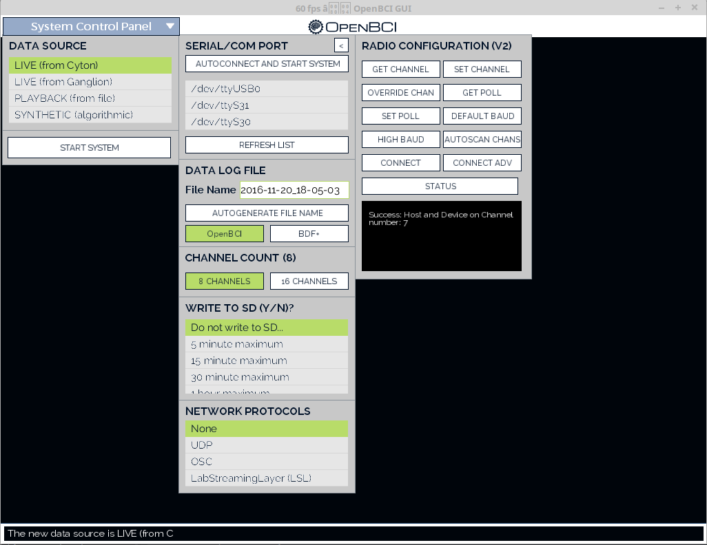
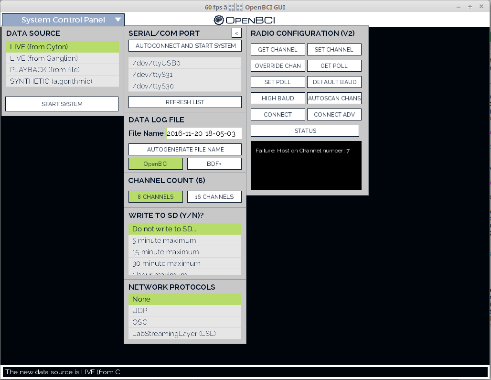
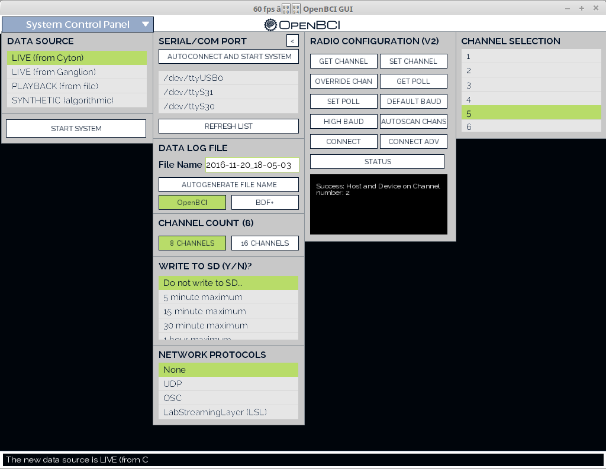
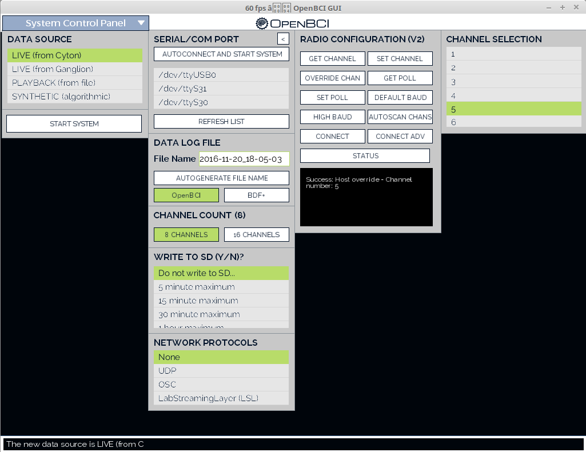
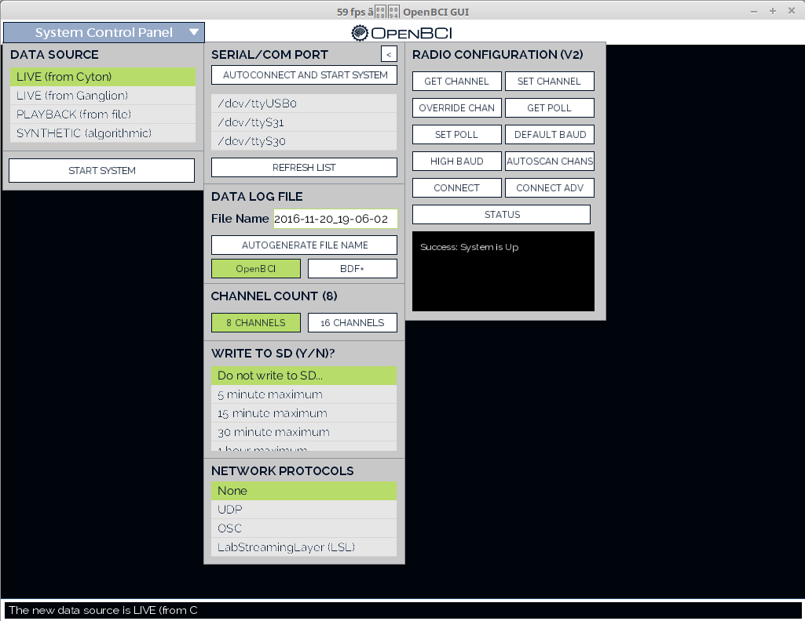

# Bluetooth Radio Configuration
With the newest additions to the OpenBCI firmware, a slew of new commands are now available to configure the interaction between the USB "dongle" and the OpenBCI board. This tutorial will cover these commands and the new widget that comes along with them.

For reference throughout this tutorial, the USB bluetooth radio is the "host" and the board itself is the "device".
## 1. Opening the Configuration Menu

The newest version of the OpenBCI GUI has a "radio configuration" widget built into it to allow you to access these commands easily. First, navigate to the arrow located above the "autoconnect and start system" button. This will open the radio config panel.

## 2. Connecting to your board

Next we need to connect to the board without starting the system, so we're going to click the "connect" button.

Some Notes for Advanced users:

*  If you have changed your system's BAUD rate to 230400, you'll want to click the "connect adv" button instead 
*  You can press the "start system" button after connecting through the radio configuration menu

## 3. The Commands

### I. Get Channel

As the OpenBCI system works over bluetooth, there needs to be communication between the two different modules in order to ensure data is being successfully transmitted. Each OpenBCI board and radio is set at a certain channel so that this communication can be made possible. Clicking the "Get Channel" button will print out this channel onscreen.

Sometimes however there will be a mismatch between the device and host's channel:

If this happens at anytime and you are not an advanced user, use the "AUTOSCAN CHANS" button to sync your device and host (Elaborated below).

### II. Set Channel

The "Set Channel" button will allow you to change the channel of your host and device together. This is very useful if you're having any interference with other bluetooth devices or if you are using/are around other OpenBCI systems. No OpenBCI systems in the same area should be on the same channel. 

When you press the button a popout will appear to the right of the Radio Configuration menu. This popout has the channels (1-25) that your system can be on. Clicking on any of these buttons will switch your system (host and device) to that channel.

If either your host or device are mismatched you should have a similar error message to this:

If you get this error and are not an advanced user, use the "AUTOSCAN CHANS" button as mentioned before. 

### III. Overriding Channels

If for whatever reason your host and device are mismatched and you know what channel your device is on, you can use this button to set your host to that channel. This can be useful if you have one host and two devices you'd like to interchange between as you work. 

### IV. Get Poll
The Poll buttons should really only be used by advanced users. If you are unfamiliar with poll time I've found a decent description online: "A Bluetooth master unit polls a slave unit to enable the slave to resynchronize to the master, by sending POLL packets with sufficient frequency to maintain a connection to the slave, and in the intervals between such packets." (https://www.google.com/patents/US7693485) 

Basically the poll value is a frequency from 1-255 that interacts with the OpenBCI system's packet system.

A sucessfully connected system will simply return "Success: " followed by the current poll frequency. A system that is desynced will just display an error message.

### V. Default BAUD
If you are unfamiliar with BAUD rates, check out this great article on by mathworks: https://www.mathworks.com/help/matlab/matlab_external/baudrate.html

The default BAUD rate for an OpenBCI system is 115200 bits per second. Clicking this button will set the the system's BAUD to 115200 bits per second.

### VI. High BAUD
The current OpenBCI system supports a higher BAUD rate than previous releases. Clicking this button will set the system's BAUD to 256000 bits per second.

### VII. Autoscanning Channels
As noted above, if your host and device ever become seperated you can use this button to resychronize them. This will always connect to a OpenBCI board on the lowest channel first. That is, if you have 2 devices, 1 on channel 7 and another on channel 9, it will always connect to the device on channel 7.

### VIII. System Status
The system status button will either print out a simple success or failure message. 

That's basically it! If you have any questions on these new features feel free to post in the forums and we'll eventually create an FAQ section for this post. 