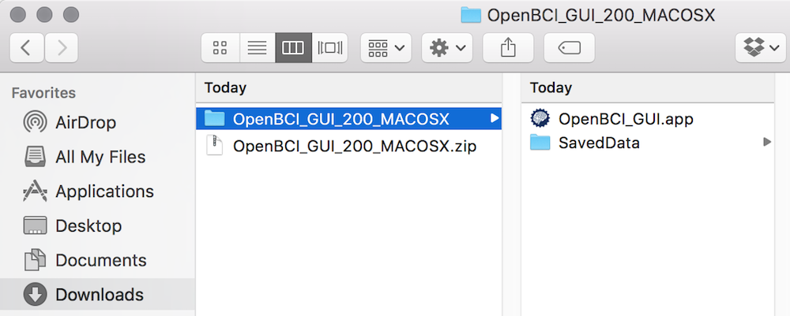
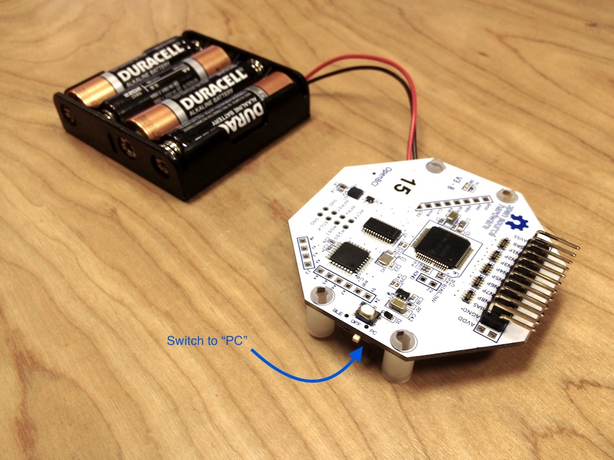
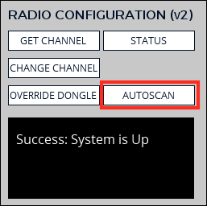

# Cyton Getting Started Guide

## I. What You Need

 1. OpenBCI Cyton Board
 2. OpenBCI Dongle
 3. OpenBCI Electrode Starter Kit (ESK) or your own electrodes (not pictured)
 4. 6V AA battery pack & (x4) AA batteries (batteries not included)
 5. (x4) plastic feet for board stabilization

### 1. Your Board

This tutorial can be followed if you are working with any Cyton board (8-bit, Cyton, or Cyton with Daisy). I'll be working with the 8-bit board.

### 2. Your OpenBCI USB Dongle

The OpenBCI USB Dongle has an integrated RFDuino that communicates with the RFDuino on the Cyton board. The dongle establishes a serial connection with your computer's on-board FTDI chip. The serial port is called /dev/tty\* (if you're using Linux or Mac) or COM\* (if you're using Windows) . You'll be connecting to this serial port from the OpenBCI GUI or whatever other software you want to end up using to interface your Cyton board.

### 3. OpenBCI Gold Cup Electrodes and Electrode Paste

If you ordered an OpenBCI Gold Cup Electrodes and Ten20 Paste you should have:

 * 10 passive, gold cup electrodes on a color-coded ribbon cable
 * 3 2oz Jars of Ten20 conductive electrode paste
 

 
If you plan to work with your own electrodes, the touch-proof adapter may come in handy. It will convert any electrode that terminates in the industry-standard touch-proof design to an electrode that can be plugged into any OpenBCI Board!

### 4. Your 6V AA Battery Pack & 4 AA Batteries

Cyton board

Cyton boards have specific input voltage ranges. These input voltage ranges can be found on the back-side of the board, next to the power supply. **BE VERY CAREFUL** to not supply your board with voltages above these ranges, or else you will damage your board's power supply. For this reason, we recommend that you always use the battery pack that came with your OpenBCI kit.

### 5. (x4) Plastic Feet

Your Cyton kit comes with 4 plastic feet that can be snapped into the holes of your board to provide extra stability while working.

## II Download/Run the OpenBCI GUI on macOS

Go to the [GUI Downloads page](http://openbci.com/donation) and download the latest software release for Mac. Once you unzip/extract the download, open the file called `OpenBCI_GUI_200_MACOSX` and there you will find the `OpenBCI_GUI.app`. You can move that into your `Applications` folder. The GUI is built on [Processing](https://processing.org/), a creative coding language, so you can also download the OpenBCI Processing Sketch and run it through Processing. A tutorial for how to do that is located [here](http://docs.openbci.com/OpenBCI%20Software/01-OpenBCI_GUI#the-openbci-gui-running-the-openbci-gui-from-the-processing-ide)  

**NOTE: If you are using a Mac with macOS Sierra, you MUST move the OpenBCI_GUI.app into your Applications folder. You also need to change your Security & Privacy settings to allow apps from Anywhere. Go to the [end](http://docs.openbci.com/Tutorials/01-Cyton_Getting%20Started_Guide#cyton-getting-started-guide-run-the-gui-on-macos-sierra) of this page for instructions on how to do that, then come back to conintue this tutorial.**

When you first run the GUI on your Mac, you will have to give administrator permission. You may see a message pop up asking you if you're sure you want to open it. Click `Open` and the app will launch.

If you have any other trouble with your permissions, or if you don't see the option to `Open` the app, check your `Settings/Security & Privacy` and make sure you tick the `Anywhere` button.

## II Download/Run the OpenBCI GUI on Windows

Go to our [Downloads Page](http://openbci.com/donation) and download the application that suits your Operating System. Then move the downloaded folder into your `Program Files` folder. Now you can run the OpenBCI GUI!

## III. Prepare your OpenBCI Hardware

### 1. Make sure your FTDI drivers are installed and up-to-date

The FTDI chip on your OpenBCI Dongle requires you to install the FTDI drivers on your machine. You may already have these installed, if you've worked with Arduino or other USB hardware accessories. You can download the latest FTDI drivers for your operating system [here](http://www.ftdichip.com/Drivers/VCP.htm). **Note:** you may need to restart your GUI for this to take effect.

**If using a MAC:** When you try to install the FTDI driver, your computer may tell you that it is unable to install the application because it is from an unidentified developer. In this case, go to System Preference > Security & Privacy and switch your settings to "Allow Applications Downloaded from: Anywhere," as seen in the screenshot to the right. You will most likely have to unlock the lock (and type in your root password) at the bottom of the Security & Privacy window before you can make this change.

### 2. Plug in your OpenBCI USB Dongle

Plug this in (facing upwards!) and you should see a blue LED light up.

**Note:** make sure your USB Dongle is switched to GPIO 6 and not RESET. The switch should be set closer to your computer as seen in the picture to the right.

### 3. Plug in your 6V AA battery pack (with batteries)

Cyton boards have specific input voltage ranges. These input voltage ranges can be found on the back-side of the board, next to the power supply. **BE VERY CAREFUL** to not supply your board with voltages above these ranges, or else you will damage your board's power supply. For this reason, we recommend that you always use the battery pack that came with your OpenBCI kit. There's a good reason we put this notice in here twice!

### 4. Switch your Cyton board to PC (not OFF or BLE)

Make sure to move the small switch on the right side of the board from "OFF" to "PC". As soon as you do, you should see a blue LED blink 3 times (if you’re using the 8-bit board; the Cyton version doesn’t blink). If you don't, press the reset button just to the left of the switch. If the LED still does not blink 3 times, make sure you have full battery. If you're sure your batteries are fully charged, consult the [hardware section](http://openbci.com/index.php/forum/#/categories/hardware) of our Forum.

**Note:** it's important to plug in your Dongle before you turn on your Cyton board. Sometimes, if the data stream seems broken, you may need to unplug your USB Dongle and power down your Cyton board. Make sure to plug your USB Dongle in first, then power up your board afterwards.

## IV. Connect to your Cyton board from the GUI

### 1. Relaunch your OpenBCI GUI

You may need to relaunch the OpenBCI GUI after installing the FTDI drivers.

### 2. Select LIVE (from OpenBCI)

In order to connect to your Cyton, you must specify the data source to be "LIVE (from Cyton)" in the first section of the SYSTEM CONTROL PANEL. Before hitting the START SYSTEM button, you need to configure your Cyton board (follow the steps below).

### 3. Find your USB Dongle's Serial/COM port 

In the first section of the LIVE (from Cyton) sub-panel, find your Dongle's Serial/COM port name. If you're using a Mac or Linux, it's name will be in the following format:

**/dev/tty***

If you're using Windows, it will appear as:

**COM#**

Your USB Dongle's port name will likely be at the top of the list. If you don't see it:

1. Make sure your dongle is plugged in and switched to GPIO 6 (not RESET)
2. Click the REFRESH LIST button in the SERIAL/COM PORT section of the sub-panel
3. Make sure you've installed the latest FTDI drivers, as described in section III.1

If you're still having trouble finding your USB Dongle's port name, refer to the [Forum](http://openbci.com/index.php/forum/) about debugging your hardware connection.

### 4. Check Status or Change Radio Channel

There is a Radio Configuration tab that you can use to check the status of your Cyton system and change the radio channel. Click on the `>` arrow to open up the options panel. Here you will find tools for configuring your Cyton Radio connection. Let's walk through the functions of each button.

   

Click on the `STATUS` button to check the status of your Cyton system. This may take a few seconds to report, as it reaches out to your Dongle and Cyton board to verify that they are talking to eachother. If they are, you will see the message `Success: System is Up`. If not, you will see `Falure: System is Down`.

Click the `GET CHANNEL` button to know the channel that your Cyton system is communicating on. If the system is up, you will get the message `Success: Host and Device on Channel number: X`. If the system is down, you will get the message `Failure: Host on Channel number: X`.  
**NOTE** the Host radio is on the Dongle, and the Device radio is on the Cyton board.

Click on the `CHANGE CHANNEL` button to change the channel that your Cyton system is communicating on. This can be really useful if you have multiple Cyton systems in the same space. When you click the button, a menu will open up with the channels. When you click on the channel you want, it will take just a second, and you should get the message `Success: Host and Device on Channel number: X`.  
**IMPORTANT** Make sure that there are not other Cytons active in the neighborhood when you change the channel!

 

Click on the `OVERRIDE DONGLE` button to change the channel of the OpenBCI Dongle only. When you click the button, a menu will open up with the channels. For the purpose of this Tutorial, go ahead and change the Dongle channel to Channel `15`. When you click on the channel number, it will take just a second, and you should get the message `Success: Host override - Channel number: 15`

Since you have just changed the channel of the Dongle only, When you click on the `STATUS` button, you will get a failure message. Similarly, when you press the `GET CHANNEL` button you will also get a failure message. But don't worry! We can use the Autoscan function to get your Cyton Board and Dongle back on the same track!

Now, click the `AUTOSCAN` button. It may take a few seconds for the Dongle to scan through every channel until it connects to your Cyton, but it will, and you will get the message `Success: System is Up` Autoscan!

### 5.(optional) Edit the Playback file name

In the DATA LOG FIlE section of the LIVE (from Cyton) sub-panel you can specify the name of your playback file. This file name is automatically defaulted to:

**SavedData\OpenBCI-RAW- + date/time**

You can edit the the name of this file by clicking in the "File Name" text field.

If you're running the OpenBCI GUI from Processing. This file will be saved at the root of your OpenBCI_GUI directory. 

If you're running the OpenBCI GUI as a standalone application, this file will be saved in /Contents/Java/Data/EEG_Data/

If working from a Mac, you'll need to right-click on the OpenBCI_GUI application and then select "show package contents" to see the /Contents directory where your playback files are saved.

After creating a Playback file, it can be replayed by running the OpenBCI GUI with the Plaback File data source mode. As a result, you can easily share recorded OpenBCI Playback files with your friends and colleagues.

### 6. Select your channel count (8 or 16)

The CHANNEL COUNT setting is defaulted to 8. If you are working with an OpenBCI Daisy Module and Cyton board (16-channel) system, be sure to click the 16 CHANNELS button before starting your system.

### 7. Select your SD setting

If you want to log data to a MicroSD inserted into the Cyton Board, in the WRITE TO SD (Y/N)? sub-panel section you can select the maximum recording time of the file. This setting is defaulted to "Do not write to SD…" and will automatically switch to this if you do not have a MicroSD card properly inserted into your Cyton board.

**Note:** be sure to select a file size that is larger than your planned recording time. The Cyton writes to the local SD in a way that enables us to write lots of data very quickly. As a result, however, we must specify how large the file will be before we begin. The technique is known as block writing.

### 8. Press "START SYSTEM"

Now you're ready to start the system! Press the START SYSTEM button and wait for the OpenBCI GUI to establish a connection with your Cyton board. This usually takes ~5 seconds. 

During this time, the help line at the bottom of the OpenBCI GUI should be blinking the words: "Initializing communication w/ your Cyton board."

**TROUBLESHOOTING**

If the initialization fails, try the following steps in order:

1. Making sure you've selected the correct serial/COM port
2. Power down your Cyton board and unplug your USB Dongle. Then, plug back in your USB Dongle and power up your Cyton board in that order. Then try restarting the system, but pressing the START SYSTEM button again.
3. If this does not work, try relaunching the OpenBCI GUI application and redo step 2 above. Then reconfigure the SYSTEM CONTROL PANEL settings, and retry START SYSTEM.
4. Make sure that your batteries are fully charged and then retry the steps above.
5. If you are still having troubles connecting to your Cyton board, refer to the [Forum](http://openbci.com/index.php/forum) for extra troubleshooting advice.

### 9. Your OpenBCI is now live!

Once the GUI successfully connects to your Cyton Board, click anywhere outside of the SYSTEM CONTROL PANEL to access the rest of the features of the GUI.

You can now press the bright green Start Data Stream button (located at the top middle of the GUI) to begin streaming live data from your CytonCyton board board.

To make sure that it is responsive, (after you've started the data stream) try running your fingers along the electrode pins at the top of your board. 

You should see the 8 (or 16 if you're using a Daisy module) channels on the EEG DATA montage behave chaotically in response to you touching the pins. The headplot on the right side of the GUI should become fully saturated (turning bright red) when you do this. And all the tracess of the FFT graph on the lower right should instantly shift upwards.

If this is the case, congratulations; you are now connected to your Cyton board. It's time to see some brain waves!

## V. Connect yourself to OpenBCI

In this quick demo, we'll be showing you how to set up 3 channels of electrophysiological data that reveal your heart activity (EKG or ECG), muscle activity (EMG), and brain activity (EEG)!

For more information on these three signals, refer to wikipedia:

 * [Heart Acitivity - Electrocardiography (EKG or ECG)](http://en.wikipedia.org/wiki/Electrocardiography)
 * [Muscle Acitivity - Electromyography (EMG)](http://en.wikipedia.org/wiki/Electromyography)
 * [Brain Activity - Electroencephalography (EEG)](http://en.wikipedia.org/wiki/Electroencephalography)

### 1. What you need

#### Necessary:

* Ten20 conductive electrode paste (or other conductive electrode gel)
* Your Cyton board, USB Dongle, battery pack, and x4 AA batteries
* x6 gold cup electrodes (from your OpenBCI electrode starter kit or other). If you are using an OpenBCI electrode starter kit, use the following electrodes so as to be consistent with the GUI's color-coding protocol:
  1. Black
  2. White
  3. Purple
  4. Green
  5. Blue
  6. Red
 
#### Optional:

* Paper towels for cleaning excess Ten20 paste
* Medical tape (or other tape) for adding extra stability to electrodes
* Ear swabs for cleaning paste from electrodes, once you're finished

### 2. Connect your electrodes to OpenBCI

1. Connect the white electrode to the SRB2 pin (the bottom SRB pin). The SRB2 pin is the default "reference pin" for your OpenBCI input channels. 
2. Connect the black electrode to the bottom BIAS pin. The BIAS pin is similar to the ground pin of common EEG systems, but it uses destructive interference waveform techniques to eliminate the "common mode noise" of all of the active channels.
3. Connect the purple electrode to the 2N pin (the bottom pin of the N2P input)
4. Connect the green electrode to the 4N pin (the bottom pin of the N4P input)
5. Connect the blue electrode to the 4P pin (the top pin of the N4P input)
6. Connect the red electrode to the 7N pin (the bottom pin of the N7P input)

#### Basic OpenBCI pin overview

The picture to the right is a perspective view of the electrode inputs that we are working with in this tutorial. The bottom pins are (N) inputs, and the top pins are (P) inputs. The default board settings look at all N channels in reference to SRB2 (the bottom SRB pin). SRB1 (the top SRB pin) can also be used as a reference, but when it is activated, it is activated for ALL channels. If using SRB1 as the reference electrode, P inputs must be used as the other input of the potential difference measurement. On the contrary, individual channels can be removed from SRB2. If a channel is removed from SRB2, it can be examined as a unique voltage potential, between the N and P pins of that channel. We will be doing this for the heart measurement in this tutorial, while examining 2 EEG channels in reference to SRB2, using the channel 2 and 7 N pins. For more information on this, refer to page 16 of the [ADS1299 datasheet](http://www.ti.com/lit/ds/symlink/ads1299.pdf). The ADS1299 chip is the analog front-end at the core of the Cyton board.

### 3. Connect your electrodes to your head and body

a) We're going to start with the electrodes on your head. Begin by scooping Ten20 electrode paste into your white gold cup electrode. This is going to be your reference (or SRB2) electrode for the other electrodes on your head. Fill the electrode so there is a little extra electrode paste spilling over the top of the gold cup, as seen in the picture to the right. 
 
**Note:** Use a paper towl or napkin to remove excess electrode paste as you are applying your electrodes.

 
b) Now apply this electrode to either one of your earlobes (either A1 or A2 as seen on the 10-20 system image  below). You can use some medical tape (or electric tape!) to give this electrode some extra stability, ensuring that it does not fall off. This electrode is the reference that all of the EEG electrodes on your head will be measured in comparison to. The uV reading that will appear in the GUI's EEG DATA montage is a measure of the potential difference between each electrode and this reference electrode (SRB2). SRB1 (the top SRB pin) can also be used as a reference pin, but we won't discuss that here. Check out the other docs on how to maximize the usage of the other pins!

 
c) Follow the same procedure for the purple electrode and apply it to your forehead 1 inch above your left eyebrow (as if you were looking at yourself) and an inch to the left of your forehead's centerline. 
 

 
This electrode location is Fp2 on the [10-20 System](http://en.wikipedia.org/wiki/10-20_system_%28EEG%29). The 10-20 System international standard for electrode placement in the context of EEG. Fp indicates the a "frontal polar" site.
 

 
d) Now follow the same procedure for the red electrode and place it on the back of your head, 1 inch above the inion (as seen on the 10-20 system), and 1 inch to the left. This electrode location is O1 on the 10-20 system. The 'O' stands for occiptal, meaning above your occipital lobe (or visual cortex).
 
**Note:** to do this, pull your hair aside and make sure the electrode is nested as deeply as possible, with the electrode paste making a definitive conductive connection between your scalp and the gold cup.

e) Now follow the same procedure as step 2 above to apply the black electrode to your other earlobe (either A1 or A2 from the 10-20 system). The black electrode is connected to the BIAS pin, which is used for noise cancelling. It is similar to a GROUND pin, which establishes a common ground between the Cyton board and your body, but it has some extra destructive interference noise cancelling techniques built in! 

You're now done connecting electrodes to your noggin! I like to use a cheap cotton hairband to add extra stability to all of the electrodes connected to my head, by placing it gently on top of all of the electrodes. 
 

f) Now connect the green electrode to your right forearm, somewhere on top of a muscle that you can flex easily. With this electrode we will be looking at both heart activity and muscle activity. I also like to use tape to hold this electrode in place. That's going to hurt a little bit to take off. Hopefully your arms aren't as hairy as mine...

g) Finally, connect the blue electrode to your wrist on the opposite arm with the green electrode. This will serve as the reference electrode for the blue electrode. If you noticed, the blue electrode is on the pin above the green electrode. We will be removing pin 4 from SRB2 so that it is not included in the same reference signal being used to measure brain waves. The main reason for this is because the microvolt (uV) values produced by your heart and muscles are much stronger than the signals we can detect from your brain, so we don't want these signals to interfere. I'll go into more detail about this later on, when it comes time to adjust the channel settings in the GUI.
 

### 4. Launch the GUI and adjust your channel settings

a) If your OpenBCI GUI is not already running, relaunch it and configure the DATA SOURCE mode to LIVE (from OpenBCI). Refer to **section IV** of this guide for more information on this process. Since we are only using 3 channels, set the channel count to 8, even if you have a daisy system. Nothing will go wrong if you start the system with 16 channels, except the EEG DATA montage will be unnecessarily cluttered.

b) Once you have pressed START SYSTEM and the GUI has connected to your OpenBCI device, exit the SYSTEM CONTROL PANEL and start the live data stream. You should see live data from your body (and the unattached channels) streaming into the EEG DATA montage on the left side of the GUI.

c) Now we are going to power down the channels we aren't using. Do this by clicking the channel number buttons outside of the left side of the EEG DATA montage. We are only using channels 2, 4, and 7, so power down every other channel. Don't bother with the smaller dark grey squares to the right of the buttons with numbers; they are used for impedance measuring, but we won't go into that now. You can also power down the channels with keyboard shortcuts (1-8). Power them back up with [SHIFT] + 1-8. If you are working with a daisy module, channels 9-16 can be powered down with q, w, e, r, t, y, u, i, respectively. You can power those channels back up with [SHIFT] + the same key. 

d) Now that you have powered down channels 1, 3, 5, 6, and 8, your EEG DATA montage should look similar to the screenshot on the right (after you relax and let the system settle).

e) Now it's time to optimize your Cyton board's channel settings for this setup. Click the CHAN SET tab to the right of the EEG DATA tab, and an array of buttons should appear of the EEG DATA montage. These buttons indicate the current settings of the ADS1299 registers on your Cyton board. For more information on these settings, refer to pages 39-47 of the [ADS1299 datasheet](http://www.ti.com/lit/ds/symlink/ads1299.pdf).

We have simplified the interface through the OpenBCI firmware and OpenBCI GUI to allow easy, real-time interaction with these registers. For more information on this, please refer to our doc page regarding the ADS1299 interface.

By deactivating channels 1, 3, 5, 6, and 8, those channels were automatically removed from the BIAS and SRB2, so as not to interfere with the signal. The only thing left to do is update channel 4, the input we are using for EMG and EKG. Begin by clicking the PGA Gain button for channel 4 until it is set to x8. Then remove it from the BIAS and SRB2. The reason we do this is because the uV values for EMG and EKG are much bigger (and easier to pick up) than the EEG signals on channels 2 and 7. As a result, we want to prevent channel 4 from influencing the common mode noise rejection of the BIAS, as well as remove it from the EEG reference channel (SRB2).

f) After updating these settings, click the EEG DATA tab again, and your EEG DATA montage should now appear similar to the image on the right. Notice that you no longer see the heart beat artifacts in channels 2 and 7. Additionally, the heart beat signal in channel 4 should be more steady, looking more like a typical EKG signal.

### 5. Minimizing noise

So there's a good chance your current setup isn't showing clean data like the screenshots above. There are a number of possible reasons for this. We'll go through troubleshooting them here.

#### Get rid of AC noise

Get rid of 60 Hz (or 50 Hz if you're in Europe or any country that operates on a 50 Hz power grid). The OpenBCI has a built-in notch filter, that does a decent job at eliminating 60 Hz noise. You can adjust the notch filter to 50 Hz by clicking the "Notch 60 Hz" button. Additionally, if your Cyton board is on a table with any power chords or devices that are plugged into a wall outlet, move it to a location away from any electronic devices plugged into the wall. This will drastically reduce the alternating current (AC) influence on your signal.

#### Stabilize your electrodes

Make sure your electrode cables are steady. If you shake the electrodes that are dangling from your head/body, you'll notice that it severely affects the signals. This movement noise is something that could be greatly improved with "active" electrodes, but when using the "passive" electrodes that come with the OpenBCI electrode starter kit, you have to be very careful to remain steady while using the system, in order to produce the best signal. Sometimes, I'll bind all of the electrode cables together with a piece of electric tape to secure them and minimize cable movement. If you do this, don't worry about including the blue and green electrodes in the bundle, since movement noise doesn't affect the EMG/EKG signal as significantly.

#### Ensure that your electrodes are securely connected

Ensure that your electrodes are connected securely (especially your reference)!

#### Make sure your OpenBCI hardware is streaming data properly

Every so often, an error will occur with the wireless communication between your OpenBCI Dongle and board. If you've followed all of the steps above, and the data that you are seeing in the GUI interface is still illegible, try the following:

Power down your Cyton board and unplug your USB Dongle. Then, plug back in your USB Dongle and power up your Cyton board in that order. Then try restarting the system, but pressing the START SYSTEM button again.

#### Further troubleshooting

If you're still having issues, refer to the [Forum](http://openbci.com/index.php/forum) for further troubleshooting techniques.

## VI. Check out your body's electrical signals!

Congratulations! If you've made it this far, it's finally time to check out your body's electrophysiological signals!

### 1. Check out your heart activity (EKG)

Channel 4 in the GUI should now be producing a nice steady succession of uV spikes. This is your heart beating! Try taking slow, deep breaths and watch how it influences your heart rate. If you look carefully, you may notice your heart beat more rapidly as your inhaling, and more slowly as you're exhaling.

For more information on how to analyze an electrocardiography (EKG) signal, or on how to set up a full EKG (with 10 electrodes), check out the [wikipedia page on EKG](http://en.wikipedia.org/wiki/Electrocardiography). The image to the right (pulled from the Wikipedia page) shows the various segments of a single heart beat.

### 2. Watch your muscles flex (EMG)

Now, try flexing your forearm or whatever muscle you placed the green electrode on top of. You should see a high-amplitude, high-frequency signal introduced into channel 4. This is the electric potential created by you activating your muscle!

If you relax your muscle again, you should see the channel 4 signal return to your heart beat (just EKG). The picture on the right shows this transition. When you're flexing your muscle, the electrode is picking up EMG and EKG at the same time. After you relax your muscle, the high-frequency signal disappears, and you're able to see just EKG.

### 3. Eye blinks and jaw clenching (more EMG)

Now blink your eyes a few times. Each time you blink you should see a strong spike on the EEG DATA montage. It should be most visible in channel 2, the channel for the electrode directly above your eye! This uV spike is a result of the muscles in your forehead that make your eyes blink.

Now try clenching your jaw. You should see a big uV spike in both channels 2 and 7. Each time you clench your jaw, you are introducing a strong EMG artifact into any electrodes on your scalp. If you put your fingers on the side of your head (above your ear) and clench your teeth, you should be able to feel the muscles in your head flexing.

In the photo to the left, you can see what these signals look like the green highlighted region shows a single eye blink. The two blue sections show an extended period of jaw clenching.

It's interesting to note that these signals are not picked up in channel 4. This is because channel 4 is only looking at the potential difference across your body—from your right forearm to your left wrist. As a result the EMG/EEG artifacts being produced on your head (in reference to SRB2) are not visible in this channel.

### 4. Brain waves (alpha) with OpenBCI!

Now, for what we've all been waiting for... let's check out some brain waves! 

Firstly, deactivate channel 4 so that you are only looking at the EEG channels (2 and 7).

It's best to do this portion of the tutorial with a friend. You'll understand why in a second. It just so happens that the easiest way to consciously produce brain waves is by closing your eyes. When you do this, your occipital lobe (the part of your brain responsible for processing visual information) enters into an alpha wave state at a frequency between 7.5-12.5 Hz. Alpha brain waves are the strongest EEG brain signal! Historically, they are thought to represent the activity of the visual cortex in an idle state. An alpha-like variant called [mu (μ)](http://en.wikipedia.org/wiki/Mu_wave) can be found over the motor cortex (central scalp) that is reduced with movement, or the intention to move [Wikipedia].

For more information on Alpha waves check out [Wikipedia](http://en.wikipedia.org/wiki/Alpha_wave) and Chip's EEG Hacker [blog post](http://eeghacker.blogspot.com/2014/10/detecting-alpha-waves-threshold.html) about detecting alpha waves with OpenBCI V3.

Once you've closed your eyes, have your friend press the 'm' key on your keyboard to take screenshots. Tell him or her to wait until a strong alpha spike emerges on the Fast Fourier Transform (FFT) Graph, the graph in the lower-right of the GUI. The spike should be somewhere between 7.5-12.5 on the the x-asix of the FFT graph, indicating that there is a strong presence of waves in that frequency range.

After you've taken a few good screenshots, open up the .JPGs and take a look. **Note:** the screenshots are located in the root directory of your application, or in the OpenBCI_GUI directory if you are working from Processing. 

You'll notice that the strongest alpha wave signals should be appearing in channel 7, the O2 (O standing for occipital) electrode on the back of your head. Count the number of waves in a single 1-second time period on channel 7 of the EEG DATA montage. The number of waves should correspond x-axis position of the spike on the FFT graph. If you've identified your alpha waves, congratulations! You've now seen your first brain waves with OpenBCI!

### 5. What's next?

For more ideas on what to do next, check out the OpenBCI [Community Page] (http://openbci.com/community/) and the other OpenBCI Docs pages.

Also, if you have a great follow-up tutorial to this getting started guide or something else you want to share, feel free to create your own by following format we have in the [Docs repo](https://github.com/OpenBCI/Docs) of our Github. It's really easy to create your own Docs page with a Markdown editor like [Mou](http://25.io/mou/) or [MacDown](https://macdown.uranusjr.com/). If you do so, send us a pull request on Github and we'll add your tutorial to the Docs! If you have troubleshooting questions be sure to visit the [OpenBCI Forum](http://openbci.com/index.php/forum/). For all other inquiries, contact us at contact@openbci.com.
 

## RUN THE GUI ON macOS SIERRA

When Apple Computer updated their Operating System to Sierra (v10.12.x), they changed a few things about your `Security & Privacy` default settings. Sierra won't allow any apps that aren't from the App Store or Identified Developers. While we work on becoming Identified Developers, you will need to change your default `Security & Privacy` settings. Here's how to do it:  

1. Open the Terminal app from your /Applications/Utilities/ folder and then enter the following command syntax: `sudo spctl --master-disable` and press the  `return` key.
2. You will be prompted to enter your administrator password. Do that, and then press `return` key.

>This hack was published by [osXdaily](http://osxdaily.com/2016/09/27/allow-apps-from-anywhere-macos-gatekeeper/) September, 2016.

Now, go to your `System Preferences/Security & Privacy` and make sure that your system allows apps downloaded from Anywhere. You may again be prompted for your administrator password.   
Now go back to where you were before to continue!