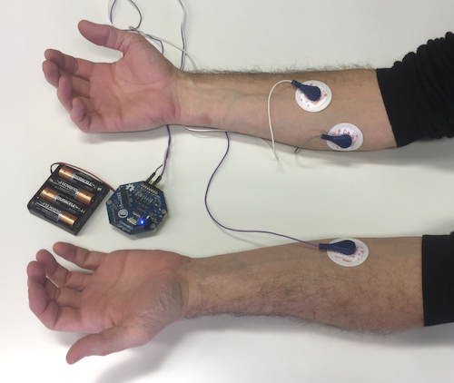
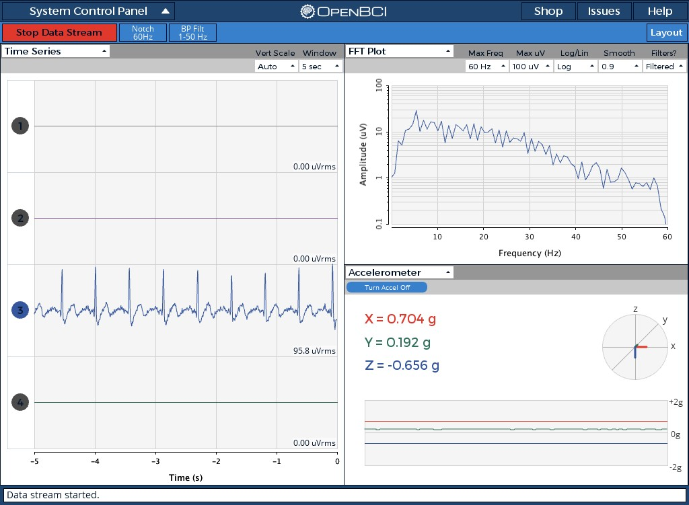
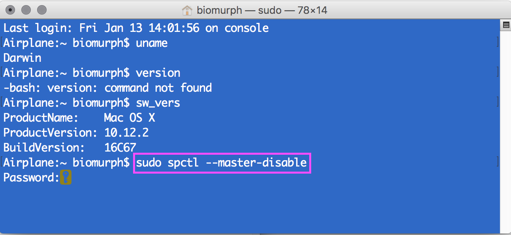
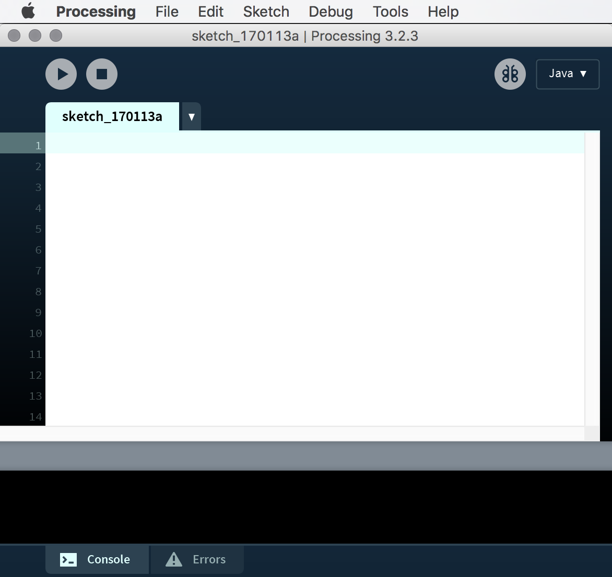
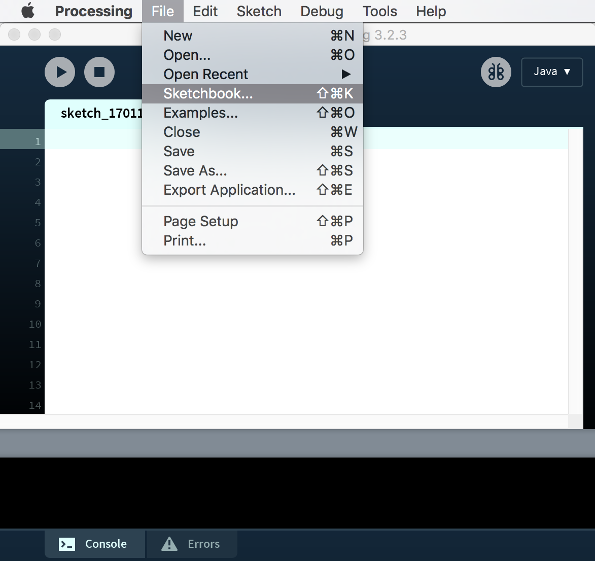
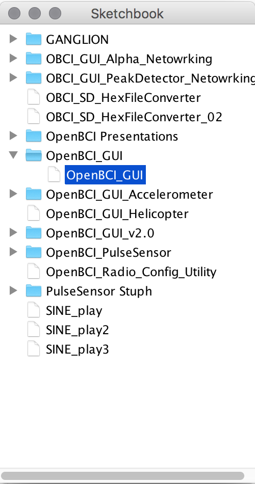

# Ganglion Getting Started Guide
###Overview
This guide will walk you through setting up your Ganglion, connecting it to your computer, and then connecting it to yourself. The first tutorial is for Mac users. the second is for Windows users. Please review this guide in its entirity before starting. Have fun!

## What You Need

 1. OpenBCI Ganglion Board 
 3. 6V AA battery pack & (x4) AA batteries (batteries not included)
 4. (x4) plastic feet for board stabilization
 5. OpenBCI [Gold Cup Electrodes](http://shop.openbci.com/collections/frontpage/products/openbci-gold-cup-electrodes?variant=9056028163), or your own electrodes, and [Electrode Paste](http://shop.openbci.com/collections/frontpage/products/ten20-conductive-paste-2oz-jars)
 6. [Snap Electrode Cables](http://shop.openbci.com/collections/frontpage/products/emg-ecg-snap-electrode-cables?variant=32372786958) and [Snap Electrodes](http://shop.openbci.com/collections/frontpage/products/skintact-f301-pediatric-foam-solid-gel-electrodes-30-pack?variant=29467659395)
 7. A computer connected to the internet

### 1. Your Ganglion

The battery connector on the back can accept 3V to 12V DC power input. The pushbutton is a reset button. For more information on the Ganglion Hardware, visit the [OpenBCI Ganglion](http://docs.openbci.com/Hardware/07-Ganglion) page in the Hardware section.

### 2. Gold Cup Electrodes and Paste

If you ordered OpenBCI [Gold Cup Electrodes](http://shop.openbci.com/collections/frontpage/products/openbci-gold-cup-electrodes?variant=9056028163) and [Electrode Paste](http://shop.openbci.com/collections/frontpage/products/ten20-conductive-paste-2oz-jars), it should come with:

 * 10 passive, gold cup electrodes on a color-coded ribbon cable
 * 3 2oz Jars of Ten20 conductive electrode paste
 

 
If you plan to work with your own electrodes, the [Touch-Proof Adapter](http://shop.openbci.com/collections/frontpage/products/touch-proof-electrode-cable-adapter?variant=31007211715) will come in handy. It will convert any electrode that terminates in the industry-standard touch-proof design to an electrode that can be plugged into any OpenBCI Board!

### 4. (x4) Plastic Feet

Your OpenBCI kit comes with 4 plastic feet that can be snapped into the holes of your board to provide extra stability while working.

### 5. Your 6V AA Battery Pack & 4 AA Batteries

Install 4 AA batteries in your battery pack, plug in your Ganglion board and turn on the power switch. You should see the BLUE LED blink gently. Blinking means that the BLE radio is not connected or paired with any computer or phone/tablet. Once the Gagnlion is connected, the LED stays steady on.

## Download/Run the OpenBCI GUI on macOS

This part is for Mac users. If you use Windows or Linux, there are special parts for you below.  
  
  

First, turn on your computer's Bluetooth.  

  
Then go to the [GUI Downloads page](http://openbci.com/donation) and download the latest software release for Mac. The GUI is built on [Processing](https://processing.org/), a creative coding language, so you can also download the OpenBCI Processing Sketch and run it through processing. Once you unzip/extract the download, open the file called `OpenBCI_GUI_200_MACOSX` and there you will find the `OpenBCI_GUI.app`. You can move that into your `Applications` folder.  
  
**NOTE: If you are using a Mac with macOS Sierra, you can currently ONLY run the OpenBCI GUI from Processing. Please go [here](http://docs.openbci.com/Tutorials/02-Ganglion_Getting%20Started_Guide#ganglion-getting-started-guide-run-the-gui-in-processing-on-macos-sierra) and follow the easy instructions to get up and running with Processing, then come back to this tutorial.** 

When you first run the GUI on your Mac, you will have to give administrator permission. You may see a message pop up asking you if you're sure you want to open it. Click `Open` and the app will launch. 

If you have any other trouble with your permissions, or if you don't see the option to `Open` the app, check your `Settings/Security & Privacy` and make sure you tick the `Anywhere` button. 

Once the GUI is running, select `LIVE (from Ganglion)`. That button will turn green, and you will see a pane open titled `BLE DEVICES`, and a list of Ganglions in the neighborhood. Each Ganglion has it's own unique 4 character ID (in HEX), and you will see it listed in the `BLE DEVICES` window. If you don't see any Ganglions, check to make sure your Ganglion has a battery connected, is switched on, and the blue LED is blinking. If there are multiple Ganglions in the room, you can find yours by turning it off, clicking the `REFRESH LIST` button, then turn on your Gagnlion again. Make a note of *your* Ganglion's 4 character ID.  

**NOTE every time you run the GUI, it will generate a recording to file. You have an option at this point to create your own file name, in the `DATA LOG FILE` window, should you choose to.**  

Click on the Ganglion board name that you want to connect to, so that it turns green, and now you are ready to roll! Press the `START SYSTEM` button. It may take up to a minute, but the GUI is setting itself up and connecting to your Ganglion! 

When the GUI connects, it opens up to the default window layout. For a more indepth guide to the GUI interface and functionality, check out the [OpenBCI GUI](http://docs.openbci.com/OpenBCI%20Software/00-OpenBCISoftware) doc. For the purposes of this introductory tutorial, You should follow the following steps to setup the GUI.  

Click on the `Layout` dropdown menu, and select the one outlined in red. 

Click the `Vert Scale` dropdown menu, and change the Veritcal Scale to `Auto`.  

Click the `Head Plot` dropdown menu on the lower right widget container and change it from `Head Plot` to `Accelerometer`. Then turn on the Accelerometer by clicking the `Turn Accel On` button.

  

Now let's get the first data from the Ganglion! Click on the `Start Data Stream` button, and you should see the `Time Series` window scrolling some data to the left, the `FFT Plot` container will show you the power level of the signals at different frequencies. The `Accelerometer` window will also scroll data.  

Pick up your board, and move it around. You should see the data in the `Accelerometer` window also move around, and if you're touching the input pin headder, you will see some noise in the other windows. Nice!  

**NOTE If you're having trouble, check out the [troubleshooting](http://docs.openbci.com/Tutorials/02-Ganglion_Getting%20Started_Guide#ganglion-getting-started-guide-troubleshooting) section below.**

Now that you've got your computer connected to the Ganglion, it's time to connect your *self!*  

## Connect yourself to OpenBCI

In this quick demo, we'll be showing you how to set up your Ganglion to read 3 your heart activity (ECG), muscle activity (EMG), and brain activity (EEG)!

For more information on these three signals, refer to wikipedia:

 * [Heart Acitivity - Electrocardiography (ECG)](http://en.wikipedia.org/wiki/Electrocardiography)
 * [Muscle Acitivity - Electromyography (EMG)](http://en.wikipedia.org/wiki/Electromyography)
 * [Brain Activity - Electroencephalography (EEG)](http://en.wikipedia.org/wiki/Electroencephalography)

Let's start off with something simple, ECG is the electric signal that causes your ticker to tick, and it's easy to measure if you attach electrodes on either side of your body. 

In this example, I'm attaching two of the sticky `SKINTACT` electrodes to either arm, and then an extra one on my elbow. It doesn't matter what elbow you choose. 

Now a note about your Ganglion board setup. There are 4 switches on the top of the board that are used to re-route the input connections to make connecting yourself easy. The default setting (the way your ganglion was shipped to you) is with the switches in the `UP` position. This allows you to connect your electrodes to the `+` and `-` pins of any channel, and measure the differential between them. For more of a deep dive on Ganglion Hardware, go to [this Doc](http://docs.openbci.com/Hardware/07-Ganglion)

Here, I'm connecting my `arm` electrodes to the `+` and `-` pins of channel `3`.  

**NOTE Connect the `+` pin to your LEFT arm, otherwise the pulse wave will be upside down! The `+` pin is on the TOP row of the pin header. See the [Ganglion Hardware](http://docs.openbci.com/Hardware/07-Ganglion) doc for more details.**

You also need to connect the elbow electrode to the pin labeled `D_G` This is the `Driven Ground` pin of the Ganglion, and it is important to connect to this pin so that you and the Ganglion 'agree' on what `0 Volts` is, otherwise your signal will be unstable.

Since we are only using channel `3` for this example, you can turn off the other channels so that they don't fill the screen with noise. Click on the channel number to turn off channels `1`, `2`, `4`. You can also turn them back on just by clicking the number.

You should see on the `Time Series` window a waveform that is called a 'normal sinus rhythm'. That's your heart beat! If you don't see a waveform like the one on the right, then you might be a robot... One way to check to make sure that you are wired up to the Ganglion correctly is to do what's called an Impedance Check. This process will measure the connection quality between your body and the Ganglion.

To measure your connection to the board, we have to change the Accelerometer widget into the Impedance widget. Click on the `Accelerometer` drop down menu and select `Ganglion Signal`. You will see a button labeled `Start Impedance Check`. Press that button.

When you start the impedance check, the data will stop streaming, but some numbers will start to pop up in the `Ganglion Signal` window. These values are a measure of the input impedance, or the connection quality, between your body and the Ganglion. In the case of using ECG electrodes on bare skin, you would expect to see a value of between 5k and 10k. Notice the other channels are reporting high values. That's because there is nothing connected to them! Notice that the dot next to `Channel[3] Impedance` is green. That means it's good! The lower, the better!

Now, let's take a look at some EMG signals. EMG is the measure of the electrical activity of your muscles, and to do this, we will need to attach another of the `SKINTACT` electrodes. I'm sticking another one on my RIGHT wrist, and attaching the snap cable to it.

The EMG signal is a high frequency signal that is really easy to see in the Time Series window. In this image, I'm squeezing my fist three times in a row.

***This Getting Started Guide will be updated periodically. Check back soon for BRAINWAVES!***

## Run The GUI In Processing On macOS Sierra

The things you will need to run the OpenBCI GUI in Processing are:  

 * [Processing App](https://processing.org/download/?processing)
 * [OpenBCI GUI Sketch](https://github.com/OpenBCI/OpenBCI_GUI)
 * [OpenBCI Electron HUB](https://github.com/OpenBCI/OpenBCI_Ganglion_Electron/releases/tag/v0.3.0)

First, go to processing.org and download the latest version of Processing. While that's downloading, move on to the next step, which will allow you to run the OpenBCI GUI on Sierra.

When Apple Computer updated their Operating System to Sierra, they changed a few things about your `Security & Privacy` default settings. Sierra won't allow any apps that aren't from the App Store or Identified Developers. While we work on becoming Identified Developers, you will need to change your default `Security & Privacy` settings. Here's how to do it:  

1. Open the Terminal app from the /Applications/Utilities/ folder and then enter the following command syntax: `sudo spctl --master-disable` and press the  `return` key.
2. You will be prompted to enter your administrator password. Do that, and then press `return` key.

>This hack was published by [osXdaily](http://osxdaily.com/2016/09/27/allow-apps-from-anywhere-macos-gatekeeper/) September, 2016.

Now, go to your `System Preferences/Security & Privacy` and make sure that your system allows apps downloaded from Anywhere. You may again be prompted for your administrator password.  

By this time, Processing has likely downloded and extracted itself. Go ahead and move it to your `Applications` folder, and launch the application. If this is the first time that you are running Processing, it will create what it calls it's `Sketch` folder. The default location for the `Sketch` folder is in your Documents folder:  

	Users/<user-name>/Documents/Processing
	
This is the location that we will move the OpenBCI GUI files that we'll download next.  

The OpenBCI GUI code repository is located on github [here](https://github.com/OpenBCI/OpenBCI_GUI). click on the `Clone or download` button in green on the right, and select `Download ZIP`. If you are a advanced github user, go ahead and clone it if you like  

After the download completes and the file extracts itself, you will see the folder called `OpenBCI_GUI-master`. Change the name of this file to `OpenBCI_GUI`. If you don't change it, it won't work! Now move the folder `OpenBCI_GUI` and it's entire contents to:

	Users/<user-name>/Documents/Processing
	
	
	
Inside the `OpenBCI_GUI` folder, there is a folder called `libraries`. Theses are the 3rd party libraries that the OpenBCI GUI uses to work it's magic. You need to move all of these folders into:

	Users/<user-name>/Documents/Processing/libraries
	
folder. Once you have done that, quit out of Processing. There's one more big step, and it means going back to the OpenBCI github repository.

   

There is a piece of software which is necessary to make the connection between the GUI and your computer's Bluetooth hardware. 
We call this the OpenBCI Electron Hub. Go to our github repository for the [Hub](https://github.com/OpenBCI/OpenBCI_Ganglion_Electron/releases/tag/v0.3.0), and click on the `Ganglion-Hub-v0.3.0-macOS.zip` link.  

After it downloads and unpacks itself, your Downloads folder will look like this. the `Ganglion Hub app` needs to be inside your sketch folder, in a specific place.  

Move the `Ganglion Hubb app` from your Downloads folder to:

	Users/<user-name>/Documents/Processing/OpenBCI_GUI/OpenBCI_GUI/data
	
That is the final structural step to getting all of the pieces in place to run the GUI in Processing. Pat yourself on the back for a job well done, and get ready to see if it actually works!  
If the Processing app is still running, quit out of it and start it again from scratch (Processing needs to restart to find the libraries and other stuff).  

When you get Processing running again, you will see a window open up. This is the Processing IDE (Integrated Development Environment).

Select `File > Sketchbook` and you will open a window where you should see the option to select `OpenBCI GUI`. When you get that far, select `OpenBCI GUI` and the Processing will open up yet another window, that contains all the code to successfully run the OpenBCI GUI.  

If you don't know anything about coding, don't edit these files. If you like to dig in to the meat of what makes things work, by all means. have at it. You are looking at the program code that makes the OpenBCI GUI work it's magic. Now, it's time to run it!

Press the `play` button on the upper left of the IDE, and the sketch will try to launch in all it's glory. If this is your first time running the sketch, you will get a message from the Mac OS that will ask you if you will allow permission for an unsigned app to run. The app in question is the Electron Hub. If you've enabled apps to run from Anywhere, you can just give permission to run the app. However, it is likely that the GUI will not function, because timing is everything. You will need to quit the sketch (press `command+q` or click the `x` button on the upper left of the GUI). Then, relaunch the sketch by pressing the `play` button as above. This time you won't get the alert from the Mac OS, and the GUI will launch in all it's glory!  
 Now go back to where you were before to continue this tutorial!

##TROUBLESHOOTING

If the initialization and data stream fails, try the following steps:

1. Make sure your computer's Bluetooth is turned `ON`
2. Making sure you've selected the correct Ganglion, if there are multiple Ganglions in the viscinity.
3. Power down your Ganglion, and close the GUI. Then try restarting the system, buy turning on the Ganglion, and restaring the GUI. 
4. Make sure that your batteries are fully charged and then retry the steps above.
5. If you are still having troubles connecting to your OpenBCI board, refer to the [Forum](http://openbci.com/index.php/forum) for extra troubleshooting advice.
