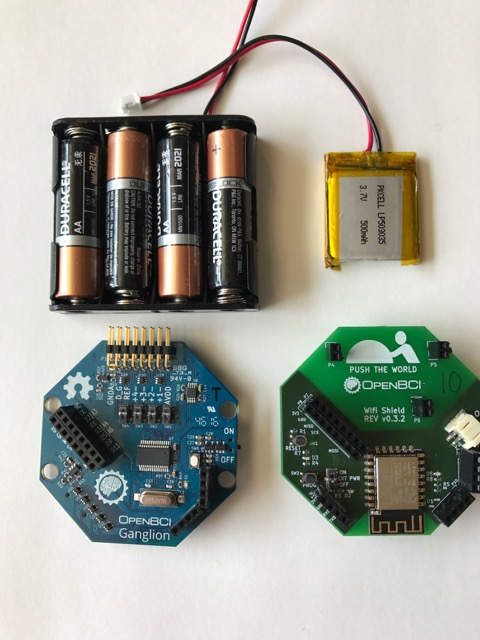
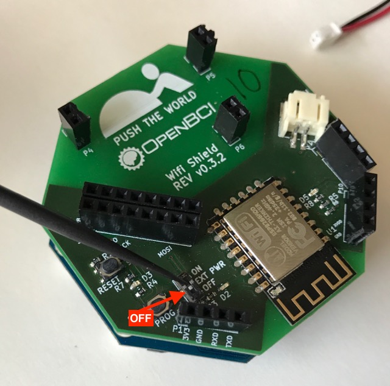

# Wifi Getting Started Guide

**If you see a typo [please open an issue](https://github.com/OpenBCI/Docs/issues/new) or please fix it with a Pull Request on [Github](https://github.com/OpenBCI/Docs).**

## Overview

Congrats on getting an OpenBCI WiFi Shield produced in partnership with [Push The World](www.pushtheworldllc.com).

Before we jump into setting up your WiFi Shield, here are some helpful links:

 * [Learn to update your WiFi Shield](http://docs.openbci.com/Hardware/12-Wifi_Programming_Tutorial) to the [latest firmware](https://github.com/OpenBCI/OpenBCI_32bit_Library/releases/tag/v3.0.0-rc4).
 * Learn about the physical hardware on the WiFi Shield checkout the [OpenBCI Wifi Hardware docs](http://docs.openbci.com/Hardware/11-Wifi)
 * Lookup the commands for the HTTP rest server on the WiFi Shield at the [swaggerhub.io](https://app.swaggerhub.com/apis/pushtheworld/openbci-wifi-server/1.3.0)
 * Checkout the firmware that powers the WiFi Shield at [on Github](http://github.com/OpenBCI/OpenBCI_WIFI)

Always make sure you have the [latest firmware](https://github.com/OpenBCI/OpenBCI_WIFI/releases/latest) loaded on your WiFi Shield. Additionally, you will need to update your [Cyton (at least version v3.0.0-rc4 or newer)](https://github.com/OpenBCI/OpenBCI_32bit_Library/releases/tag/v3.0.0-rc4) to the latest firmware and/or [Ganglion (at least v2.0.0-rc1 or newer)](https://github.com/OpenBCI/OpenBCI_Ganglion_Library/releases/tag/v2.0.0-rc1).

This guide will walk you through setting up your WiFi Shield, connecting it to your computer, and then connecting it to yourself. The first tutorial is for the Ganglion and the second is for the Cyton.

## Powering Your WiFi Shield

A 3.7V LiPo rechargeable battery is highly recommended for powering the WiFi Shield.

### Cyton

You only need one battery when using the Cyton with the WiFi Shield. The Cyton takes power from the WiFi Shield. When the Cyton is powered by the WiFi Shield, you'll find the power switch on the Cyton becomes useless. Don't worry, that's intended. More about powering the Cyton and WiFi Shield can be found in the [these detailed docs](http://docs.openbci.com/Hardware/11-Wifi).

#### What you need

1. OpenBCI WiFi Shield
2. OpenBCI Cyton Board **IMPORTANT: Must have at least [v3.0.0-rc4 Cyton firmware](https://github.com/OpenBCI/OpenBCI_32bit_Library/releases/tag/v3.0.0-rc4) or newer!**
3. One LiPo battery or 6V AA battery pack & (x4) AA batteries (batteries not included)

#### Important Concepts and Tutorials

Please read and be comfortable with the following tutorials

1. [Attaching the WiFi Shield to the Cyton](//Todo: add link)
2. [Powering the WiFi Shield with Cyton](//Todo: add link)
3. [Removing the WiFi Shield from the Cyton](//Todo: add link)
4. [Updating the WiFi Shield Firmware](http://docs.openbci.com/Hardware/12-Wifi_Programming_Tutorial)
5. [Flashing Cyton Firmware](http://docs.openbci.com/Hardware/05-Cyton_Board_Programming_Tutorial) docs.

### Ganglion

You need two batteries in total when using WiFi with the Ganglion. One to power the WiFi Shield and one to power the Ganglion. The WiFi Shield will pull about 10x the amount of power as the Ganglion! The rational behind the two batteries is in the [OpenBCI Wifi Hardware docs](http://docs.openbci.com/Hardware/11-Wifi) and will be addressed in an upcoming hardware revision.

#### What you need

 1. OpenBCI WiFi Shield
 2. OpenBCI Ganglion Board **IMPORTANT: Must have at least v2.0.0 Ganglion firmware or newer!**
 3. 2 batteries, 3.7V or 4.2V LiPo or 6V AA battery will work (batteries not included)

**IMPORTANT! Keep the dip switch labeled `EXT PWR` to `OFF` when using Ganglion.**

#### Important Concepts and Tutorials

Please read and be comfortable with the following tutorials

 * [Attaching the WiFi Shield to the Ganglion](//Todo: add link)  docs.
 * [Powering the WiFi Shield **without** powering the Ganglion](//Todo: add link)
 * [Removing the WiFi Shield from the Ganglion](//Todo: add link)  docs.
 4. [Updating the WiFi Shield Firmware](http://docs.openbci.com/Hardware/12-Wifi_Programming_Tutorial)
 * [Flashing Ganglion Firmware](http://docs.openbci.com/Hardware/09-Ganglion_Programming_Tutorial) docs.

## Get the WiFi Shield On Your Wireless Network

The WiFi Shield must be on the same wireless network as your computer, smart phone, or other internet connected device you wish to talk to the device with. When the WiFi Shield can't join a known network, the Shield turns into a WiFi hotspot, and will have a name such as "OpenBCI-A4AD" where the last four digits are hexadecimal and are unique to your WiFi shield. Use any wireless device to connect to launch a captive touch portal from the the WiFi Shield hotspot.

The WiFi shield does not work for Enterprise level security. Use your cellphone as a hot spot or set up your own wifi network. Push The World is planning a WiFi direct connection as another alternative for researchers and those on enterprise networks.

### Example

A WiFi network is called _MeerketManor_, it's password protected, and the iPhone is connected to _MeerketManor_.

There is a known issue where it may take several times to bring up the captive touch portal, Push The World is actively seeking a better solution, in the meantime, be patient and try multiple times to connect to the board. Power cycling the board may useful.

After a couple seconds a captive touch portal will appear on the computer, phone or tablet. Click _Configure WiFi_.

On the next screen, see that _MeerketManor_ is listed as a possible network for the WiFi Shield to join. Select _MeerketManor_ and enter the password for the network and press _save_.

The credentials saved page will show. If a mistake was made in the password, no worries, Try to rejoin the WiFi Shield network and repeat the process. If the _MeerketManor_ password was entered correct, then the WiFi Shield will join _MeerketManor_ after a quick reboot and every time the network is within range the WiFi shield is not connected to any board.

The OpenBCI is now fully qualified port 80 http server that is fully defined on with an industry standard swagger.io format. Click for [full http server description](https://app.swaggerhub.com/apis/pushtheworld/openbci-wifi-server/1.3.0).

## Connecting with the OpenBCI GUI

[Download the latest version](http://openbci.com/index.php/downloads) of the OpenBCI GUI

### Installing OpenBCI GUI

On Mac, drag and drop the application to /Applications

On Windows, move the application to Program Files. Always run as administrator.

### Streaming Data On Cyton

Select Cyton from the first drop down

Select "Wifi (from WiFi Shield)" as the transfer protocol

Select the desired WiFi Shield from the dropdown list and configure any other settings

Press connect and start streaming!

If you are unable to connect to the board

1. Verify the EXT PWR switch is in the ON position.
2. Verify you do not have a battery in the Cyton
3. Verify the latest firmware on the Cyton
4. Verify the latest firmware on the WiFi Shield

### Streaming Data On Ganglion

Select Ganglion from the first drop down

Select "Wifi (from WiFi Shield)" as the transfer protocol

Select the desired WiFi Shield from the dropdown list and configure output settings

Press connect and start streaming!

If you are unable to connect to the board

1. Always turn the WiFi Shield on and then immediately turn the Ganglion on.
2. Verify the EXT PWR switch is in the OFF position.
3. Verify you are using one battery for the Ganglion and one battery for the WiFi Shield.
4. Verify the latest firmware on the Ganglion
5. Verify the latest firmware on the WiFi Shield
