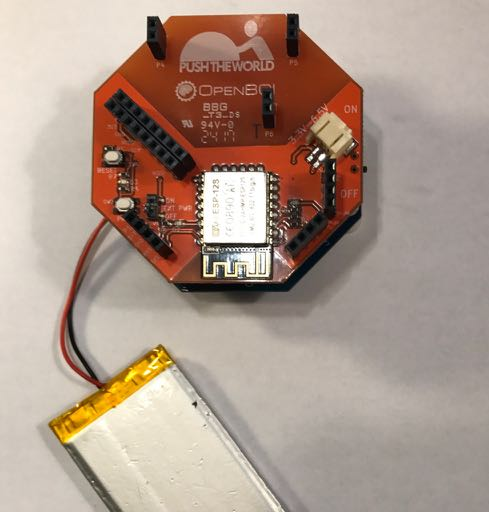

# Wifi Getting Started Guide

**[Suggest changes on this page](https://github.com/OpenBCI/Docs/edit/master/Tutorials/03-Wifi_Getting_Started_Guide.md)**

## Overview

Congrats on your new OpenBCI WiFi Shield! The WiFi Shield was produced in a partnership between OpenBCI and Push The World. OpenBCI lended their expertise in prototyping, sourcing, and distribution while [Push The World](www.pushtheworldllc.com) designed the hardware, firmware, drivers and OpenBCI_GUI code. We are excited to provide a device that opens up a whole new world of possibilities.

## Prerequisites

The WiFi Shield requires your Cyton to run the latest [v3.0.0](https://github.com/OpenBCI/OpenBCI_32bit_Library/releases/tag/v3.0.0) firmware and your Ganglion to the latest [v2.0.0](https://github.com/OpenBCI/OpenBCI_Ganglion_Library/releases/tag/v2.0.0) firmware.

**You must update your firmware before getting started.**

* [Updating Cyton Firmware Tutorial](http://docs.openbci.com/Hardware/05-Cyton_Board_Programming_Tutorial#cyton-board-programming-tutorial-overview)
* [Updating Ganglion Firmware](http://docs.openbci.com/Hardware/09-Ganglion_Programming_Tutorial)

This guide will walk you through setting up your WiFi Shield, connecting it to your computer, and then connecting it to yourself. The first tutorial is for the Cyton and the second is for the Ganglion.

## Cyton with WiFi Shield

You only need one battery when using the Cyton with the WiFi Shield. The Cyton takes power from the WiFi Shield. When the Cyton is powered by the WiFi Shield, you'll find the power switch on the Cyton becomes useless.

### What you need

 1. OpenBCI WiFi Shield
 2. OpenBCI Cyton Board **Must have at least [v3.0.0 Cyton firmware](https://github.com/OpenBCI/OpenBCI_32bit_Library/releases/tag/v3.0.0) or newer!** Here is the guide for [uploading new firmware to your Cyton Board](http://docs.openbci.com/Hardware/05-Cyton_Board_Programming_Tutorial).
 3. One LiPo battery or 6V AA battery pack & (x4) AA batteries (batteries not included)

### General Overview

In general the steps are:

 1. Power off WiFi Shield and Cyton
 2. Seat WiFi Shield on Cyton
 3. Put `EXT PWR` switch on Shield to `ON`
 4. Plug battery into WiFi Shield only
 5. Main power switch on WiFi Shield to `ON`

### Powering the Shield

Install 4 AA batteries in your battery pack or charge up your LiPo battery. The Wifi shield has a larger power draw then the Bluetooth communication system so we recommend using LiPo battery packs. You can keep the `EXT PWR` switch `ON` to passthrough power to the Cyton, more on this in the section below titled _Powering the Shield_.

**IMPORTANT! Keep the dip switch labeled `EXT PWR` to `ON` when using Cyton.**

The Wifi Shield and the Cyton board use only one battery by means of the JST connector on the Wifi shield. Passing through power to the Cyton requries having the `EXT PWR` switch in the `ON` position.

The pass through LED (the right most LED) on the wifi shield will show the solid blue LED from the Cyton below.

Make sure that the external power switch is set to `ON` to send power through to the Cyton board.

The Cyton is not able to supply enough current to power the power-hungry wifi shield, so we put a bigger voltage regulator on the shield to power both the Wifi chip and pass the Cyton components.

## Ganglion with WiFi Shield

### What you need

 1. OpenBCI WiFi Shield
 2. OpenBCI Ganglion Board **IMPORTANT: Must have at least v2.0.0 Ganglion firmware or newer!**
 3. Two batteries, 3.7V or 4.2V LiPo or 6V AA battery will work (batteries not included)

### General Overview

In general the steps are:

 1. Power off WiFi Shield and Ganglion
 2. Seat WiFi Shield on Ganglion
 3. Put `EXT PWR` switch on Shield to `OFF`
 4. Plug battery into Ganglion
 5. Plug battery into WiFi Shield
 6. Main power switch on WiFi Shield to `ON`
 5. Main power switch on Ganglion to `ON`

### Powering the Shield

The Ganglion runs at 3 Volts while the WiFi Shield runs at 3.3V. There fore the Ganglion should not be able to Power the WiFi Shield.

Install 4 AA batteries into your battery pack. or charge up your LiPo batteries. The Wifi shield draws more current than the Ganglion so we recommend using LiPo to power the Wifi Shield.

To use two batteries, keep `EXT PWR` to `OFF`.

You should have two batteries plugged in, always power the WiFi Shield before the Ganglion.

On some modules the Ganglion can power the WiFi Shield using only one battery with `EXT PWR` to `ON`.

## Get the WiFi Shield On Your Wireless Network

The WiFi Shield must be on the same wireless network as your computer, smart phone, or whatever other internet connected device you wish to talk to the WiFi Shield with. For example, in order to stream data into the OpenBCI GUI using your WiFi Shield, you must first make sure that your WiFi shield and computer that is running the OpenBCI GUI are on the same WiFi network.

Before the WiFi Shield has joined a network, the Shield acts as a WiFi hotspot, and will have a name such as "OpenBCI-A4AD" where the last four digits are hexadecimal and are unique to your WiFi shield.

To connect your WiFi shield to your local WiFi network (or any other WiFi network), use any WiFi-enabled device to connect to the WiFi shield hotspot. Doing this launches the captive touch portal as shown in the screenshots below. The captive touch portal is used to connect your WiFi shield to your local WiFi network (or any other WiFi network) so that it can share data across that network.

**Important Notes Before You Continue:**

* In order to unpair your WiFi Shield with a WiFi network (or update its firmware), it cannot be attached to an OpenBCI Board (Cyton or Ganglion). It needs to be powered separately and disconnected from a board, so that it can effectively power cycle after a network connection or firmware update.
* If you have trouble joining the WiFi Shield network, turn the WiFi of your phone/computer/etc. off/on
* It may take 10-15 seconds for your WiFi shield to appear in your WiFi options (be patient!)
* Once you connect your WiFi shield to a network, it will no longer appear in your WiFi options with its "OpenBCI-XXXX" unique ID. To make it reappear, you must first "ERASE CREDENTIALS" of the WiFi Shield from the WIFI SHIELDS configuration inside the OpenBCI GUI
* The WiFi shield does not work for Enterprise level security. Use your cellphone as a hot spot or set up your own wifi network if this is an issue. Push The World is planning a WiFi direct connection as another alternative for researchers and those on enterprise networks.

Follow the below example that goes through the steps of connecting the WiFi Shield to a local WiFi networked called _MeerketManor_. **Note:** in your case the network will not be called _MeerketManor_ but will instead be the name of whatever WiFi network you wish to connect your WiFi Shield to and share data across.

### Example

Your local WiFi network is called _MeerketManor_ and it is password protected. You turn on the WiFi on your smartphone and search for WiFi network options. Additionally, your WiFi Shield is connected to a battery and powered on (and not connected to an OpenBCI Board!). In your iPhone's WiFi network options, you see _MeerketManor_ and "OpenBCI-A4AD" (the last 4 characters will be different in your case).

You click "OpenBCI-A4AD", in an attempt to launch the captive touch portal.

**Note:** there is a known issue where it may take several times to bring up the captive touch portal. Push The World is actively seeking a better solution, in the meantime, be patient and try multiple times to connect to the board. Power cycling the board may useful.

After a couple seconds a captive touch portal will appear on the computer, phone or tablet. Click _Configure WiFi_.

On the next screen, see that _MeerketManor_ is listed as a possible network for the WiFi Shield to join. Select _MeerketManor_ and enter the password for the network and press _save_.

If the _MeerketManor_ password was entered correctly, then the WiFi Shield will join _MeerketManor_ after a quick reboot and every time the network is within range. Have fun streaming your brain waves over WiFi!

**Note:** the OpenBCI WiFi shield cannot be paired with multiple WiFi networks. However, if the WiFi Shield is out of range of the network it is currently paired with, it will reappear as a hotspot again. At this point, if you reconnect to the hotspot and then connect the WiFi Shield to a different WiFi network. The previous network credentials will be overwritten by the new ones.

If you are a developer and want to control the WiFi Shield through HTTP commands checkout the [server specifications](https://app.swaggerhub.com/apis/pushtheworld/openbci-wifi-server/1.3.0)!

## Connecting with the OpenBCI GUI

Although the WiFi Shield can be connected to any internet connected device, the OpenBCI_GUI provides a great application to get started!

### Download/Install/Run the OpenBCI GUI

The OpenBCI GUI gained WiFi Shield support as of `v3.0.0` or later.

Please [follow the step by step guide](http://docs.openbci.com/OpenBCI%20Software/01-OpenBCI_GUI) to install the OpenBCI_GUI as a standalone application. WiFi has no prerequisites other then installing the OpenBCI Hub on Windows, on mac and linux, the hub is built into the standalone app.

Come back to this guide when your GUI is running!

### Streaming Data On Cyton

Select `LIVE (from Cyton)` from the first drop down

Select `Wifi (from WiFi Shield)` as the transfer protocol

The GUI will automatically start searching for WiFi Shields

Select the desired WiFi Shield from the dropdown list

The Cyton will default to a sample rate of 1000Hz with a latency of 10ms. For the majority of modern data WiFi networks these settings will work. If your data transfer LED (`D2` on WiFi Shield) is not solid blue, then you should try adjusting your sample rate and latency while you determine your wireless network problems.

Press `START SYSTEM` when you're ready to begin streaming.

Press `Start Data Stream` to begin streaming!

When you are finished recording, you may press `Stop Data Stream`

Then end your session by pressing `STOP SYSTEM` from the `System Control Panel` drop down.

If you are unable to connect to the board

1. Verify the EXT PWR switch is in the ON position.
2. Verify you do not have a battery in the Cyton
3. Verify the latest firmware on the Cyton
4. Verify the latest firmware on the WiFi Shield

### Streaming Data On Ganglion

Select `LIVE (from Ganglion)` from the first drop down

Select `Wifi (from WiFi Shield)` as the transfer protocol

The GUI will automatically start searching for WiFi Shields

Select the desired WiFi Shield from the dropdown list

The Ganglion will default to a sample rate of 1600Hz with a latency of 10ms. For the majority of modern data WiFi networks these settings will work. If your data transfer LED (`D2` on WiFi Shield) is not solid blue, then you should try adjusting your sample rate and latency while you determine your wireless network problems.

Press `START SYSTEM` when you're ready to begin streaming.

Press `Start Data Stream` to begin streaming!

When you are finished recording, you may press `Stop Data Stream`

Then end your session by pressing `STOP SYSTEM` from the `System Control Panel` drop down.

If you are unable to connect to the board

1. Verify all three LEDs on the WiFi Shield are solid on.
2. If using the Ganglion to power the WiFi Shield, verify the `EXT PWR` switch is in the `ON` position.
3. If using two batteries, verify the `EXT PWR` switch is in the `OFF` position and be sure to always turn the WiFi Shield on before the Ganglion.
4. Verify the latest firmware on the Ganglion
5. Verify the latest firmware on the WiFi Shield

## Get WiFi Shield IP, Mac Address, Firmware Version and more

Select `LIVE (from Ganglion)` or `LIVE (from Cyton)` from the first drop down

Select `Wifi (from WiFi Shield)` as the transfer protocol

The GUI will automatically start searching for WiFi Shields

Select the desired WiFi Shield from the dropdown list

Select the right carrot button to open the WiFi Configuration window

If the connection to the WiFi Shield was successful, you will see a success message.

When you are finished, press the left facing carrot to close the WiFi Configuration window.

### Get WiFi Shield Firmware Version

To verify you have the latest OpenBCI_Wifi firmware version, select `FIRMWARE VERSION` from the WiFi Configuration menu

Compare the firmware version with the [latest OpenBCI_Wifi firmware](https://github.com/OpenBCI/OpenBCI_WIFI/releases/tag/v1.1.3) available and download/update your firmware if it's outdated.

### Get WiFi Shield IP Address

To get the Wifi Shield IP Address, select `IP ADDRESS` from the WiFi Configuration menu

### Get WiFi Shield Mac Address

To get the Wifi Shield IP Address, select `MAC ADDRESS` from the WiFi Configuration menu

### What OpenBCI Board is Connected to the Wifi Shield

If you are having trouble starting to stream with the GUI, then select `OPENBCI BOARD` to verify the WiFi Shield is attached properly to the Cyton or Ganglion.

### Erase WiFi Credentials

If you want to switch what WiFi network your WiFi Shield is on, you can select `ERASE CREDENTIALS`. **NOTE: WiFi Shield must be detached from Ganglion or Cyton.**

The GUI will automatically detach from the WiFi Shield. Your WiFi Shield should now be a hotspot which you can join to give the WiFi Shield the credentials for the new network.

## Helpful links and resources

Before we jump into setting up your WiFi Shield, here are some helpful links:

 * [Learn to update your WiFi Shield](http://docs.openbci.com/Hardware/12-Wifi_Programming_Tutorial) to the [latest firmware](https://github.com/OpenBCI/OpenBCI_32bit_Library/releases/tag/v3.0.0-rc4).
 * Learn about the physical hardware on the WiFi Shield checkout the [OpenBCI Wifi Hardware docs](http://docs.openbci.com/Hardware/11-Wifi)
 * Lookup the commands for the HTTP rest server on the WiFi Shield at the [swaggerhub.io](https://app.swaggerhub.com/apis/pushtheworld/openbci-wifi-server/1.3.0)
 * Checkout the firmware that powers the WiFi Shield at [on Github](http://github.com/OpenBCI/OpenBCI_WIFI)
