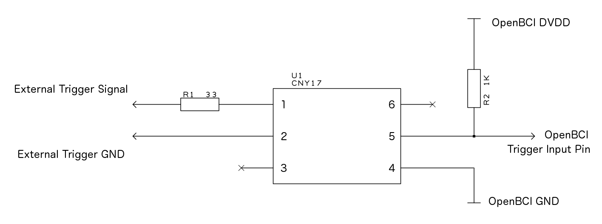
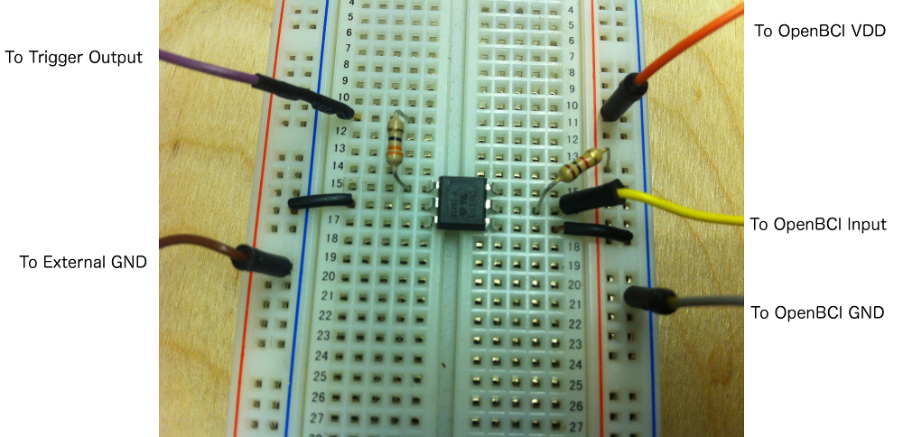

#External Trigger on OpenBCI 32bit Board
Sometimes, when studying EEG or other biopotential signals, you will want to have precise timing between external events or stimulus and the data stream. For example, if you are working with P300 waves it is necessary to know the exact time that the signal was presented to the subject in order to look for the tell-tale brain wave that happens about 300mS after the stimulus. 

This tutorial will cover a couple of ways to add an external trigger to the OpenBCI data stream on our 32bit Board. Please read this entire page before jaunting off into hardware hacking.

##External Triggering The Easy Way
The code used in this example is located [**here**](https://github.com/OpenBCI/OpenBCI_Button_Trigger) for those of you who want to play along at home. There's a tutorial for how to program the 32bit Board [**here**](http://docs.openbci.com/Hardware/05-Cyton_Board_Programming_Tutorial)

The OpenBCI 32bit Board comes with a user accessible pushbutton switch already on the board, wired right to the PIC32 microcontroller. Brilliant! It is the PROG button, and it is used by to put the PIC into bootloader mode when uploading new firmware. When it's not doing that it's attached to pin D17 with a 470K pulldown resistor, so when you press the PROG button, D17 goes from LOW to HIGH. The PROG pushbutton is a great way to get user acknowlegement of a stimulus (for example) into the data stream. You will likely want to note the rising edge (pushed state) of the button press, so that's the example code that we'll work with.

	int pushButton = 17;		// the button is on pin D17
	int pushButtonValue;		// used to hold the latest button reading
	int lastPushButtonValue;	// used to remember the last button state
	boolean addAuxToSD = false;	// use this to write auxiliary data to SD if you like
	boolean state = HIGH;		// used to toggle the on-board LED
	
First thing is to establish the variables we need to read the pushbutton switch, and a flag to let the rest of the program know we got new data. The OpenBCI library already has a variable array for auxiliary data, called auxData, which we will use for logging. I've also added a flag for writing data to an SD card (if you like that kind of thing) and a boolean to toggle the on-board blue LED for user feedback, which is always nice.

In the setup function, we set the pin direction and prime the button variables. The startFromScratch() function resets the board peripheral devices and does some general housekeeping, along with making inital serial contact with any controlling program. the useAccel and useAux variables are inside the OpenBCI_32_Daisy library (hence the **OBCI.**) and it's important to decide and select which kind of data you want to log. It is possible to do both, but you will need to manually operate the useAux or useAcel variables (tutorial on that coming sooooon).

	void setup(){
		// stuff here...
		pinMode(pushButton, INPUT);		// set the button pin direction
		pushButtonValue = lastPushButtonValue = digitalRead(pushButton); // seed
		startFromScratch();     // initialize OpenBCI, read device IDS
  		// you can set EITHER useAccel or useAux to true
  		// if you want both, you MUST set and clear one of the variables every sample
		OBCI.useAccel = false;  // option to add/remove accelerometer data to stream
  		OBCI.useAux = true;     // option to add/remove auxiliary data to stream
		// more stuff...	
	}
		
Then, in the loop, we want to check for the rising edge of the button press, make note of it in the auxData array, and set the write-to-SD flag (if you like). Finally, we want to get the button press event into the data stream. (Reference the [OpenBCI Data Format Doc](http://docs.openbci.com/Hardware/03-Cyton_Data_Format) for data packet anatomy) There are 6 bytes available in each data packet, and the default format is to read them as three 16bit integers (aka 'words' or 'shorts'). You can decide to add your flags into the auxData array any way you choose. In this example, we are setting each short to the value 0x6620. That's because our [OpenBCI GUI](https://github.com/OpenBCI/OpenBCI_Processing) converts these variables to Gs (the GUI is expecting accelerometer data) and 0x6620 converts to PI (3.14). Our sample rate of 250SPS gives us a 4mS resolution on external trigger events like the rising edge of the PROG button press. 

	pushButtonValue = digitalRead(pushButton);    // feel the PROG button
	if (pushButtonValue != lastPushButtonValue){  // if it's changed,
        	if (pushButtonValue == HIGH){    // if it's gone from LOW to HIGH
          		// 0x6220 converts to PI in GUI
          		OBCI.auxData[0] = OBCI.auxData[1] = OBCI.auxData[2] = 0x6220;  
          		addAuxToSD = true;       // add Aux Data to the SD card if it's there
          		state = !state;		// toggle the state variable
          		digitalWrite(LED,state);	// toggle the LED for user useability
        	}
        	lastPushButtonValue = pushButtonValue; // keep track of the changes!
	}

You can do the button feeling at any point in the loop() function. In our sample code linked above, I'm putting it outside of the if(is-running) conditional so that I can see the LED toggle even when the board is not streaming data. That's a nice way to know that you've got everything set up and working before starting a data logging session.

Here's an example of what the data looks like after it's been logged by our GUI.

	217, -18.08, -23.04, -21.59, -29.86, -23.76, -19.65, -28.79, -19.47, 0.00, 0.00, 0.00
	218, -18.17, -22.82, -21.59, -29.93, -23.85, -19.65, -28.72, -19.16, 0.00, 0.00, 0.00
	219, -17.97, -23.04, -21.39, -29.97, -23.92, -19.56, -28.74, -19.24, 0.00, 0.00, 0.00
	220, -17.99, -23.07, -21.61, -30.00, -23.72, -19.71, -28.52, -19.16, 0.00, 0.00, 0.00
	221, -17.90, -23.04, -21.48, -30.09, -23.85, -19.54, -28.43, -19.18, 3.14, 3.14, 3.14
	222, -17.90, -22.96, -21.48, -30.20, -23.72, -19.38, -28.57, -18.95, 0.00, 0.00, 0.00
	223, -17.93, -22.89, -21.26, -29.97, -23.96, -19.65, -28.54, -18.95, 0.00, 0.00, 0.00

And here's an example of what the data looks like after it's been logged to the SD card.

	D9,FFFCD7,FFFBF9,FFFC3A,FFFAC8,FFFBD9,FFFC91,FFFAF8,FFFC99
	DA,FFFCD3,FFFC03,FFFC3A,FFFAC5,FFFBD5,FFFC91,FFFAFB,FFFCA7
	DB,FFFCDC,FFFBF9,FFFC43,FFFAC3,FFFBD2,FFFC95,FFFAFA,FFFCA3
	DC,FFFCDB,FFFBF8,FFFC39,FFFAC2,FFFBDB,FFFC8E,FFFB04,FFFCA7
	DD,FFFCDF,FFFBF9,FFFC3F,FFFABE,FFFBD5,FFFC96,FFFB08,FFFCA6,6220,6220,6220
	DE,FFFCDF,FFFBFD,FFFC3F,FFFAB9,FFFBDB,FFFC9D,FFFB02,FFFCB0
	DF,FFFCDE,FFFC00,FFFC49,FFFAC3,FFFBD0,FFFC91,FFFB03,FFFCB0

##External Triggering The Harder Way
Sometimes a situation may arise where you need to interface OpenBCI witn an existing system, for example an audio or visual event-related potential (ERP). In such a case, it is most desireable to have the onset of the signal tightly bound, temporally, with the EEG data. It is possible to interface the OpenBCI 32bit Board with the external signal generating system using a few low-cost components. 
Our goal with the OpenBCI board is to make biosensing safe and fun. The biggest part of the safety part is making sure that you can't plug yourself accidentally into the mains electrical supply (yikes!). If you are interfacing an external trigger that is **NOT** operating under a battery supply, we recommend thinking twice about incorporating it into your system/protocol. If you have thought throug it twice, here's how we do it when we need to.

###Optoisolation

The simplest trick is to isolate the OpenBCI circuit from the trigger signal generating circuit. For this purpose, we picked an Optoisolator with 5000 Volts isolation between the input and the output. [CNY17](http://www.mouser.ee/ProductDetail/Vishay-Semiconductors/CNY17F-2X006/?qs=sGAEpiMZZMteimceiIVCB7Uit3aMEvQQFLjPtOr%2f870%3d) family from Vishay is a great example of a low-cost high islolation optoisolator. It's usually available, and costs under a dollar (USD) in singles. In the circuit to the right, when an external trigger of 3.3V to 5V is applied to the Anode of the input (pin 1), the output (pin 5) will go from HIGH to LOW.

	int triggerPin = 18;		// the CNY17 Collector is on pin 18
	int triggerValue;		// used to hold the latest trigger reading
	int lastTriggerValue;	// used to remember the latest trigger state
	boolean addAuxToSD;        // option to add the aux data to the SD card 

The code to read this trigger input is quite similar to the previous button code. In this case, we need to use a different pin (pin 18) and watch for the **falling** edge of the trigger.

	void setup(){
		// stuff here...
		pinMode(triggerPin, INPUT);		// set the button pin direction
		triggerValue = lastTriggerValue = digitalRead(triggerPin); // seed
		startFromScratch();     // initialize OpenBCI, read device IDS
  		// you can set EITHER useAccel or useAux to true
  		// if you want both, you MUST set and clear one of the variables every sample
		OBCI.useAccel = false;  // option to add/remove accelerometer data to stream
  		OBCI.useAux = true;     // option to add/remove auxiliary data to stream
		// more stuff...	
	}
	
	void loop(){
	// do stuff
	triggerValue = digitalRead(triggerPin);    // feel the trigger pin
    	if (triggerValue != lastTriggerValue){  // if it's changed,
    		if (triggerValue == LOW){    // if it's gone from HIGH to LOW
       			// 0x6220 converts to PI in GUI
       			OBCI.auxData[0] = OBCI.auxData[1] = OBCI.auxData[2] = 0x6220; 
        		addAuxToSD = true;           // add Aux Data to the SD card if it's there
        		state = !state;		// toggle the state variable
          		digitalWrite(LED,state);	// toggle the LED for user useability
		}
		lastTriggerValue = triggerValue; // keep track of the changes
    	}
    
    	// do other stuff
    	}

Have fun, be safe, and, as always, we're [here to help](http://openbci.com/index.php/forum/) 
