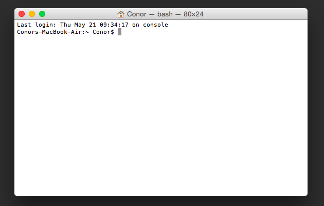

#Fixing FTDI InBufferSize for OS X

### Summary

If you've been working with OpenBCI on MAC OS X, you may have noticed that the data coming from your board and into your computer is very choppy. This is a result of the FTDI virtual com port (VCP) driver's default settings for Mac OS X. For more info on FTDI VCP drivers, see [this forum thread](http://openbci.com/forum/index.php?p=/discussion/196/os-x-and-virtual-com-ports-mavericks-yosemite-note) and the [FTDI VCP web page](http://www.ftdichip.com/Drivers/VCP.htm).

This document details how to edit the config data of the **Info.plist** file of your FTDI VCP driver, so that the choppiness is significantly reduced, and you are able to process the data in real-time, with minimal latency!

This tutorial has been verified to work with the following MAC OS X versions:

- 10.9
- 10.10
- 10.11


### Step 1: open Terminal



To open Terminal, go to: 

/Applications/Utilities/Terminal

All of the lines of code you see below you will run from the Terminal command line. If you are unfamiliar with using Terminal, check out this [Introduction to the Terminal in Mac OS X](https://www.youtube.com/watch?v=yIY3iPDVUBg) Youtube tutorial.

***!!! WARNING !!!*** 

Be very careful when using the **sudo rm** command. It is used to remove files from your system. Never EVER enter the following command by itself, without specifying a filepath. That will wipe your hard drive.

If you are new to Terminal, it is best to simply copy and paste the lines of code below into your terminal window.

### Step 2: Remove any existing FTDI drivers & reboot

Remove the FTDI [kernel extension](http://forums.macnn.com/79/developer-center/81624/what-is-a-kext-file/) (.kext) from your machine. You might not have it  installed already. If you do not, skip this step.

```
sudo rm -rf /System/Library/Extensions/FTDIUSBSerialDriver.kext
```

Also, make sure you do not have another older version of the FTDI Driver on your machine. For some reason version 2.2.18 installs itself in **/System/Libraries/Extensions**, whereas version 2.3 installs itself in **/Libraries/Extentions**, a different filepath altogether.

If you find **FTDIUSBSerialDriver.kext** there as well, remove it with the following line of code:

```
sudo rm -rf /Library/Extensions/FTDIUSBSerialDriver.kext
```

After removing all exisitng FTDI drivers, reboot your computer before continuing.

### Step 3: get the FTDI driver (2.2.18, not 2.3)

Download and install the FTDI Driver 2.2.18 for your processor from the [FTDI VCP page](http://www.ftdichip.com/Drivers/VCP.htm). The latest FTDI VCP driver for MAC OS X (version 2.3) does not work yet for this fix.

Here are the direct download links for [32-bit](http://www.ftdichip.com/drivers/VCP/MacOSX/FTDIUSBSerialDriver_v2_2_18.dmg) and [64-bit](http://www.ftdichip.com/Drivers/VCP/MacOSX/FTDIUSBSerialDriver_v2_2_18.dmg) processors. Most likely you are working with 64-bit.

The downloaded .dmg comes with two installers in it. **FTDIUSBSerialDriver_10_3** for OS X 10.3 and **FTDIUSBSerialDriver_10_4_10_5_10_6_10_7** for the rest. You most likely need to install **FTDIUSBSerialDriver_10_4_10_5_10_6_10_7**.

### Step 4: enable dev mode

Prior to making edits to the kext file, you must enable kext dev mode and disable signature verification. For OS X 10.10 or older, you just type:

```
sudo nvram boot-args="kext-dev-mode=1"
```

For 10.11 or newer, you need to reboot your computer and before booting, hold the Cmd-R key. This will get you into recovery mode. From Utilities, choose Terminal and type:

```
csrutil disable
```

You can then close the Terminal application and reboot your computer to normal mode. You can proceed with Step 6.

### Step 5: reboot your computer

After re-installing the FTDI driver and enabling kext dev mode, reboot your computer once more to ensure that everything has taken effect.

### Step 6: plug in your dongle

Plug in your dongle and ensure that the switch is set to GPIO6 (not RESET). 


### Step 7: unload the FTDI kernel extension 

```
sudo kextunload /System/Library/Extensions/FTDIUSBSerialDriver.kext
```

### Step 8: make sure it's unloaded

```
kextstat | grep FTDI
```
If everthing is good, nothing should print after running this command.

### Step 9: open the Info.plist file:

```
sudo emacs /System/Library/Extensions/FTDIUSBSerialDriver.kext/Contents/Info.plist
```
**Note:** if you'd prefer to use vim (as opposed to emacs) as your text editor, go right ahead! To do so, use run the terminal command below, as opposed to the one above.

```
sudo vim /System/Library/Extensions/FTDIUSBSerialDriver.kext/Contents/Info.plist
```

### Step 10: edit the config data

Now add the new config data for the "FT X Series" as seen below. The "FT X Series" key is about 1/3 of the way through the Info.plist file and all of the keys are in alphabetical order. Scroll down to 'F'!

**BEFORE**

```
<key>FT X Series</key>
<dict>
       <key>CFBundleIdentifier</key>                               
 	   <string>com.FTDI.driver.FTDIUSBSerialDriver</string>
       <key>IOClass</key>
       <string>FTDIUSBSerialDriver</string>
       <key>IOProviderClass</key>
       <string>IOUSBInterface</string>
       <key>bConfigurationValue</key>
       <integer>1</integer>
       <key>bInterfaceNumber</key>
       <integer>0</integer>
       <key>bcdDevice</key>
       <integer>4096</integer>
       <key>idProduct</key>
       <integer>24597</integer>
       <key>idVendor</key>
       <integer>1027</integer>
</dict>
```

**AFTER**

```
<key>FT X Series</key>
<dict>
      	<key>CFBundleIdentifier</key>
    	<string>com.FTDI.driver.FTDIUSBSerialDriver</string>
     	<key>IOClass</key>
        <string>FTDIUSBSerialDriver</string>
        <key>IOProviderClass</key>
        <string>IOUSBInterface</string>
        <key>bConfigurationValue</key>
        <integer>1</integer>
        <key>bInterfaceNumber</key>
        <integer>0</integer>
        <key>bcdDevice</key>
        <integer>4096</integer>
        <key>idProduct</key>
        <integer>24597</integer>
        <key>idVendor</key>
        <integer>1027</integer>
        <key>ConfigData</key>
        <dict>
          <key>PortName</key>
          <string>OpenBCI</string>
          <key>InBufferSize</key>
          <integer>64</integer>
        </dict>
</dict>
```
**Note:** We also rename the port name to OpenBCI because it's easier to spot if the board is connected or not.

### Step 11: save & close

In emacs:

To save:
**[CTRL] + x**
followed by 
**[CTRL] + s**

To close emacs:
**[CTRL] + x**
followed by 
**[CTRL] + c**

---------------

In vim:

Hit the **[esc]** key to go into command mode.
Then type **:wq** to save and quit.


### Step 12: reload the kernel extension
```
sudo kextload /System/Library/Extensions/FTDIUSBSerialDriver.kext
```

### Step 13: make sure it's loaded
```
kextstat | grep FTDI
```
You should get a response that looks something like this:

```
  145    0 0xffffff7f82dce000 0x8000     0x8000     com.FTDI.driver.FTDIUSBSerialDriver (2.2.18) <118 37 5 4 3 1>
```

### Step 14: have fun with real time data 

Open the OpenBCI Processing GUI (or other software), connect to your device, and begin streaming the data. 

Check out the improved latency!

```
\m/-(^.^)-\m/
```
  

------------


### Helpful Resources

- [Marion's original fix (thank you)!](http://ebrain.io/openbci-ftdi-driver/)
- [FTDI VCP web page](http://www.ftdichip.com/Drivers/VCP.htm)
- [What is a .kext file?](http://forums.macnn.com/79/developer-center/81624/what-is-a-kext-file/)
- [FTDI Driver Installation Guide for MAC OS X](http://www.ftdichip.com/Support/Documents/AppNotes/AN_134_FTDI_Drivers_Installation_Guide_for_MAC_OSX.pdf)


