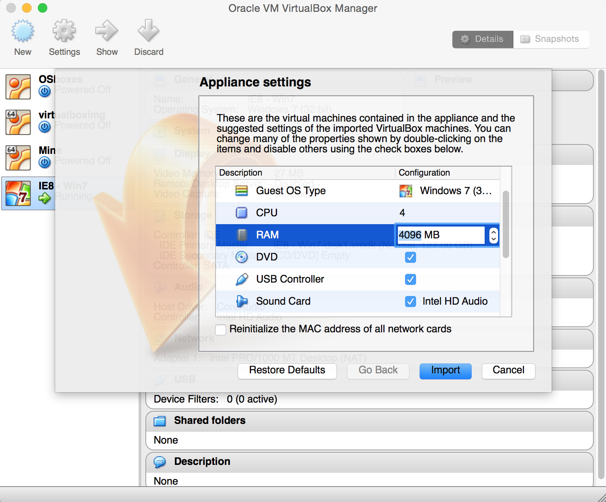

# Installing Windows 7 VM in Virtual Box

1. Download [Virtual Box](https://www.virtualbox.org/wiki/Downloads). 
1. Go to <http://dev.modern.ie/tools/vms/> and download a Windows 7 virtual machine (I used IE8) image for your appropriate host on the "Choose your OS" tab. (The OS that your computer runs natively). Choosing Virtual Box as the platform.
1. Extract and double click on the .OVA file resulting from the extraction. This should start Virtual Box and set up your VM's configurations. 
1. Some EEG processing software uses a lot of RAM (OpenViBE aquisition server for example). In fact, some will take up one entire core, if they can. Because of this, I would advise that you configure your VM to have multiple cores and as much RAM as you deem reasonable. 
1. Import the VM, go through all the configs and start it. 
1. For more detailed instructions/tutorials and troubleshooting see the [Windows Manual](http://modernievirt.blob.core.windows.net/vhd/release_notes_license_terms_1_5_15.pdf). (If you selected a different distribution other than Win 7, see the respective manual in the Windows page.)
1. Follow the [OBCI on Windows](http://docs.openbci.com/Tutorials/11-OpenBCI_on_Windows) tutorial to properly connect your OBCI board on Windows.

NOTE: Make sure that Guest Additions are installed correctly on your VM. With the image used, they should be automatically installed.
