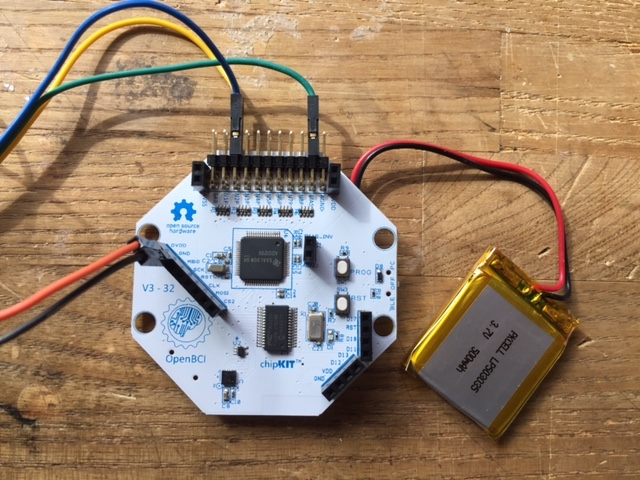

# MyoWare OpenBCI Integration

## I. Materials needed

1. MyoWare board
2. OpenBCI board (we'll be using a Cyton board) with headers soldered and power source
3. OpenBCI dongle, if using Cyton board
4. Two male-male wires, and three male-female wires
5. Soldering iron and materials

### 1. Soldering the MyoWare Headers

Solder 5 wires to the MyoWare board as shown below. Solder the male-male wires to the "+" and "-" connects, and the male-female wires to the R, E, and M connects.

The wires attached to the "+" and "-" connects will be used to supply power to the board. They'll be attached to high voltage and ground outputs on the OpenBCI board.

The wires attached to the R, E, and M connects will transmit electrical signals from MyoWare's three electrodes to the OpenBCI board. R is the reference electrode, the one attached to the black wire. M is the middle electrode, and E is the end electrode. The E and M electrodes will measure activity across a muscle. 

### 2. Preparing OpenBCI Board
Your Cyton board should look like this:

If your Cyton board is missing the black, female pin connectors (called "headers") sticking out of the board, you will need to solder them on before continuing. 

### 3. Wiring the MyoWare board to the OpenBCI board 
Connect the 5 wires from the MyoWare board in step 2 to the OpenBCI board, as shown below:

The "+" and "-" from the MyoWare board should go to DVDD and GND connects on the left side of the Cyton board. R, E, and M will connect to the pins at the top.

The wires should be connected like this:

| MyoWare Board | OpenBCI Board |
| -------------- | -------------- |
| \+ | DVDD |
| \- | GND |
| R | BIAS (top pin) |
| E | N1P Top |
| M | N1P Bottom |

R, "+", and "-" must always go to the pins shown above. E and M can also be connected to N2P top and N2P bottom, or N3P top and N3P bottom, or any of the other two "NXP" pins.

When you have everything wired up, plug in your OpenBCI board and dongle, and turn everything on. Then open up the OpenBCI GUI!

### 4. Using the GUI

As the myoware is basically now a 3-electrode system, we can use it as such in the GUI! If you use the newest GUI version you can use the EMG widget to visualize this data:

This should be the data at rest (before a muscle flex)

Here is the data after a muscle is flexed

And here it is as the muscle goes back to rest

You can use these events to trigger analog or digital events from within the GUI as you like! Make sure to check out the `EMG_Widget.pde` file for a full description of how to do this.
