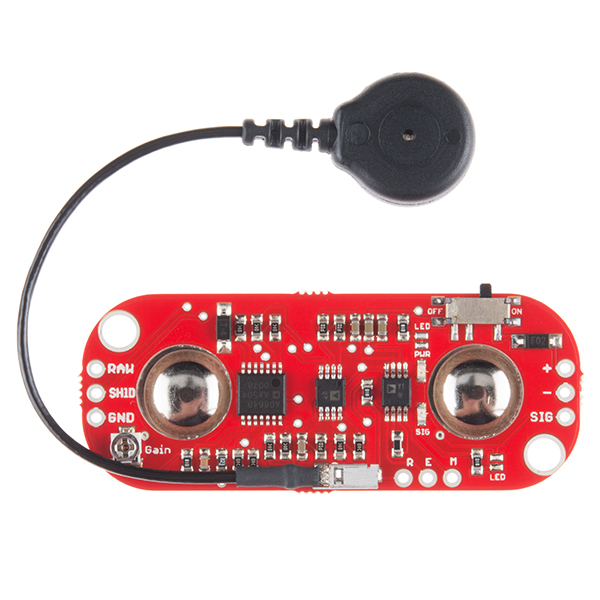
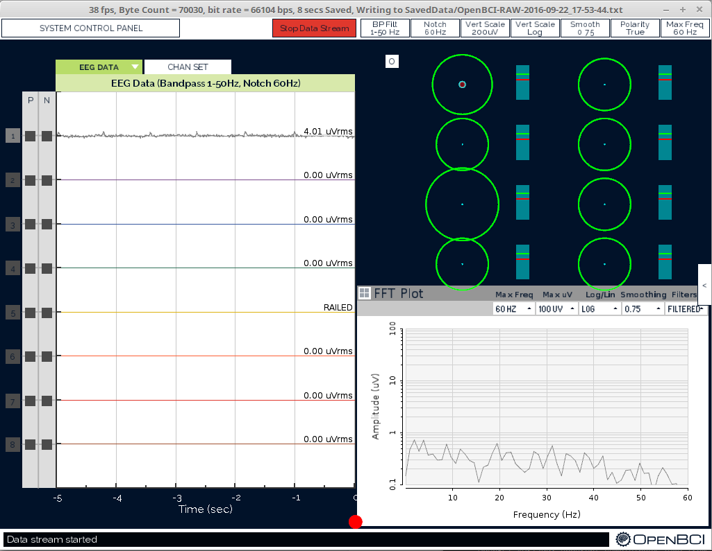
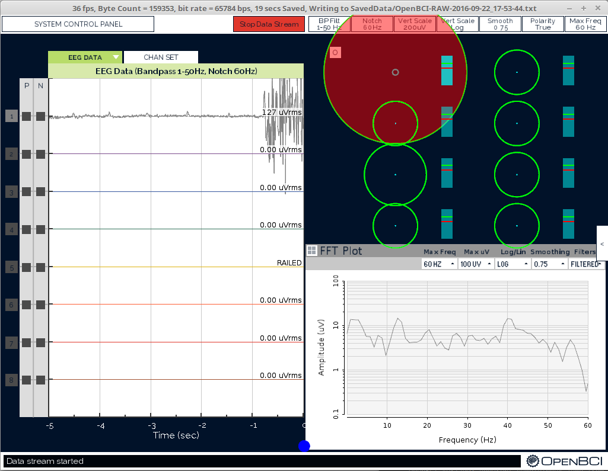
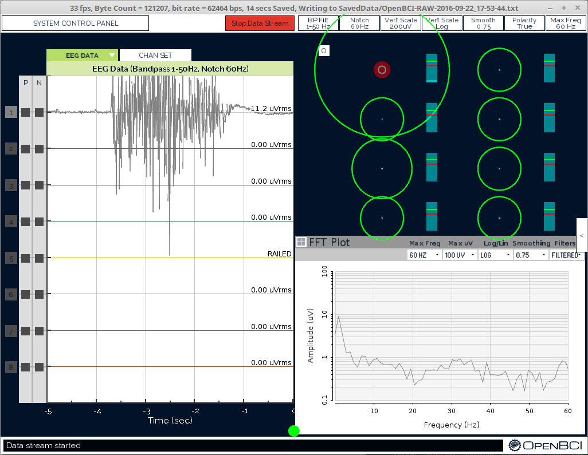

# MyoWare OpenBCI Integration

## I. Materials needed

1. MyoWare Board
2. OpenBCI Board and power source
3. OpenBCI Dongle
4. Headers for soldering (I used male headers but you can use whichever you prefer).
5. Jumper Wires (depending on which headers you use). At least 3 of these cables will need to have female ends and at least 2 will need male ends, the other vary depending on which headers you use.
6. Soldering Iron and some rosin

### 1. Soldering the MyoWare Headers

In order to properly integrate the MyoWare with your OpenBCI board, we will need to get the output of each electrode attached to the myoware  board itself. To do this we will need to solder headers onto the R, E, and M parts of the board. 
R is the reference electrode, the one with the wire. E is the end electrode, and M is the middle electrode. These two electrodes will measure activity across a muscle. 

In addition to these electrode headers we will need to solder headers onto the areas that supply power to the MyoWare. In order to do this, simply solder two headers to the + and - parts of the board. This will be your ground and power supplied from the OpenBCI board.

### 2. OpenBCI Headers

If you have not already soldered your headers onto OpenBCI board, you should do so now. However if you'd prefer to minimize soldering, at least solder headers into the leftmost area of the board. We will be utilizing DVDD and GND right above the OpenBCI logo.

### 3. Wiring 

The wiring is very simple actually! All we need to do is connect the two electrode pins to an NXP input (I used N1P for this tutorial), and the reference to the bottom BIAS pin. For example:
R (Myo)  -> BIAS(OBCI)
M (Myo) -> N1P Bottom (OBCI)
E (Myo) -> N1P Top (OBCI)
+ (Myo) -> DVDD (OBCI)
- (Myo) -> GND (OBCI)

While the M and E electrodes can be interchanged onto any of the NXP pins, the reference electrode will always need to stay on the bottom BIAS pin.

When you have everything wired up, plug in your OpenBCI board and dongle, and turn everything on. Then open up the GUI and you can start coding!

### 4. Using the GUI

As the myoware is basically now a 3-electrode system, we can use it as such in the GUI! If you use the newest GUI version you can use the EMG widget to visualize this data:

This should be the data at rest (before a muscle flex)

Here is the data after a muscle is flexed

And here it is as the muscle goes back to rest

You can use these events to trigger analog or digital events from within the GUI as you like! Make sure to check out the `EMG_Widget.pde` file for a full description of how to do this.