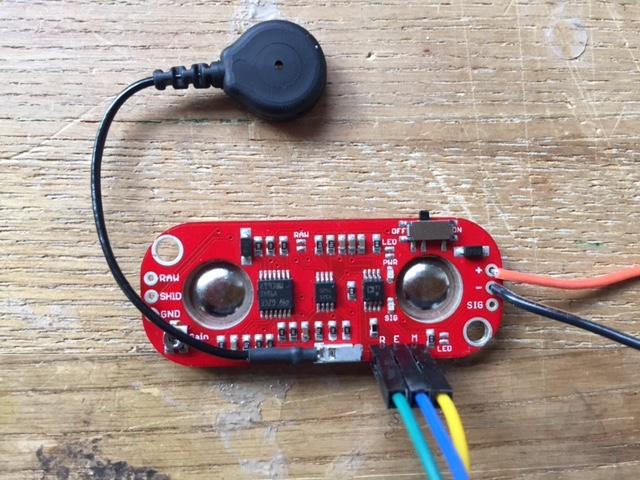

# MyoWare OpenBCI Integration

## I. Materials needed

1. MyoWare board
2. OpenBCI board (we'll be using a Cyton board) with headers soldered and power source
3. OpenBCI dongle, if using Cyton board
4. Two male-male wires, and three male-female wires
5. Soldering iron and materials

### 1. Soldering the MyoWare Headers

Solder 5 wires to the MyoWare board as shown below. Solder the male-male wires to the "+" and "-" connects, and the male-female wires to the R, E, and M connects.

The wires attached to the "+" and "-" connects will be used to supply power to the board. They'll be attached to high voltage and ground outputs on the OpenBCI board.

The wires attached to the R, E, and M connects will transmit electrical signals from MyoWare's three electrodes to the OpenBCI board. R is the reference electrode, the one attached to the black wire. M is the middle electrode, and E is the end electrode. The E and M electrodes will measure activity across a muscle. 

### 2. OpenBCI Board

If you have not already soldered your headers onto OpenBCI board, you should do so now. However if you'd prefer to minimize soldering, at least solder headers into the leftmost area of the board. We will be utilizing DVDD and GND right above the OpenBCI logo.

### 3. Wiring 

The wiring is very simple actually! All we need to do is connect the two electrode pins to an NXP input (I used N1P for this tutorial), and the reference to the bottom BIAS pin. For example:
* R (Myo)  -> BIAS(OBCI)
* M (Myo) -> N1P Bottom (OBCI)
* E (Myo) -> N1P Top (OBCI)
* \+ (Myo) -> DVDD (OBCI)
* \- (Myo) -> GND (OBCI)

While the M and E electrodes can be interchanged onto any of the NXP pins, the reference electrode will always need to stay on the bottom BIAS pin.

When you have everything wired up, plug in your OpenBCI board and dongle, and turn everything on. Then open up the GUI and you can start coding!

### 4. Using the GUI

As the myoware is basically now a 3-electrode system, we can use it as such in the GUI! If you use the newest GUI version you can use the EMG widget to visualize this data:

This should be the data at rest (before a muscle flex)

Here is the data after a muscle is flexed

And here it is as the muscle goes back to rest

You can use these events to trigger analog or digital events from within the GUI as you like! Make sure to check out the `EMG_Widget.pde` file for a full description of how to do this.
