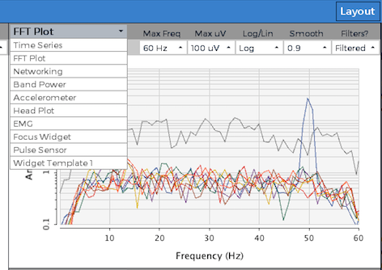

# Custom GUI Widgets

This tutorial shows you how to create your own custom widgets for the [OpenBCI GUI](https://github.com/OpenBCI/OpenBCI_GUI). In just a few easy steps you can have your own mini applications added to the dropdown menus of the OpenBCI GUI for running specialized applications in real-time. These widgets can tap directly into the main data structure of the OpenBCI GUI, so you can experiment with brain waves and other bio data right in the GUI.

## What is a GUI Widget?

GUI widgets are the mini tools that fit into the OpenBCI GUI's interface panes. Examples of GUI widgets include the Time Series, the FFT widget, the Networking widget, and so on. In the upper left hand corner of every widget there is a dropdown menu that lists all of the available widgets. If you click the dropdown and select a new widget from the dropdown, it will replace the widget that currently fills the container you are inside of. You can rearrange the layout of the widget containers by clicking the "Layout" button in the upper righthand side of the GUI. Follow the rest of this tutorial to try creating your own!



## Helpful Background Skills

* Knowledge of [Processing](https://processing.org/) or Java-based programming
* Experience with [running the OpenBCI GUI from the Processing IDE](http://docs.openbci.com/OpenBCI%20Software/01-OpenBCI_GUI#the-openbci-gui-running-the-openbci-gui-from-the-processing-ide)


### Step 1 - duplicate the W_template.pde file & rename

The [W_template.pde](https://github.com/OpenBCI/OpenBCI_GUI/blob/master/OpenBCI_GUI/W_Template.pde) file is designed to serve as a simple starting point for creating your own widgets. You'll want to start by duplicating this file and renaming it to something like W_myNewWidget.pde, where "myNewWidget" is something relevant to the purpose of your new widget! Try to adhere to the naming convention and put **W_** in front to make sure that all of your widgets end up next to one another in your project directory.

You need to remember to rename the class to make sure that it is a unique and not the same class as W_template.pde. The first uncommented line of your file should read:

```
class W_myNewWidget extends Widget {
```

### Step 2 - add your new widget to the widgetManager.pde file

Before adding any fancy code that grabs ahold of local data structures, make sure you add your new widget to the [widgetManager.pde](https://github.com/OpenBCI/OpenBCI_GUI/blob/master/OpenBCI_GUI/WidgetManager.pde) file. By doing this, you make sure your new widget is added to the dropdown menu of each widget. This is helpful because now you can see what your doing as you add graphics to your widget as you continue to develop it.

Follow the protocol instantiating your widget globally by adding it here:

```
// MAKE YOUR WIDGET GLOBALLY
W_timeSeries w_timeSeries;
W_fft w_fft;
W_networking w_networking;
W_BandPower w_bandPower;
W_accelerometer w_accelerometer;
W_ganglionImpedance w_ganglionImpedance;
W_headPlot w_headPlot;
W_template w_template1;
W_emg w_emg;
W_openBionics w_openbionics;
W_Focus w_focus;
W_PulseSensor w_pulsesensor;
W_myNewWidget w_myNewWidget;
```

Then, make sure to "setup" your widget and add it to the array of all widgets by mimicing the setup code lines 

```
  ...
  
  w_networking = new W_networking(_this);
  w_networking.setTitle("Networking");
  addWidget(w_networking, w);

  w_myNewWidget = new W_myNewWidget(_this);
  w_myNewWidget.setTitle("My New Widget");
  addWidget(w_myNewWidget, w);
  
  w_bandPower = new W_BandPower(_this);
  w_bandPower.setTitle("Band Power");
  addWidget(w_bandPower, w);
  
  ...
  
  
```

### Step 3 - make sure your widget appears in the widget dropdown

**Note:** before you can compile the GUI, you'll need to rename the global functions at the bottom of your W_myNewWidget.pde file so that they are different from the global functions at the bottom of W_template.pde. While running the GUI, these functions are automatically activated when the corresponding dropdown is activated in the nav of your widget. Make sure that string (ex: "Dropdown1") in the addDropdown function of the constructor is the exact same string as the name of your corresponding global function at the bottom of your .pde file. The index of the menu item selected is what is passed into the function (ie "int n").

```
//These functions need to be global! These functions are activated when an item from the corresponding dropdown is selected

void Dropdown1(int n){
  println("Item " + (n+1) + " selected from Dropdown 1");
  if(n==0){
    //do this
  } else if(n==1){
    //do this instead
  }

  closeAllDropdowns(); // do this at the end of all widget-activated functions to ensure proper widget interactivity ... we want to make sure a click makes the menu close
}

void Dropdown2(int n){
  println("Item " + (n+1) + " selected from Dropdown 2");
  closeAllDropdowns();
}

void Dropdown3(int n){
  println("Item " + (n+1) + " selected from Dropdown 3");
  closeAllDropdowns();
}
```

Run the GUI, and make sure you can see your new widget in the widget dropdown menu in the upper left corner of all widgets. If you don't see it, make sure you did the above steps properly.


### Step 4 - design your custom widget

Explore how the  existing widgets are accessing data structures internal to the GUI, and see if you can make something cool!

**Some cool things to know:**

* Every widget has `x, y, w, h` variables that corresponds to the left edge of the widget (horizontal pixel location), the top edge of the widget (vertical pixel location), the # of pixels wide, and the # of pixels tall, respectively. These variables update automatically when the screen is resized or when the widgets are cycled through the layout containers. When adding graphics to your widget, do everything based off of these variables to ensure responsiveness.
* Aside from setting up your widget in the widgetManager.pde file, all of your code can live inside of the W_myNewWidget.pde file (if done correctly).
* To see how to access global data structures like FFT data and Time Series data, check out how the [other widgets](https://github.com/OpenBCI/OpenBCI_GUI/tree/master/OpenBCI_GUI) are accessing data in their `update()` functions
* To learn more about how widgets work, look at the [widget.pde](https://github.com/OpenBCI/OpenBCI_GUI/blob/master/OpenBCI_GUI/Widget.pde) file. That said, I don't recommend changing anything!


### Step 5 - share your custom widget with the world!

If you make a functional widget that you think others could benefit from, please share it with the world by submitting a pull request to the [OpenBCI_GUI repo](https://github.com/OpenBCI/OpenBCI_GUI)! 

