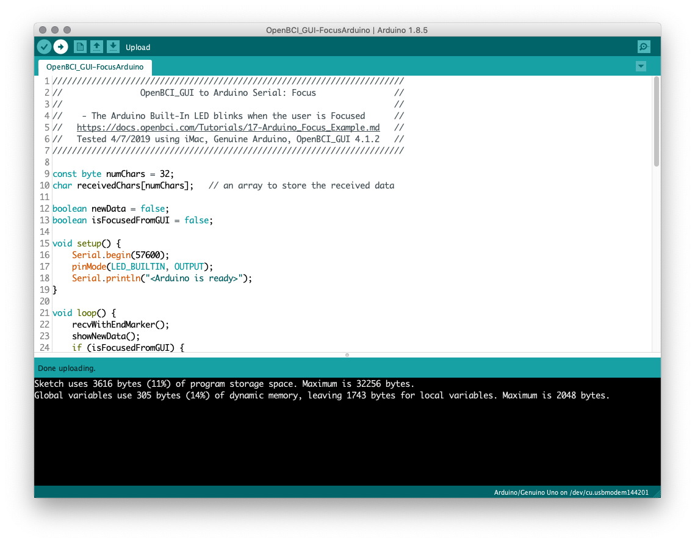
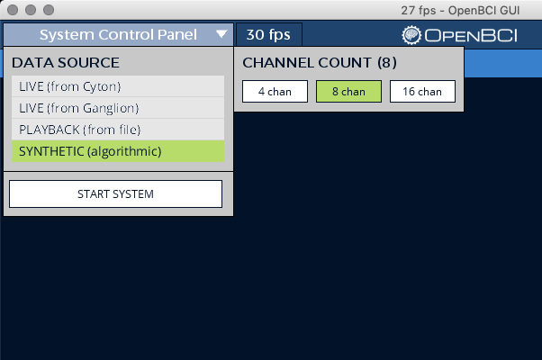
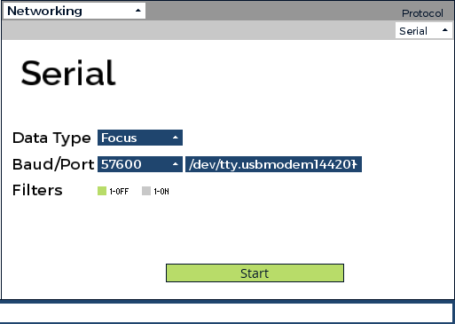
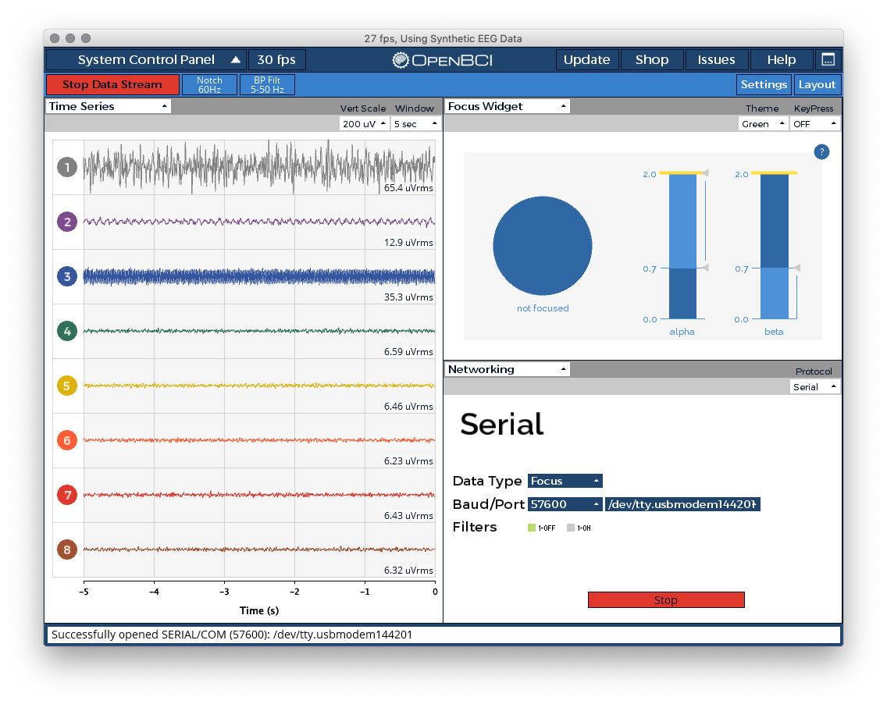
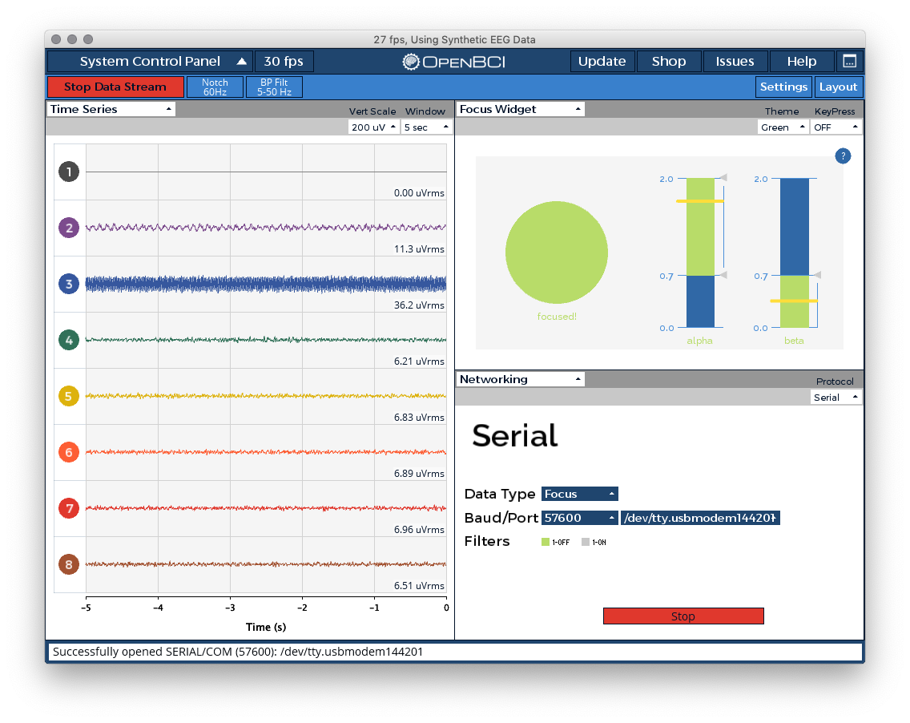

# Send Focus Data from GUI to Arduino

This tutorial shows you how to get started streaming data from the OpenBCI_GUI's Focus Widget via Serial connection to an [Arduino UNO](https://store.arduino.cc/usa/arduino-uno-rev3).

## What do I need?
- The [OpenBCI_GUI](https://github.com/OpenBCI/OpenBCI_GUI/releases/latest) standalone app or Processing sketch
- An [Arduino UNO](https://store.arduino.cc/usa/arduino-uno-rev3), or other similar device
- An [OpenBCI Board](https://shop.openbci.com/collections/frontpage) *(Optional)*

## Helpful Background Skills

* [Arduino Basics](https://www.arduino.cc/en/Guide/HomePage)
* Knowledge of [Arduino](https://www.arduino.cc/reference/en/) or C-based programming
* Experience running the OpenBCI GUI [from the Processing IDE](https://docs.openbci.com/OpenBCI%20Software/01-OpenBCI_GUI#the-openbci-gui-running-the-openbci-gui-from-the-processing-ide) *(Optional)*

### Step 1 - Load the Example in the Arduino IDE

The [OpenBCI_GUI-FocusArduino.ino](../assets/files/OpenBCI_GUI-FocusArduino/OpenBCI_GUI-FocusArduino.ino) file is designed to serve as a simple starting point for creating your own Arduino project using data from the GUI over serial.

### Step 2 - Upload the Arduino sketch

### Step 3 - Open OpenBCI_GUI in Synthetic Mode

### Step 4 - Start Streaming

#### Open and Setup the Networking Widget

#### Open the Focus Widget. Then, click "Start Data Steam" and then "Start" in the Networking Widget

#### Next, turn off channel one to simulate Focused state.

### Step 5 - Learn! Create! Share!

From here, you can add more to your new Arduino project to react to data from the OpenBCI_GUI!

 - **How does the Focus Widget work? [Checkout this community post!](https://openbci.com/community/using-openbci-guis-focus-widget-to-harness-alpha-and-beta-waves/)**
  - **Add more positive information here**

