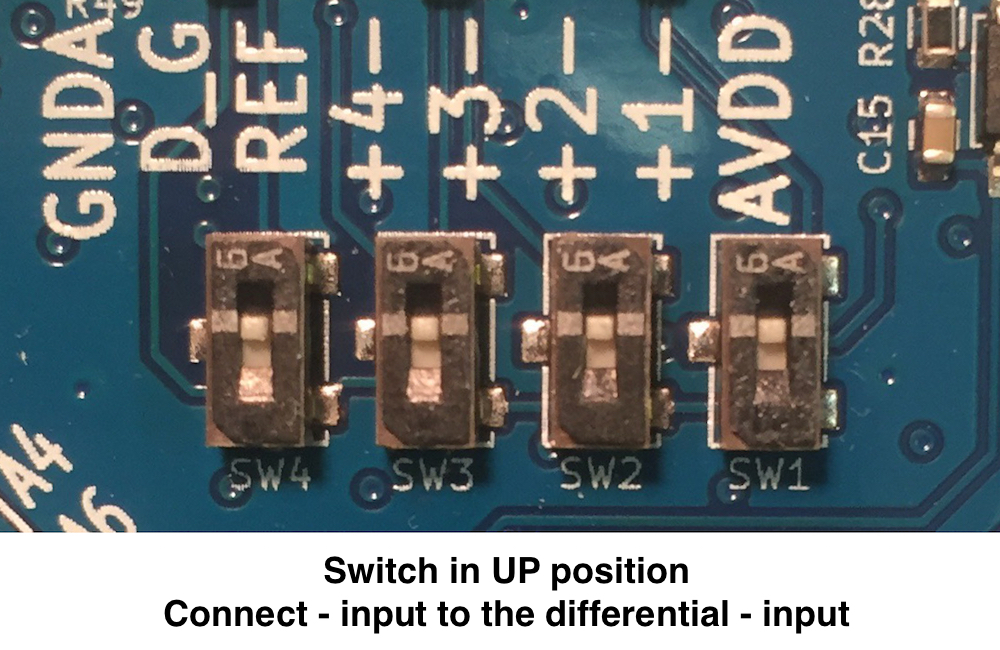
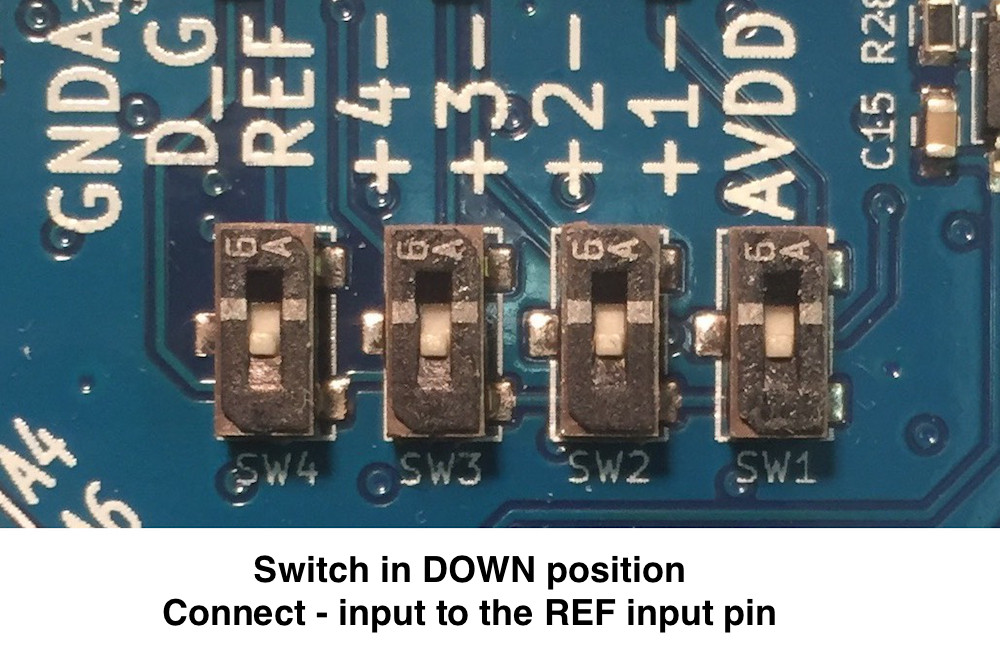

#OpenBCI Ganglion

The OpenBCI Ganglion PCBs were designed with KiCAD, an Open Source PCB capture software. You can find a link to download KiCAD in our [Gagnlion design files repository](https://github.com/OpenBCI/Ganglion_Hardware_Design_Files) where you will find design files and component library files to load into KiCAD and edit, if you like, along with the full BOM for this maiden production run.

## OpenBCI Ganglion Board

###Ganglion Board Specs

* Power with 3.3V to 12V DC battery ONLY
* [Simblee](http://www.simblee.com) BLE Radio module (Arduino Compatible)
* [MCP3912](http://www.microchip.com/wwwproducts/en/MCP3912) Analog Front End
* [LIS2DH](http://www.st.com/en/mems-and-sensors/lis2dh.html) 3 axis Axellerometer
* MicroSD Card Slot
* Board Dimensions 2.41" x 2.41" (octogon has 1" edges)
* Mount holes are 1/16" ID, 0.8" x 2.166" on center
* Switches to manually connect/disconnect inputs to the REF pin

###Simblee Breakout Pins:

* Digital I/O Pins:
	* D0, D1, D2, D3, D4, D5, D9, D11, D12, D21, D23, D24
* Analog Input Pins:
	* A3, A4, A5, A6
* SPI bus pins:
	* MOSI, MISO, SCK
* Other Pins:
	* Simblee Reset, VDD, GND

The SPI pins are available for user access. The blue LED on the board is connected to pin D23. Note that the Analog pins are shared with Digital I/Os. VDD is 3.0V. 

###Push Button
The button switch is connected to the Simblee reset pin, along with a 10K pullup resistor. Pressing this button will put the Simblee into reset. 

###Sensor Inputs
The Ganglion Board is a 4 channel biosensing board. There is a 16 pin Right Angle header, which can be used to interface electrode sensors of all types. Here is a description of the pins.

* **GNDA**
	* Power Supply: 0 Volts. Connects to the top and bottom pin
* **D_G**
	* Driven Ground: 1.5 Volts. Connects to the top and bottom pin
* **REF**
	* Combined Reference input. Connects to the top and bottom pin
* **+4-**
	* Channel input #4. + input on top, - input on bottom
* **+3-**
	* Channel input #3. + input on top, - input on bottom
* **+2-**
	* Channel input #2. + input on top, - input on bottom
* **+1-**
	* Channel input #1. + input on top, - input on bottom
* **AVDD**
	* Power Supply: 3.0 Volts Connects to the top and bottom pin

Each input channel is buffered by an [AD8237](http://www.analog.com/en/products/amplifiers/instrumentation-amplifiers/ad8237.html) Instrumentation Amplifier. There are 4 small slide switches (SW1, SW2, SW3, SW4) which can be set connect the **-** inputs from the InAmps either to their associated **-** pin, or to the **REF** pin.  
The **default** position for these swithches is **UP**, which connects them to their associated differential channel **-** input pin.   
When you move the switch down, that associated channel's **-** input is connected to the **REF** pin. This allows you to 'gang' all of the **-** pins together if you are doing something like reading EEG.

### Ganglion Board Circuit Schematic
####Download Schematic [here](https://github.com/OpenBCI/Ganglion_Hardware_Design_Files/blob/master/Ganglion_SCH.pdf)

### Ganglion Board PCB Layer Images

