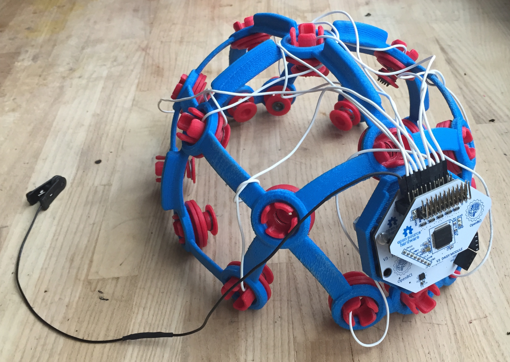

# Ultracortex

The Ultracortex is the evolution of the Spiderclaw. 

For the latest information on Ultracortex, the OpenBCI 3D-printed EEG headset, refer to the [Ultracortex Github repo](https://github.com/OpenBCI/Ultracortex). There you'll find the latest printable STLs, as well as documentation on how to print & assemble the headsets.

Ultracotex Versions:

* Mark 1 - modeled & printed (April 2015)
* [Mark 2 - modeled & printed (May-June 2015)](https://github.com/OpenBCI/Ultracortex/tree/master/Mark_2)
* Mark 3 - currently under development (June 2015-present)

