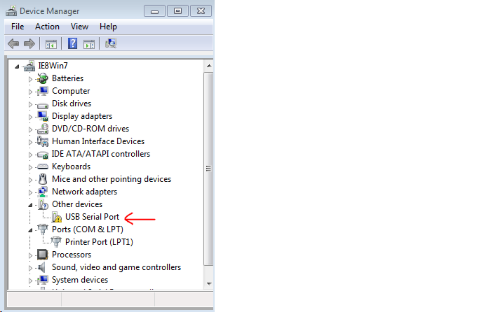
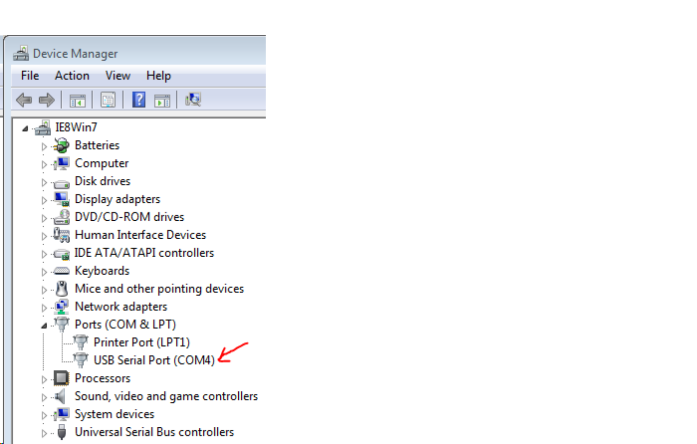
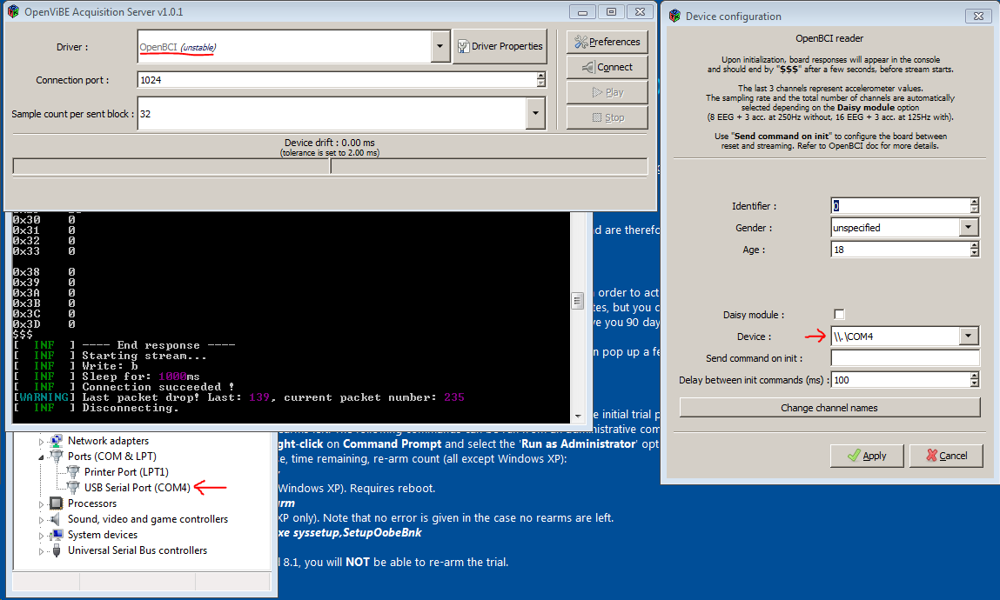

# Connecting OBCI with OpenViBE

ERROR: XML not downloadable yet.

OpenViBE works best and is easiest to install in Windows.
If you have a windows machine, go ahead and skip to the OpenViBE + OBCI section and follow form there.

If you run OS X, don't worry, this guide was made specificaly for mac users so keep reading.

NOTE: [Linux builds](http://openvibe.inria.fr/downloads/) of OpenViBE also work. Some linux users might find this guide useful but keep in mind it is ment primarily for mac + win7.

### Windows 7 Virtual Machine

1. Download [Virtual Box](https://www.virtualbox.org/wiki/Downloads). 
* Go to <http://dev.modern.ie/tools/vms/> and download a Windows 7 virtual machine (I used IE8) image for your appropriate host on the "Choose your OS" tab. (The OS that your computer runs natively). Choosing Virtual Box as the platform.
* Extract and double click on the .OVA file resulting from the extraction. This should start Virtual Box and set up your VM's configurations. 
* OpenViBE aquisition server uses a lot of RAM. In fact, it'll take up one entire core, if it can. Because of this, I would advise that you configure your VM to have multiple cores and as much RAM as you deem reasonable. 

* Import the VM, go through all the configs and start it. 
* For more detailed instructions/tutorials and troubleshooting see the [Windows Manual](http://modernievirt.blob.core.windows.net/vhd/release_notes_license_terms_1_5_15.pdf). (If you selected a different distribution other than Win 7, see the respective manual in the Windows page.)

NOTE: Make sure that Guest Additions are installed correctly on your VM. With the image used, they should be automatically installed.

### OpenViBE + OBCI
1. Make sure you have a running Windows 7 Machine (be it either a VM or native).
* Download the latest OpenViBE software from their [website](http://openvibe.inria.fr/downloads/). 
* Connect the OpenBCI dongle to the computer.
* Power ON the OpenBCI board.
* Enable **FTDI FT231X USB UART** on virtual box through 
**Devices > USB Devices**.
* Allow windows to try to install usb drivers (if error keep reading).
* Open **Device Manager** from the start menu (or **Control Panel > Hardware > Device Manager**) and try to identify the OBCI board. It should be listed as either a COM port or an unidentified USB device.

* If Unidentified, follow the troubleshoot below, otherwise, skip the to next step:
	- Download [FTDI drivers](http://www.ftdichip.com/Drivers/VCP.htm).
	- Right click on Unidentified USB Device from the **Device Manager** tab and select **Update Driver Software**.
	- Select the "**Browse my Computer for Driver**" option and navigate to the FTDI download folder. Click on the folder and then click OK. 
	- Your board should now be recognized as a COM port. 
* Open **Device Manager**. If no errors occurred in the previous two steps, there should be a COM port number listed. To check it is the OBCI board, connecting and disconnecting the Dongle should connect and disconnect the COM port.

 

* The default FTDI latency is too large for EEG applications. To change it, right click the USB Serial Port of the OBCI board and go to **Properties > Port Settings > Advanced** and change the **Latency Timer** from the default 16 ms to 1 ms. 

* Start the OpenViBE Signal Acquisition Server (SAS). **C: > Program Files > openvibe > openvibe-acquisition-server** (normally shows up when searching “openvibe” in start menu). 
* In the SAS select the OpenBCI (unstable means not throughly tested) option from the drop down list.
* Then open **Driver Properties**. In the Device option, select the COM port number your OBCI board was connected to.

* Press Connect. If error, troubleshoot:
	- Look at the terminal window that the SAS opens up. It has a verbose report on the SAS's condition. 
	- Often, pressing the restart button on the OBCI board, or Disconnecting/Conneting the Dongle will fix any connection issues. 
	- If error given is that it connot open the selected port, make sure the COM port selected in driver options is the same as your board.
* Open the OpenViBE designer GUI and load the attached [xml file](../assets/files/OBCI-display.xml). This file is a pre-made graph that will display both the EEG channels and the AUX channels which for the V3 board correspond to accelerometer values of the three cardinal directions. 
* Press the play button on the SAS; then press the play button on the Designer GUI's toolbar above.

##### Enjoy OpenBCI in OpenViBE!

##### Next Steps: 
For more advanced tutorials using OpenBCI and OpenViBE, check out [Jeremy Frey's blog](http://blog.jfrey.info/). He has done both a [P300 Speller](http://blog.jfrey.info/2015/02/04/openbci-p300-coadapt/) and a [Motor Imagery Classifier](http://blog.jfrey.info/2015/03/03/openbci-motor-imagery/)

