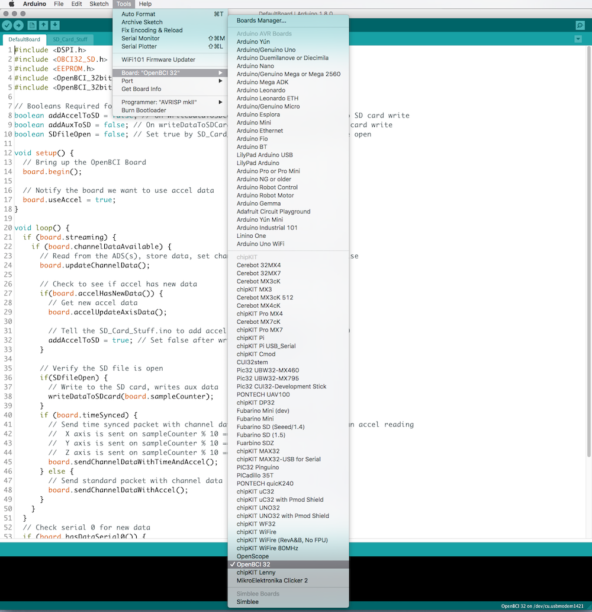

#Upload Code to OpenBCI Board

##Overview
The OpenBCI 8bit and 32bit boards have powerful microcontrollers on them which ship with the latest OpenBCI firmware to interface with the on-board ADS1299, Accelerometer, and SD card. This totorial explains how to program the firmware using the OpenBCI Dongle and you PC. If we come out with a firmware upgrade, or if your or someone comes up with a custom program, you should use the following method for your particular board.

##32bit Upload How-To
**You will need:**

* Computer running version [1.6.5](https://www.arduino.cc/en/Main/OldSoftwareReleases#previous) of Arduino IDE
* OpenBCI Dongle connected to USB port
* OpenBCI 32bit Board with battery power

***Note***: Always plug the Dongle into the PC before powering the Board because the Host (RFduino on the Dongle) must be powered before the Device (RFduino on the Board).

First, install the version 1.6.5 of Arduino IDE which can be found here:

https://www.arduino.cc/en/Main/OldSoftwareReleases#previous

***Note***: To upload code to the OpenBCI board, you need 1.6.5, while you need 1.5.8 to upload code to the dongle. If you have already installed 1.5.8, you may see an error message while installing 1.6.5 saying that you need to uninstall 1.5.8. Instead of doing that, simply move the existing "Arduino" program folder (which should be 1.5.8) in your Program Files to another folder (such as "Documents"). Go to your program manager (called "Change or Remove Program" in Windows, press Uninstall Arduino 1.6.5, and confirm if told that there was an error in uninstalling 1.6.5. Then, install 1.6.5. Rename the new "Arduino" program folder (which should now be 1.6.5) to "Arduino 1.6.5", and rename the Arduino folder that you moved to the name "Arduino 1.5.8". Move this folder back to your Program Files where "Arduino 1.6.5" is located, allowing you to keep both versions.

Windows users: While installing 1.6.5 if the installer instructs you to uninstall 1.5.8, move the Arduino folder from `Program Files (x86)` to your downloads folder. Rename this folder to `Arduino_1.5.8`. Open the `Change or remove program` app in control panel and uninstall the Arduino application. There will be a popup indicating that the files do not exist and asking if you want to remove the program from the files list, select yes. Then install 1.6.5 as normal. Navigate to back to your `Program Files (x86)` folder and locate the Arduino folder. Rename this folder to `Arduino_1.6.5`. Now drag and drop the `Arduino_1.5.8` back into `Program Files (x86)` folder.  

You can find the latest OpenBCI firmware and libraries on our github repository.

https://github.com/OpenBCI/OpenBCI_32bit

https://github.com/OpenBCI/OpenBCI_32bit_Libraries

* OpenBCI_32bit
	* This is the firmware that runs on the OpenBCI 32bit Board
* OBCI_SD
	* Supports writing raw data to on-board SD card

You will need to install the folders 'OpenBCI_32_Daisy' and 'OBCI_SD' from our Libraries repository into your Documents/Arduino/libraries folder. If there is no 'libraries' folder in the sketch folder, create one. Move the folder called 'OpenBCI_32bit' into your Documents/Arduino folder.

Before you can upload code correctly to the PIC32 with Arduino, you need to add the chipKIT-core board files to your Arduino. Follow the instructions to download and install the latest chipKIT-core hardware files from the chipKIT-core wiki

http://chipkit.net/wiki/index.php?title=ChipKIT_core

***NOTE*** You must follow the wiki instructions  **2) Manual install by copying ZIP file** from the chipKIT site.

***ASLO NOTE*** You must use the Test Build from 2015-10-18 *ONLY*

Open the OpenBCI_32bit sketch from the File -> Sketchbook dropdown. Then select OpenBCI 32 from the Board drop-down menu.

Make sure that the slide switch on the OpenBCI Dongle is switched to the GPIO6 selection. If it's on the other side, it will try to program the Dongle-mounted RFduino! Now is a good time to plug your Dongle in and power down the Board.

Select the correct serial port for your OpenBCI Dongle.

* On Macs, this will be named **/dev/tty.usbserial-DN00nnnn** where the nnnn is a combination of numbers and letters specific to your openBCI Dongle.

* On Windows, the serial port will be listed as a numbered COM port.

* On Linux, it will be different.

When you are happy with the code, you will have to put the 32bit board into bootloader mode. We don't have a way to remotely reset the chipKIT compatible IC, so you have to do it manually.

* Power OFF the OpenBCI Board.
* Press down both RST and PROG buttons at the same time.
* Power ON the OpenBCI Board.
* Release the RST button while still holding down the PROG button.
* Release the PROG button.

Now you should see the blue LED on the 32bit board blinking pleasantly. Press the upload button on the Arduino IDE. That's it! You will see some blinky lights on the Dongle, and after a short while, the Arduino IDE will tell you that it's done. Happy Hacking!

##8bit Upload How-To
**You will need:**

* Computer running Arduino IDE
* OpenBCI Dongle connected to USB port
* OpenBCI 8bit Board with battery power

Make sure that the slide switch on the OpenBCI Dongle is switched to the GPIO6 selection. That way the DTR reset signal will get passed over-air to the ATmega328. If it's on the other side, it will try to program the Dongle-mounted RFduino!  
You can find the latest firmware and libraries on our github repository

https://github.com/OpenBCI/OpenBCI_8bit

You will need to install these files from our repository into your Documents/arduino/libraries folder

* SdFat
    * Supports writing raw data to on-board SD card
* OpenBCI_8
    * The OpenBCI 8bit Library

Move the file OpenBCI_8bit_SD.ino into your Documents/arduino folder, and start up the Arduino IDE. you should then see the sketch in your Sketch folder.

Select Arduino UNO from the Board drop-down menu.

Select the correct serial port for your OpenBCI Dongle.

* On Macs, this will be named **/dev/tty.usbserial-DN00nnnn** where the nnnn is a combination of numbers and letters specific to your openBCI Dongle.

* On Windows, the serial port will be listed as a COM port.

* On Linux, it will be different.

When you are happy with the code, simply press upload to program the OpenBCI 8bit target. That's it! You will see some blinky lights on the Dongle, and after a short while, the Arduino IDE will tell you that it's done.

## Troubleshooting

If the upload fails with `No Target Found`:

1. Unplug the Dongle and Device.
2. Plug the Dongle into your computer.
3. Plug the Device into your computer.
4. Put the device into bootloader mode.
5. Try upload again.

If the upload fails with `Program Flash Failed` it's due to the Arduino IDE not being able to read from the serial port fast enough possibly do to resource starvation or overall computer power. We recommend taking the following actions:

* Keep the Board and Dongle physically close to each other during the upload.
* Keep the Arduino IDE open, front and center and don't use any other programs during the upload.
* Close all open programs such as (Google Chrome, MS Word, etc...) and only have the Arduino 1.6.5 IDE open during upload.
* Restart your computer and don't open any other programs other than the Arduino 1.6.5 IDE used for programming.
* If all else fails, find a friend with a more powerful computer and do the uploading from their computer.

In extreme conditions, if you have tried all five of the above methods and still can't upload, then you can try to increase the Device's polling time [in the RFduino Device firmware code](https://github.com/OpenBCI/OpenBCI_Radios/blob/master/OpenBCI_32bit_Device/OpenBCI_32bit_Device.ino#L41). Increase `pollTime` incrementally (by about 5ms) until the upload succeeds. Upload the new radio code to the Device ([see tutorial](http://docs.openbci.com/tutorials/03-Upload_Code_to_OpenBCI_Dongle#uploading-device-firmware-to-openbci-boards-program-device-radio-with-openbci-dongle)). After you are satisfied with the uploaded code. You should set the Device's `pollTime` back to 60mS to remain compatible with existing drivers.   
