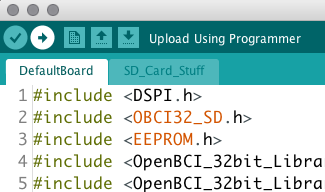

#Upload Code to OpenBCI Board

##Overview
The OpenBCI 8bit and 32bit boards have powerful microcontrollers on them which ship with the latest OpenBCI firmware to interface with the on-board ADS1299, Accelerometer, and SD card. This totorial explains how to program the firmware using the OpenBCI Dongle and you PC. If we come out with a firmware upgrade, or if your or someone comes up with a custom program, you should use the following method for your particular board.

##8bit Upload How-To
**You will need:**

* Computer running Arduino IDE
* OpenBCI Dongle connected to USB port
* OpenBCI 8bit Board with battery power

Make sure that the slide switch on the OpenBCI Dongle is switched to the GPIO6 selection. That way the DTR reset signal will get passed over-air to the ATmega328. If it's on the other side, it will try to program the Dongle-mounted RFduino!  
You can find the latest firmware and libraries on our github repository

	https://github.com/OpenBCI/OpenBCI_8bit

You will need to install these files from our repository into your Documents/arduino/libraries folder

* SdFat
	* Supports writing raw data to on-board SD card
* OpenBCI_8
	* The OpenBCI 8bit Library
	
	

Move the file OpenBCI_8bit_SD.ino into your Documents/arduino folder, and start up the Arduino IDE. you should then see the sketch in your Sketch folder.

Select Arduino UNO from the Board drop-down menu.

Select the correct serial port for your OpenBCI Dongle. 

* On Macs, this will be named **/dev/tty.usbserial-DN00nnnn** where the nnnn is a combination of numbers and letters specific to your openBCI Dongle.

* On Windows, the serial port will be listed as a COM port.

* On Linux, it will be different.

When you are happy with the code, simply press upload to program the OpenBCI 8bit target. That's it! You will see some blinky lights on the Dongle, and after a short while, the Arduino IDE will tell you that it's done.

##32bit Upload How-To
**You will need:**

* Computer running mpide from chipKIT
* OpenBCI Dongle connected to USB port
* OpenBCI 32bit Board with battery power

Make sure that the slide switch on the OpenBCI Dongle is switched to the GPIO6 selection. If it's on the other side, it will try to program the Dongle-mounted RFduino! You can find the latest version of the mpide from chipKit here

	http://chipkit.net/started/install-chipkit-software/
	
You can find the latest firmware and libraries on our github repository

	https://github.com/OpenBCI/OpenBCI_32bit

You will need to install these files from our repository into your Documents/arduino/libraries folder

* SD
	* Supports writing raw data to on-board SD card
* OpenBCI_32
	* The OpenBCI 32bit Library
* OpenBCI_32_SD
	* The mpide code for OpenBCI 32bit Board
	
Before you can upload code correctly to the PIC32 with mpide, you need to make a change to a file inside the mpide application. **The 32bit code won't work unless you do this!** This can be scary if you've never altered application files before, but don't worry. If you really screw things up, you can just download a clean copy of the mpide again! The file we need to change is called Board_Defs.h, and it is located in a specific place for different operating systems:

* The file is located here on a MAC
	* mpide.app/Contents/Resources/Java/hardware/pic32/variants/DP32/Board_Defs.h
* It's similar on Windows
	* C/Program Files (86)/mpide/hardware/pic32/variants/DP32/Board_Defs.h
* On Linux, find the app where you put it and go to 
	* mpide/hardware/pic32/variants/DP32/Board_Defs.h
	
The edit we need to make is to the DSPI0 pin definitions for MISO and MOSI (about line 350 or so). Change the DSPI0 MISO pin to 5, and the DSPI0 MOSI pin to 10. Then save the modified file Board_Defs.h. Now you're ready to start the mpide app, and upload code to the OpenBCI 32bit Board!

	define _DSPI0_MISO_IN	  PPS_IN_SDI1
	define _DSPI0_MISO_PIN   5 	  // [Changed for OpenBCI was 10] RA1  SDI1 SDI1R = RPA1 = 0
	define _DSPI0_MOSI_OUT   PPS_OUT_SDO1
	define _DSPI0_MOSI_PIN   10  // [Changed for OpenBCI was 18] RA4  SDO1 RPA4R = SDO1 = 3

Move the file OpenBCI_32bit_SD.pde into your Documents/mpide folder, and start up the mpide. you should then see the sketch in your Sketch folder.

Select chipKIT DP32 from the Board drop-down menu.

Select the correct serial port for your OpenBCI Dongle. 

* On Macs, this will be named **/dev/tty.usbserial-DN00nnnn** where the nnnn is a combination of numbers and letters specific to your openBCI Dongle.

* On Windows, the serial port will be listed as a COM port.

* On Linux, it will be different.

When you are happy with the code, you will have to put the 32bit board into bootloader mode. We don't have a way to remotely reset the chipKIT compatable IC, so you have to do it manually.

* First, press and hold the RST button
* Then press and hold the PROG button
* Then, release the RST button while still holding the PROG button down
* OK, now you can release the PROG button

Now you should see the blue LED on the 32bit board blinking pleasantly. Press the upload button on the mpide. That's it! You will see some blinky lights on the Dongle, and after a short while, the Arduino IDE will tell you that it's done.
