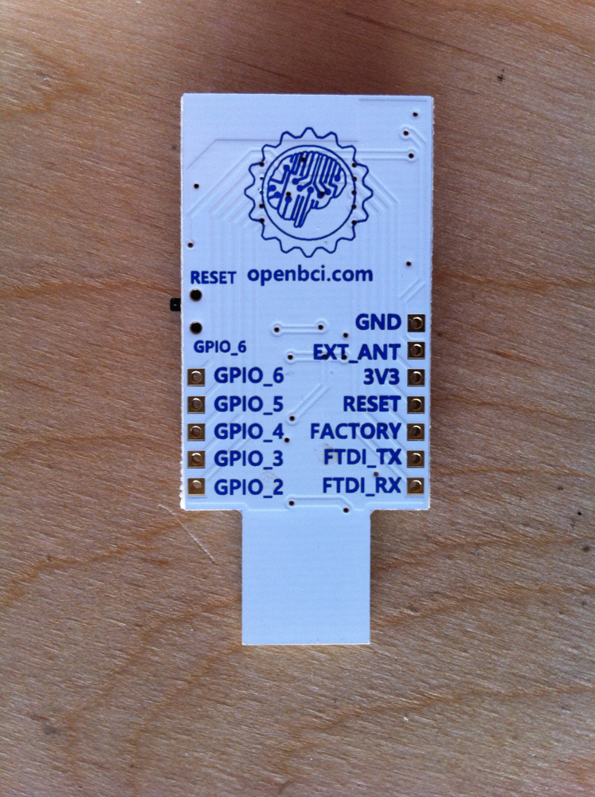

#Upload Code to OpenBCI Dongle

##Overview
The OpenBCI 8bit and 32bit Boards come with a USB dongle that allows for communication between the Board and your computer. There is a BLE radio module (actually an [RFduino 22301](http://www.rfduino.com/product/rfd22301-rfduino-ble-smt/index.html)) on the Dongle and Board that make the communication happen. Here's some terms that are important to note:

* The radio Module on the Dongle is called the **HOST**
* The radio module on the Board (8bit or32bit) is called the **DEVICE**
* Host-Device pairs can be programmed to transmit on up to **25** discreet channels
* The firmware are *important* differences in the 8bit and 32bit systems

This page covers how the radio link works, and how to upload new firmware to the Dongle radio and the Board radio. 
##Setting up your system to program OpenBCI Dongle

**You will need:**

* Computer(Windows or Mac or Other)
* Latest [Arduino BETA IDE](http://arduino.cc/en/Main/Software#toc3)
* Custom RFduino libraries for OpenBCI
* A 0.1uF capacitor (see Device section below)

Download and install the latest Arduino BETA IDE. This is the one with support for the Arduino Yun and Arduino Due (Version 1.5.something)

Download the [OpenBCI_Radios](https://github.com/OpenBCI/OpenBCI_Radios) repo from our github, and place it in the proper location depending upon your OS.
	
	On a Mac, put the RFduino folder and everything it contains in
	/Applications/Arduino.app/Contents/Resources/Java/hardware
	
	On a Windows, put the RFduino folder and everything it contains in 
	C\Arduino-1.5.x\hardware\arduino
	
The files contained in the RFduino folder are custom builds for OpenBCI by our good friends over at RFdigital. Those guys are great! They helped us to squeeze all of the speed we could get out of the RFduinoGZLL library, and also gave us access to 25 discreet channels for OpenBCI boards to work on. ROCK!

##Uploading Host Firmware to the Dongle

This process is the easiest of the two. Before you begin, note that there is a switch on the dongle that allows for selection between **RESET** and **GPIO6**. This switch routes the DTR pin from the FTDI chip to either RESET or GPIO6 pin on the RFduino module. Whe the switch is in the GPIO6 position, the Dongle is ready for general communication, code upload, and streamingData mode to the OpenBCI Board. When the switch is in the RESET position, it is possible to upload code to the RFduino right there on the Dongle. 

If you want to modify the firmware that the OpenBCI Dongle came with, or roll your own, make sure that you are setting the RFduino up as a HOST, and that channel is selected correctly. The channel your boards were shipped with is noted on the static baggie that it came in. 

	// place this above the setup()
	#include <RFduinoGZLL.h>  // using the Gazelle Stack
	device_t role = HOST;  // This is the HOST
	
	void setup(){
		 RFduinoGZLL.channel = 6;  // use channels 2-25. 1 is same as 0 and 0-8 in normal GZLL library
		 RFduinoGZLL.begin(role);  // start the GZLL stack
		 // more stuff here
	}

Also, make sure that you use the code that is specific to your board. There are important differences between the way the 8bit and 32bit code functions! Both the 8bit Host and 32bit Host code are downloaded with the RFduino libraries above.

	

#Uploading Device Firmware to OpenBCI Boards

##Overview
In order to upload code to the Board RFduino, you need to have a Serial connection to the computer. This is traditionally done with a FTDI cable breakout (SparkFun and Adafruit sell several). If you have an FTDI cable or breadout handy, make sure that it is a 3V device! **Using a 5V FTDI device could damage the RFduino on-board OpenBCI!** It is also possible to upload code to the Board mounted RFduino using the OpenBCI Dongle. This page will go over a few ways of uploading firmware to the OpenBCI Device radios.

Again, there is a small difference between the 8bit and 32bit boards, explained below.

##Program Device Radio with OpenBCI Dongle

The idea here is to use the FTDI chip on the Dongle to bridge USB to Serial for the upload process. There is a bit of prep, and a special program for the Dongle radio so that it doesn't get in the way. 

First, solder the headers that came with your OpenBCI Dongle.

