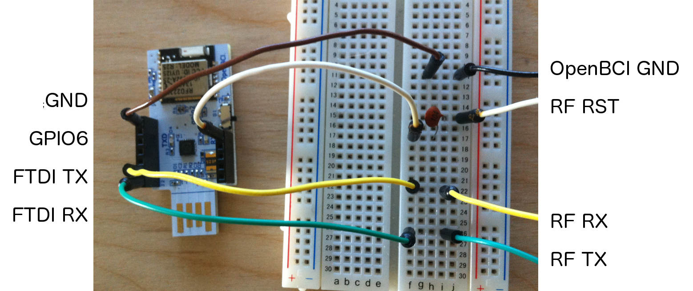
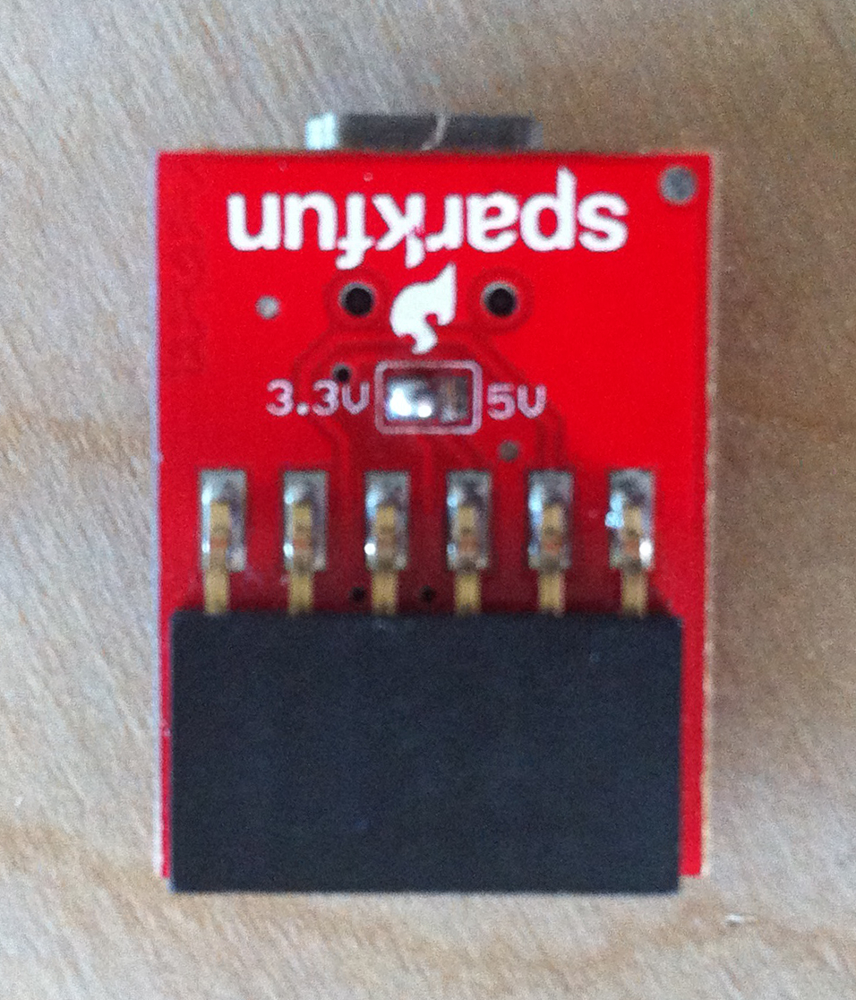
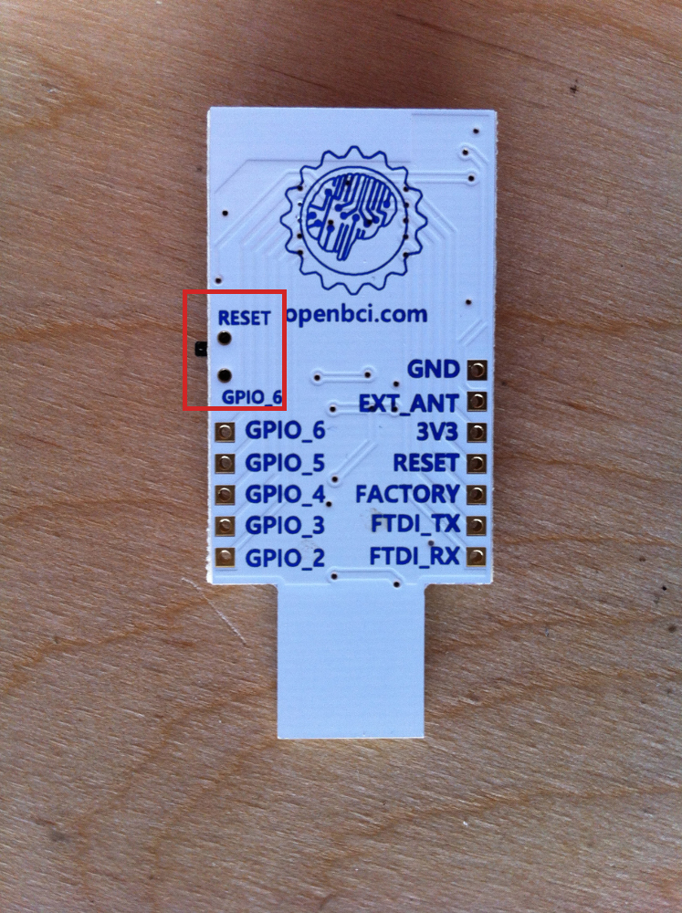

#Upload Code to OpenBCI Radios

##Overview
The OpenBCI 8-bit and 32-bit Boards come with a USB dongle that allows for communication between the Board and your computer. There is a BLE radio module (actually an [RFduino 22301](http://www.rfduino.com/product/rfd22301-rfduino-ble-smt/index.html)) on the Dongle and Board that make the communication happen. Here's some terms that are important to note:

* The radio module on the Dongle is called the **HOST**
* The radio module on the Board (8-bit or 32-bit) is called the **DEVICE**
* Host-Device pairs can be programmed to transmit on up to **25** discreet channels
* There are *important* differences in the firmware for 8-bit and 32-bit systems

This page covers how the radio link works, and how to upload new firmware to the Dongle radio and the Board radio.
##Setting up your system to program OpenBCI Radios

**You will need:**

* Computer (Windows or Mac or Other)
* Arduino IDE Version 1.5.8 BETA
* Custom [RFduino libraries for OpenBCI](https://github.com/OpenBCI/OpenBCI_RFduino/archive/master.zip)
* A 0.1uF capacitor (see Device section below)

**Steps:**

1. Download and install the [Arduino IDE Version 1.5.8 BETA](http://www.arduino.cc/en/Main/OldSoftwareReleases#1.5.x).

   On Windows be sure to download the file marked `Windows Installer`.

   On Mac download the `MAC OS X` version, unzip the app and move it into Applications folder, and then install Java 6 if prompted.

2. Download the [OpenBCI_RFduino](https://github.com/OpenBCI/OpenBCI_RFduino/archive/master.zip) repo from our github.

3. Unzip the folder.

4. Now move the folder called RFduino and everything it contains to:

  On a Mac
/Applications/Arduino.app/Contents/Resources/Java/hardware/arduino

  On a Windows
C:\Program Files (x86)\Arduino-1.5.x\hardware\arduino

  On Linux, put the RFduino folder and everything it contains in
arduino-1.5.8/hardware/arduino

**NOTE FOR LINUX USERS**
Linux users will need to have the program [wine](https://www.winehq.org/) installed in order to continue. There is a dependency for the arduino code that requires the running  `RFDLoader.exe` to continue.
In order to run this .exe, do the following:

  1. Navigate to the /hardware/arduino/RFduino folder
  2. Rename RFDLoader to RFDLoader.old (just in case)
  3. Download [RFDLoader](../assets/RFDLoader)
  4. Drag RFDLoader to the RFduino folder

That's it! As long as `wine` is installed normally the script should take care of any issues you may have when uploading.

5. Download the [OpenBCI_Radios 2.0.0 Firmware](https://github.com/OpenBCI/OpenBCI_Radios/tree/2.0.0) repo from our github. You may also clone the repo into your libraries folder cited after step 6. (Once 2.0.0 is merged with master this will link to master instead of a branch)

6. Unzip the folder, and if it is named OpenBCI_Radios-master, rename it to just OpenBCI_Radios.

7. Move the OpenBCI_Radios folder from your downloads into:

   On Mac/Linux:
Documents/Arduino/libraries

   On Windows:
C:\Users\username\Documents\Arduino\libraries

   If there is no 'libraries' folder in the above folder, create one.

8. Open the Arduino IDE 1.5.8, restart the Arduino IDE if it was open.

9. Select `RFDuino` from `Tools -> Board -> RFDuino`

10. Upload!

The files contained in the RFduino folder are custom builds for OpenBCI by our good friends over at RFdigital. Those guys are great! They helped us to squeeze all of the speed we could get out of the RFduinoGZLL library, and also gave us access to 25 discreet channels for OpenBCI boards to work on. ROCK!

**Note for Windows users** While installing 1.5.8 if the installer instructs you to uninstall 1.6.5, move the Arduino folder from `Program Files (x86)` to your downloads folder. Rename this folder to `Arduino_1.6.5`. Open the `Change or remove program` app in control panel and uninstall the Arduino application. There will be a popup indicating that the files do not exist and asking if you want to remove the program from the files list, select yes. Then install 1.5.8 as normal. Navigate to back to your `Program Files (x86)` folder and locate the Arduino folder. Rename this folder to `Arduino_1.5.8`. Now drag and drop the `Arduino_1.6.5` back into `Program Files (x86)` folder.  

#Uploading Device Firmware to OpenBCI Board

##Overview
In order to upload code to the Board RFduino, you need to have a Serial connection to the computer. This is traditionally done with a FTDI cable breakout (SparkFun and Adafruit sell several). If you have an FTDI cable or breakout handy, make sure that it is a 3V device! **Using a 5V FTDI device could damage the RFduino on-board OpenBCI!** It is also possible to upload code to the Board mounted RFduino using the OpenBCI Dongle. This page will go over a few ways of uploading firmware to the OpenBCI Device radios.

Again, there is a small difference between the 8-bit and 32-bit boards, explained below.

##Program Device Radio with OpenBCI Dongle

The idea here is to use the FTDI chip on the Dongle to bridge USB to Serial for the upload process. There is a bit of prep, and a special program for the Dongle radio so that it doesn't get in the way.

First, solder the headers that came with your OpenBCI Dongle. Then, move the switch to the RESET position, and upload some dummy code to the Dongle radio so that it doesn't interfere with the Serial upload process. Go to the Arduino IDE 1.5.8 and do `File-->Examples-->OpenBCI_Radios-->RadioPassThru32bit`. Make sure to select `RFDuino` from `Tools -> Board -> RFDuino`. Now hit the upload button, it's the button to the right of the check mark in the top left of the IDE. After uploading, make sure to move the switch back over to the GPIO6 side!

Next you need a breadboard, 8 jumpers and a 0.1uF capacitor. 0.1uF capacitors are small and lentil-shaped, and have the number 104 printed on one side. You can order them online from Amazon, eBay, or hobby electronics store. If you have blue buttons on your board you do not need the 0.1uF capacitor because it is already on the board. The 0.1uF capacitor needs to be in series between the Dongle GPIO6 pin and the OpenBCI Board RESET pin.

Here's a picture of the connections that you need to make. Power the OpenBCI board with the battery pack it came with, and so you only need these four connections to do the upload. You could also power the OpenBCI board with 3V from the Dongle, but that makes the next step a bit trickier. In any case, these are the basic pin connections that you need to make when powering the board with a battery pack:

* FTDI RX	-->	RF TX
* FTDI TX	-->	RF RX
* GPIO6	-->	0.1uF Cap	-->	RF RST
* GND	-->	GND

Now go to the Arduino IDE 1.5.8 and open the file called `RadioDevice32bit` by going to `File-->Examples-->OpenBCI_Radios-->RadioDevice32bit`. Make sure to use the same channel number for both the Host and the Device.

*Important!* As of firmware version 2, you must first flash the board with the line `radio.flashNonVolatileMemory();` in the `setup()` function uncommented, then comment the line back out and program again. It is very important that you reprogram the board with the line commented out. We must do this because with firmware version two, the channel number is stored to non-volatile memory so we can change the channel number of the system from the PC/Driver. *If this is your first time uploading firmware version two (your bought you board prior to July 2016), you may ignore this message the first time you upload radio code.*

On The **8-bit Board**, the pins you need to connect to are accessed from the TOP of the board. Insert the jumpers into the holes in the correct position, and press them tightly agains the sides of the holes to make a strong connection. Now, you can upload Device code to the RFduino on the OpenBCI 8-bit Board!

On the **32bit Board** the pins you need to connect to are accessed from the BOTTOM of the board. Connect the jumper wires to the *center* of the pads as shown and press tightly while uploading to the Device.
Helpful tips:
* Use a 4pin female header to keep the wires in place
* Don't move your hand at all
* Place the board on a table or hard surface
* Keep the pins straight up and *centered* on the pads. (perpendicular to the surface of the pads)

There is a trick to it, it may take you a couple tries to get good at it. On Mac, It does not matter if you select `/dev/cu.*` or `/dev/tty.*` in the port selection on the Arduino IDE.

##Program Device Radio with Other FTDI Boards

There are many, many FTDI chip breakouts and cables out there that you can use. Here are a couple examples of popular devices.

###RFduino

RFduino makes a small board that they call a [USB Shield](http://www.rfduino.com/product/rfd22121-usb-shield-for-rfduino/index.html). The form-factor and pinout of the OpenBCI Dongle matches exactly the pinout of the RFduino USB Shield. It's almost like we planned it that way ;) The only thing to change, is that the GPIO6 is not the same as the OpenBCI Dongle. Connect the OpenBCI pin RF RST to the RFduino USB Shield pin RESET. And, you don't need to provide a 0.1uF cap, because **the USB Shield comes with the 0.1uF capacitor already installed!**

###FTDI Friend

Another example would be the [FTDI Friend](http://www.adafruit.com/products/284) from Adafruit. In this case, the pin labled 'RTS' is the one you want to connect to the RF RST on the OpenBCI board. We need to ensure that the 'RTS' pin is behaving correctly and that we're sending 3V logic out! Note the image of the back of the FTDI Friend. I have jumped the pads marked DTR, and also the 3V pads on VCC out. The Signal Logic Level already has the 3V pads jumped. I cut the trace on the RTS and 5V pads as well. These are the correct settings for uploading to RFduino using FTDI Friend. The 'RTS' pin jump to OpenBCI RF RST connection will also need a 0.1uF series capacitor. These breakouts are awesome, but they can be alittle advanced.

###FTDI Basic Breakout

Sparkfun makes an FTDI breakout as well, and they come in a couple of flavors. 5V and 3V. By now, you know that you want the [3V Version](https://www.sparkfun.com/products/9873). [pic coming soon] The Basic Breakout isn't as fancy as the FTDI Friend, but you do need to put a 0.1uF capacitor between the DTR pin and the RF RST pin. Also, if you have a version of this board with a voltage selection on the back, make sure that it has the 3.3V pads connected and the 5V pads cut!

#Uploading Host Firmware to the OpenBCI Dongle

##Overview

This process does not require 3rd party hardware. Before you begin, note that there is a switch on the dongle that allows for selection between **RESET** and **GPIO6**. This switch routes the DTR pin from the FTDI chip to either RESET or GPIO6 pin on the RFduino module. When the switch is in the GPIO6 position, the Dongle is ready for general communication, code upload, and streamingData mode to the OpenBCI Board. When the switch is in the RESET position, it is possible to upload code to the RFduino right there on the Dongle.

**Steps:**

1. In the Arduino IDE 1.5.8 go `File-->Examples-->OpenBCI_Radios-->RadioHost32bit` which will launch the Host firmware.

2. Then go to `Tools-->Board` and select `RFduino`.

3. Plug the Dongle into your computer. Flip the switch to the `Reset` position if it is not already.

4. Now go `Tools-->Port` and select the `COM` port (Windows)  or `/dev/tty.usbserial-*` port (Mac/Linux) for your device or

5. Click "Verify" on the toolbar (checkmark icon) to verify everything is ready. If you see `Done Compiling` then you are ready to go!

6. Choose a channel number for your device. The channel number can be set in the line 37 of code `radio.begin(OPENBCI_MODE_HOST,20);`.

7. Click "Upload" on the toolbar (the icon to the right of the checkmark). Your code is now uploading to the OpenBCI Dongle!

If you want to modify the firmware that the OpenBCI Dongle came with, or roll your own, make sure that you are setting the RFduino up as a HOST, and that channel is selected correctly. The channel your boards were shipped with is noted on the anit-static baggie that it came in.

	// place this above the setup()
	#include <RFduinoGZLL.h>  // using the Gazelle Stack
	device_t role = HOST;  // This is the HOST

	void setup(){
		 RFduinoGZLL.channel = 6;  // use channels 2-25. 1 is same as 0 and 0-8 in normal GZLL library
		 RFduinoGZLL.begin(role);  // start the GZLL stack
		 // more stuff here
	}

Also, make sure that you use the code that is specific to your board. There are important differences between the way the 8bit and 32bit code functions! Both the 8bit Host and 32bit Host code are downloaded with the RFduino libraries above.
