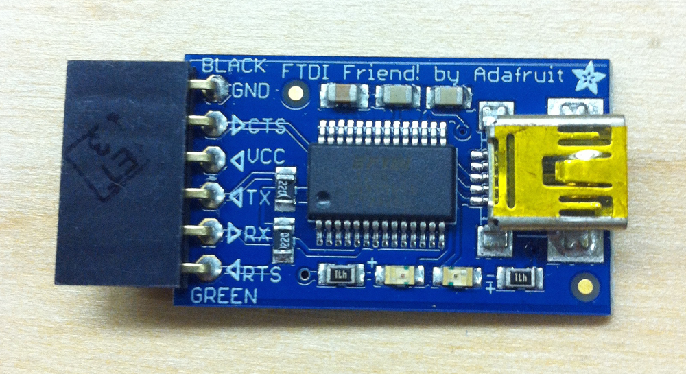
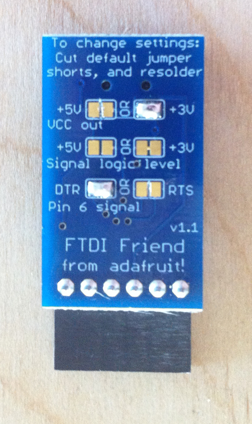

#Upload Code to OpenBCI Dongle

##Overview
The OpenBCI 8bit and 32bit Boards come with a USB dongle that allows for communication between the Board and your computer. There is a BLE radio module (actually an [RFduino 22301](http://www.rfduino.com/product/rfd22301-rfduino-ble-smt/index.html)) on the Dongle and Board that make the communication happen. Here's some terms that are important to note:

* The radio Module on the Dongle is called the **HOST**
* The radio module on the Board (8bit or32bit) is called the **DEVICE**
* Host-Device pairs can be programmed to transmit on up to **25** discreet channels
* The firmware are *important* differences in the 8bit and 32bit systems

This page covers how the radio link works, and how to upload new firmware to the Dongle radio and the Board radio. 
##Setting up your system to program OpenBCI Dongle

**You will need:**

* Computer(Windows or Mac or Other)
* Latest [Arduino BETA IDE](http://arduino.cc/en/Main/Software#toc3)
* Custom RFduino libraries for OpenBCI
* A 0.1uF capacitor (see Device section below)

Download and install the latest Arduino BETA IDE. This is the one with support for the Arduino Yun and Arduino Due (Version 1.5.something)

Download the [OpenBCI_Radios](https://github.com/OpenBCI/OpenBCI_Radios) repo from our github, and place it in the proper location depending upon your OS.
	
	On a Mac, put the RFduino folder and everything it contains in
	/Applications/Arduino.app/Contents/Resources/Java/hardware/arduino
	
	On a Windows, put the RFduino folder and everything it contains in 
	C\Arduino-1.5.x\hardware\arduino
	
The files contained in the RFduino folder are custom builds for OpenBCI by our good friends over at RFdigital. Those guys are great! They helped us to squeeze all of the speed we could get out of the RFduinoGZLL library, and also gave us access to 25 discreet channels for OpenBCI boards to work on. ROCK!

##Uploading Host Firmware to the Dongle

This process is the easiest of the two. Before you begin, note that there is a switch on the dongle that allows for selection between **RESET** and **GPIO6**. This switch routes the DTR pin from the FTDI chip to either RESET or GPIO6 pin on the RFduino module. Whe the switch is in the GPIO6 position, the Dongle is ready for general communication, code upload, and streamingData mode to the OpenBCI Board. When the switch is in the RESET position, it is possible to upload code to the RFduino right there on the Dongle. 

If you want to modify the firmware that the OpenBCI Dongle came with, or roll your own, make sure that you are setting the RFduino up as a HOST, and that channel is selected correctly. The channel your boards were shipped with is noted on the static baggie that it came in. 

	// place this above the setup()
	#include <RFduinoGZLL.h>  // using the Gazelle Stack
	device_t role = HOST;  // This is the HOST
	
	void setup(){
		 RFduinoGZLL.channel = 6;  // use channels 2-25. 1 is same as 0 and 0-8 in normal GZLL library
		 RFduinoGZLL.begin(role);  // start the GZLL stack
		 // more stuff here
	}

Also, make sure that you use the code that is specific to your board. There are important differences between the way the 8bit and 32bit code functions! Both the 8bit Host and 32bit Host code are downloaded with the RFduino libraries above.

#Uploading Device Firmware to OpenBCI Boards

##Overview
In order to upload code to the Board RFduino, you need to have a Serial connection to the computer. This is traditionally done with a FTDI cable breakout (SparkFun and Adafruit sell several). If you have an FTDI cable or breadout handy, make sure that it is a 3V device! **Using a 5V FTDI device could damage the RFduino on-board OpenBCI!** It is also possible to upload code to the Board mounted RFduino using the OpenBCI Dongle. This page will go over a few ways of uploading firmware to the OpenBCI Device radios.

Again, there is a small difference between the 8bit and 32bit boards, explained below.

##Program Device Radio with OpenBCI Dongle

The idea here is to use the FTDI chip on the Dongle to bridge USB to Serial for the upload process. There is a bit of prep, and a special program for the Dongle radio so that it doesn't get in the way. 

First, solder the headers that came with your OpenBCI Dongle. Then, move the switch to the RESET position, and upload some dummy code to the Dongle radio so that it doesn't interfere with the Serial upload process. We provide an Arduino sketch called OpenBCI_Dongle_PassThru.ino which makes this possible. Don't worry! You can re-load the Host code easily after programming the Device. After uploading, make sure to move the switch back over to the GPIO6 side!

The next thing you need are a handful of wires and a 0.1uF capacitor. 0.1uF capacitors are small and lentil-shaped, and have the number 104 printed on one side. You can get them at your local radio shack, or hobby electronics store. The 0.1uF capacitor needs to be in series between the Dongle GPIO6 pin and the OpenBCI Board RFRST pin. 

While you're at the store, might as well pick up some jumper wires and a breadboard, unless you got that kind of thing laying around... Here's a picture of the connections that you need to make. In this case, I am powering the OpenBCI board with the battery pack it came with, and so I only need these four connections to do the upload. I could also power the OpenBCI board with 3V from the Dongle, but that makes the next step abit trickier. In any case, these are the basic pin connections that you need to make when powering the board with a battery pack:

* FTDI RX	-->	RF TX
* FTDI TX	-->	RF RX
* GPIO6	-->	0.1uF Cap	-->	RF RST
* GND	-->	GND

On The **8bit Board**, the pins you need to connect to are accessed from the TOP of the board. Insert the jumpers into the holes in the correct position, and press them tightly agains the sides of the holes to make a strong connection. Now, you can upload Device code to the RFduino on the OpenBCI 8bit Board!

On the **32bit Board** the pins you need to connect to are accessed from the BOTTOM of the board. Connect the jumper wires to the pads as shown and press tightly while uploading to the Device.

##Program Device Radio with Other FTDI Boards

There are many, many FTDI chip breakouts and cables out there that you can use. Here are a couple examples of popular devices.

###RFduino

RFduino makes a small board that they call a [USB Shield](http://www.rfduino.com/product/rfd22121-usb-shield-for-rfduino/index.html). The form-factor and pinout of the OpenBCI Dongle matches exactly the pinout of the RFduino USB Shield. It's almost like we planned it that way ;) The only thing to change, is that the GPIO6 is not the same as the OpenBCI Dongle. Connect the OpenBCI pin RF RST to the RFduino USB Shield pin RESET. And, you don't need to provide a 0.1uF cap, because **the USB Shield comes with the 0.1uF capacitor already installed!** 

###FTDI Friend

Another example would be the [FTDI Friend](http://www.adafruit.com/products/284) from Adafruit. In this case, the pin labled 'RTS' is the one you want to connect to the RF RST on the OpenBCI board. We need to ensure that the 'RTS' pin is behaving correctly and that we're sending 3V logic out! Note the image of the back of the FTDI Friend. I have jumped the pads marked DTR, and also the 3V pads on VCC out. The Signal Logic Level already has the 3V pads jumped. I cut the trace on the RTS and 5V pads as well. These are the correct settings for uploading to RFduino using FTDI Friend. The 'RTS' pin jump to OpenBCI RF RST connection will also need a 0.1uF series capacitor. These breakouts are awesome, but they can be alittle advanced.

###FTDI Basic Breakout

Sparkfun makes an FTDI breakout as well, and they come in a couple of flavors. 5V and 3V. By now, you know that you want the [3V Version](https://www.sparkfun.com/products/9873). [pic coming soon] The Basic Breakout isn't as fancy as the FTDI Friend, but you do need to put a 0.1uF capacitor between the DTR pin and the RF RST pin. Also, if you have a version of this board with a voltage selection on the back, make sure that it has the 3.3V pads connected and the 5V pads cut!
