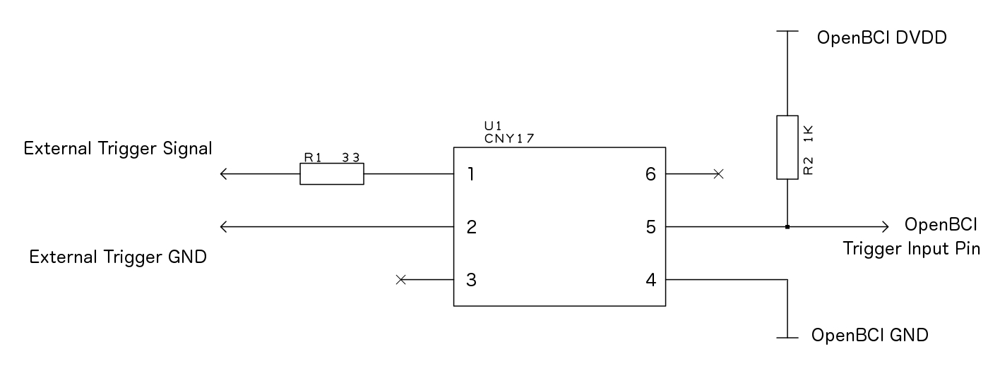
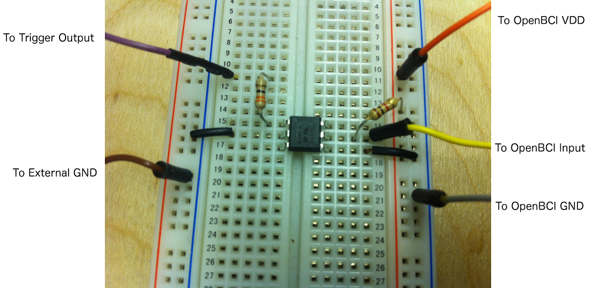

#External Trigger on OpenBCI 32bit Board
Sometimes, when studying EEG or other biopotential signals, you will want to have precise timing between external events or stimulus and the data stream. For example, if you are working with P300 waves it is necessary to know the exact time that the signal was presented to the subject in order to look for the tell-tale wave that happens about 300mS after the stimulus. 

This tutorial will cover a couple of ways to add an external trigger to the OpenBCI data stream on our 32bit Board. Please read this entire page before jaunting off into hardware hacking.

##External Triggering The Easy Way
The OpenBCI 32bit Board comes with a user defineable pushbutton switch already on the board, wired right to the PIC microcontroller. Brilliant! The PROG button is used by the PIC to put it into bootloader mode when uploading new firmware, but when it's not doing that it's attached to a GPIO(D17) with a 470K pulldown resistor. To access the PROG pushbutton in your program create a variable alias for the pin above the setup in your mpide sketch. This method will acquire signals from the subject, or their friend next to them. The PROG pushbutton is a great way to get user acknowlegement of a stimulus (for example) into the data stream. You will likely want to note the rising edge of the button press, so that's the example code that we'll work with. (**Remember:** the 32bit Board programs with mpide from chipKIT!)

	int pushButton = 17;		// the button is on pin D17
	int pushButtonValue;		// used to hold the latest button reading
	int lastPushButtonValue;	// used to remember the last button state
	boolean addAuxToSD;        // option to add the aux data to the SD card 
First thing is to establish the variables we need to read the pushbutton switch, and a flag to let the rest of the program know we got new data. The OpenBCI library already has a variable array for auxiliary data, called auxData, which we will use. In the setup function, we set the pin direction and prime the button variables.

	void setup(){
		// stuff here...
		pinMode(pushButton, INPUT);		// set the button pin direction
		pushButtonValue = lastPushButtonValue = digitalRead(pushButton); // seed
		// more stuff...	
	}
		
Then, in the loop, we wan to check for the rising edge of the button press, make note of it in the auxData[0] variable, and set the flag. Finally, we want to get the button press event into the data stream. (Reference the [OpenBCI Data Format Doc](http://docs.openbci.com/software/02-OpenBCI_Streaming_Data_Format) for data packet anatomy) There are 6 bytes available in each data packet, and the default format is to read them as three 16bit integers. By default, the accelerometer values are included in the data stream, and they update every 5th data packet (Accelerometer runs at 50Hz by default). When the OBCI.useAux boolean is set, the updated auxData value will get written with the next data packet and override the accelerometer data if it's there. The overridden accelerometer data gets bumped to the next packet. Our sample rate of 250SPS gives us a 4mS resolution on external trigger events like the rising edge of the PROG button press. 

	pushButtonValue = digitalRead(pushButton);    // feel the PROG button
     if (pushButtonValue != lastPushButtonValue){  // if it's changed,
       if (pushButtonValue == HIGH){    // if it's gone from LOW to HIGH
       OBCI.auxData[0] = 0xFFFF;	 // take note (this could be a counter, or...)
       OBCI.useAux = true;	         // set the OBCI.auxData flag
       addAuxToSD = true;           // add Aux Data to the SD card if it's there
	}
	lastPushButtonValue = pushButtonValue; // keep track of the changes
    }

Here's a link to the github branch that implements this pushbutton input!
[OpenBCI PROG Button Trigger](https://github.com/OpenBCI/OpenBCI_32bit/tree/OpenBCI_32bit_Button_Trigger)

##External Triggering The Harder Way
Sometimes a situation may arise where you need to interface OpenBCI witn an existing system, for example an audio or visual event-related potential (ERP). In such a case, it is most desireable to have the onset of the signal tightly bound, temporally, with the EEG data. In sucha case it is possible to interface OpenBCI with the signal generating system with a few low-cost interface parts. 
Our goal with the OpenBCI board is to make biosensing safe and fun. The biggest part of the safety part is making sure that you can't plug yourself accidentally into the mains electrical supply (yikes!). If you are interfacing an external trigger that is **NOT** operating under a battery supply, we recommend thinking twice about incorporating it into your system/protocol. If you've thought twice, here's how we do it when we need to.

###Optoisolation

The simplest trick is to isolate the OpenBCI circuit from the trigger signal generating circuit. For this purpose, we picked an Optoisolator with 5000 Volts isolation between the input and the output. [CNY17](http://www.mouser.ee/ProductDetail/Vishay-Semiconductors/CNY17F-2X006/?qs=sGAEpiMZZMteimceiIVCB7Uit3aMEvQQFLjPtOr%2f870%3d) family from Vishay is a great example of a low-cost high islolation optoisolator. In the circuit to the right, when an external trigger of 3.3V to 5V is applied to the Anode of the input (pin 1), the output (pin 5) will go from HIGH to LOW.

	int triggerPin = 18;		// the CNY17 Collector is on pin 18
	int triggerValue;		// used to hold the latest trigger reading
	int lastTriggerValue;	// used to remember the latest trigger state
	boolean addAuxToSD;        // option to add the aux data to the SD card 

The code to read this trigger input is quite similar to the previous button code. In this case, we need to use a different pin (pin 18) and watch for the **falling** edge of the trigger.

	void setup(){
		// stuff here...
		pinMode(triggerPin, INPUT);		// set the button pin direction
		triggerValue = lastTriggerValue = digitalRead(triggerPin); // seed
		// more stuff...	
	}
	
	void loop(){
	// do stuff
	
	triggerValue = digitalRead(triggerPin);    // feel the trigger pin
    if (triggerValue != lastTriggerValue){  // if it's changed,
    	if (pushButtonValue == LOW){    // if it's gone from HIGH to LOW
        OBCI.auxData[0] = 0xFFFF;	 // take note (this could be a counter, or...)
        OBCI.useAux = true;	         // set the OBCI.auxData flag
        addAuxToSD = true;           // add Aux Data to the SD card if it's there
	}
	lastTriggerValue = triggerValue; // keep track of the changes
    }
    
    // do other stuff
    }
