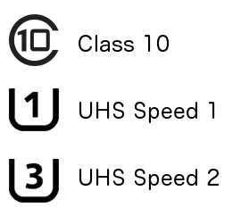
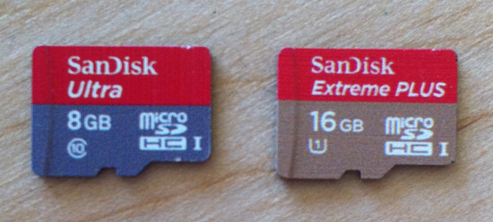
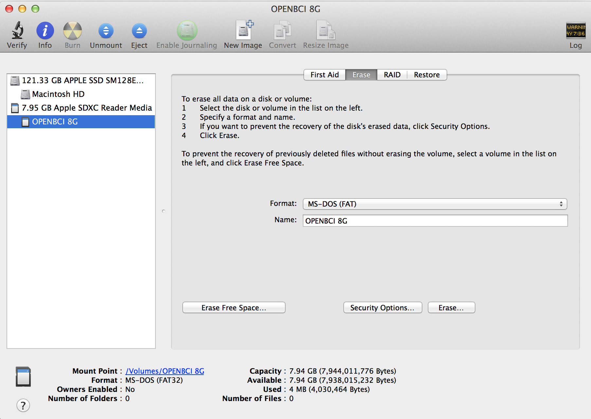
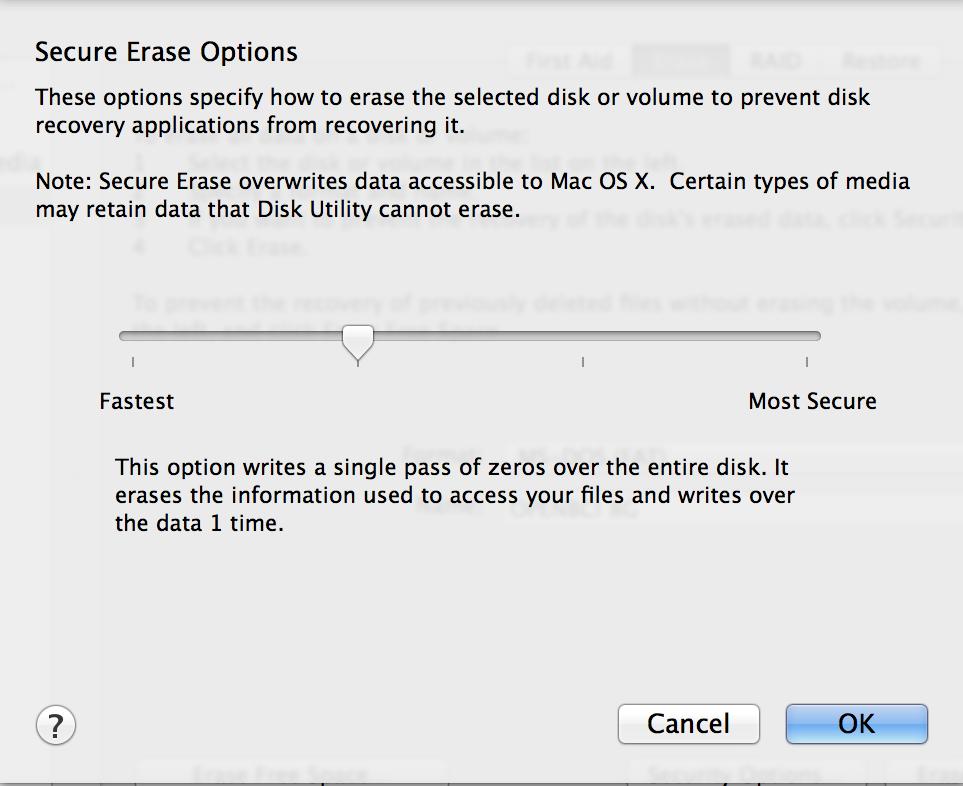
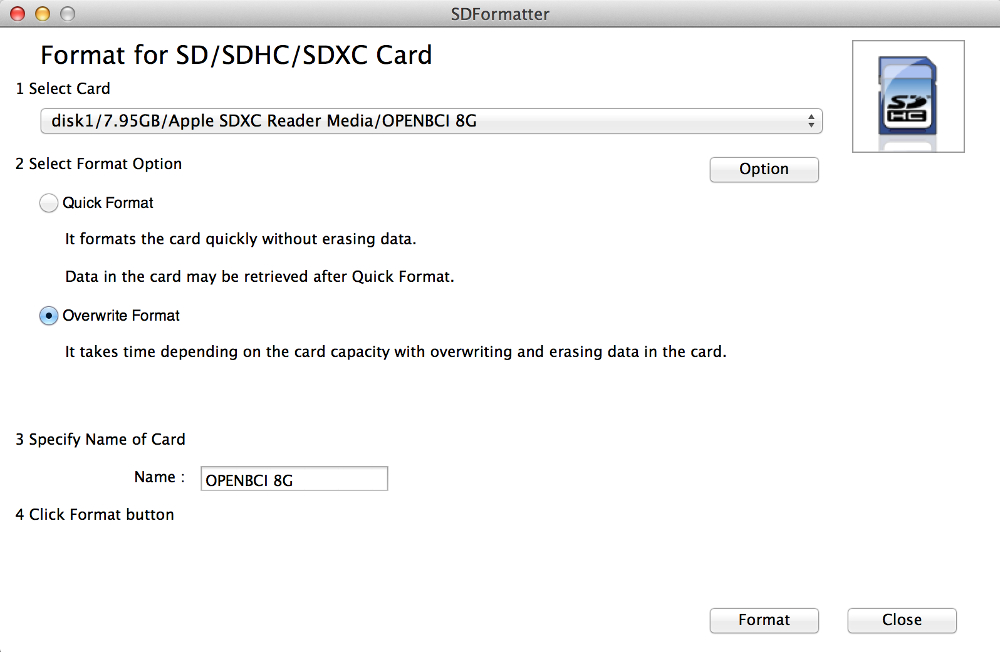
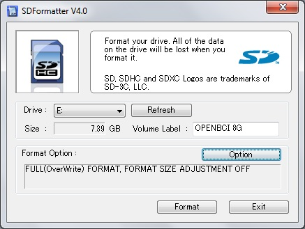
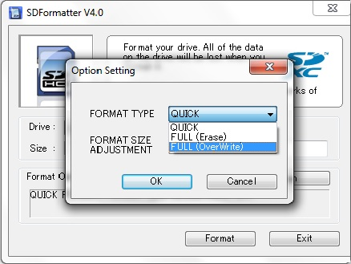

#Using SD Card with OpenBCI

##Overview
There are many situations where logging biometric data to local storage may be desirable. You may be doing a sleep study, or out on the road with your OpenBCI, and the wireless connection to a PC may be tenuous. The amount of data you are producing may require more bandwidth than the BLE connection can handle. This tutorial will cover the basics of adding an SD card for local storage to OpenBCI, how the data is formatted on the card, and how to retrieve the data after you've logged it. 

##SD Card Basics

First thing to know is that low-cost cards and slow speed cards are **not** recommended. When shopping for SD cards, make sure to look for high quality (Scan Disk, eg) and high speed (class 10 minimum). Look for the symbols to the right to know you are getting the right kind of card. You will also want to look for a card that has alot of memory. OpenBCI will generate about 1 mega bye of data when it is recording samples at the default rate of 250Hz. That's alot of data!

We've used these two cards in the OpenBCI lab, and they both work great. 

###Formatting

If you are using a new card, or one that you've had around, first thing you should do is format it. We've found that the most successful formatting method is one that overwrites the card, not just 'erasing' it which can leave old data intact. The Mac OS provides this option in the Disk Utility. Click the Erase tab, open Security Options, and slide the slider to the 'single pass of zeros' option. There are more comprehensive secure erase options, but they take longer. 

Another, and some say better, option is to use the SD Association's own formatter software. [Download it here](https://www.sdcard.org/downloads/formatter_4/). (available for Windows and Mac). We recommend using it if you are on a Windows machine, because the Windows format option does not allow for overwriting the disk. Make sure to select OverWrite Format Type when using the SDFormatter tool on Windows or Mac.

In our experience, it's best not to have any sort of file structure on the SD card. All files that OpenBCI boards create will be saved in the root. 

###Block Writing
In order to write OpenBCI data to the SD card in a timely fasion, we are using a block writing technique in Arduino and chipKIT. Blocks are 512 bytes. That means that OpenBCI will collect bytes as they come in from the sensors, and when a block is complete (512 bytes) it is written to the file on SD card. First, of course, the file needs to be created, and memory on the card allocated. OpenBCI uses ASCII commands to control the creation of a file. The following key commands allocate different amounts of SD card memory
	
    'A': BLOCK_COUNT = BLOCK_5MIN	= 5.6Mb
    'S': BLOCK_COUNT = BLOCK_15MIN	= 17Mb
    'F': BLOCK_COUNT = BLOCK_30MIN	= 34Mb
    'G': BLOCK_COUNT = BLOCK_1HR	= 67Mb
    'H': BLOCK_COUNT = BLOCK_2HR	= 133.5Mb
    'J': BLOCK_COUNT = BLOCK_4HR	= 266.8Mb
    'K': BLOCK_COUNT = BLOCK_12HR	= 800Mb
    'L': BLOCK_COUNT = BLOCK_24HR	= 1.6Gb
    'a': BLOCK_COUNT = ~14 seconds	= 262Kb

The OpenBCI Processing sketch allows for selecting recording blocks from 'A' to 'L'. The small 'a' block allocation is for testing. You can use it if you like. Make sure the card is installed correctly on the OpenBCI board before you send the command to create the file. If you don't have the card installed, all is not lost! The program will hang until a valid card is installed and the file created. One of the nice things about writing the data in blocks is that once the block is written, it is on the card. In other words, if you create a file that allocates 30 minutes of record time and then stop your recording after only 15 minutes (by resetting the uC, or powering down the board, or pulling out the card) all of the data that was written will still be on the card! 

##OpenBCI Formatting
###File Naming
We are using the SDFat library, which limits our file name to the old 8.3 format (8 charcter file name, three character file type extension). OpenBCI automatically creates SD files with an incrementing counter as part of the file name. For example, the first file that you ever make with your OpenBCI board will be called OBCI_01.TXT and the next one will be called OBCI_02.TXT. The numbering counts up in Hexadecimal until you get to file OBCI_FF.TXT, the next file will be OBCI_00.TXT. So, you have up to 256 discreet files that you can make on the SD card before you overwrite anything. The file name counter values are saved in EEPROM, and incremented every time you create a file. 

###Data Logging Format

	Sample#, 8 ADS Channel Values, 3 Accellerometer/Aux Values
	
	8B,028A3C,028A0E,028A86,028A04,0288FB,028AB7,028962,028A42
	8C,028A3D,028A09,028A89,028A08,0288FE,028AC5,028960,028A3C
	8D,028A3A,028A0B,028A85,028A01,0288ED,028AB1,02895A,028A3D
	8E,028A41,028A06,028A83,0289FE,0288F2,028AAD,028953,028A3A,02A0,FF80,21A0
	8F,028A42,028A02,028A79,0289FC,0288E8,028AAF,02894D,028A3F
	90,028A32,028A0C,028A7C,0289FF,0288EE,028AB4,028959,028A3A
	91,028A39,028A03,028A80,028A04,0288F6,028AB6,02894D,028A29
	92,028A3B,028A0C,028A84,028A04,0288F1,028ABE,028952,028A37
	93,028A3D,028A0F,028A7E,0289F6,0288EA,028AC2,02895A,028A35,02A0,FF80,2190
	94,028A40,028A11,028A76,028A03,0288E4,028ABD,028953,028A38

We tried to make it as easy as possible to log the data, given the 512 block limitation. Because it's difficult to manage signed decimal values in a timely fasion, we are writing all of the data in hexadecimal. In the example you can see that each value is separated by a comma. The Accelerometer/Aux values are only written when they get updated. In this example, the Accelerometer is sampling at 50Hz. 

The OpenBCI Processing Sketch has the functionality to read and convert these hexadecimal files to 'normal' data files. 