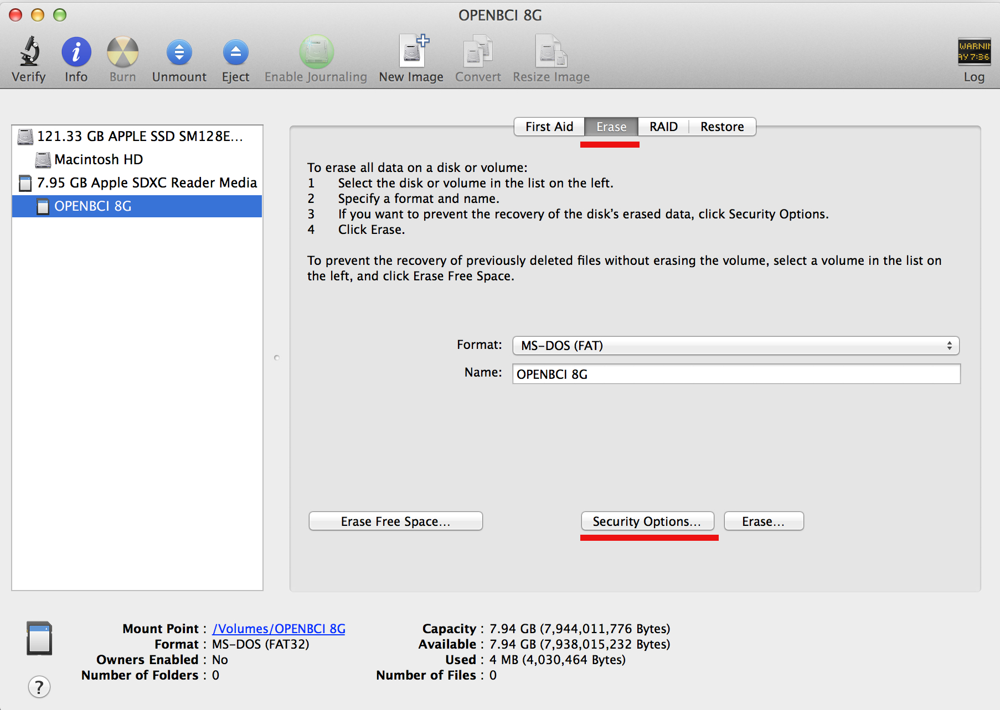

#Using SD Card with OpenBCI

##Overview
There are many situations where logging biometric data to local storage may be desirable. You may be doing a sleep study, or out on the road with your OpenBCI, and the wireless connection to a PC may be tenuous. The amount of data you are producing may require more bandwidth than the BLE connection can handle. This tutorial will cover the basics of adding an SD card for local storage to OpenBCI, how the data is formatted on the card, and how to retrieve the data after you've logged it. 

##SD Card Basics

First thing to know is that low-cost cards and slow speed cards are **not** recommended. When shopping for SD cards, make sure to look for high quality (Scan Disk, eg) and high speed (class 10 minimum). Look for the symbols to the right to know you are getting the right kind of card. You will also want to look for a card that has alot of memory. OpenBCI will generate about 1 mega bye of data when it is recording samples at the default rate of 250Hz. That's alot of data!

We've used these two cards in the OpenBCI lab, and they both work great. 

###Formatting

If you are using a new card, or one that you've had around, first thing you should do is format it. We've found that the most successful formatting method is one that overwrites the card. Mac OS provides this option in the Disk Utility, Erase, Secure Erase options.